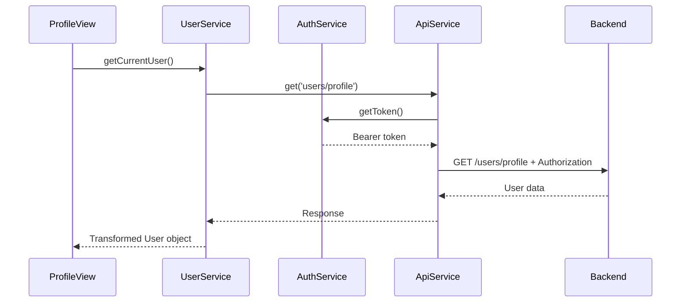
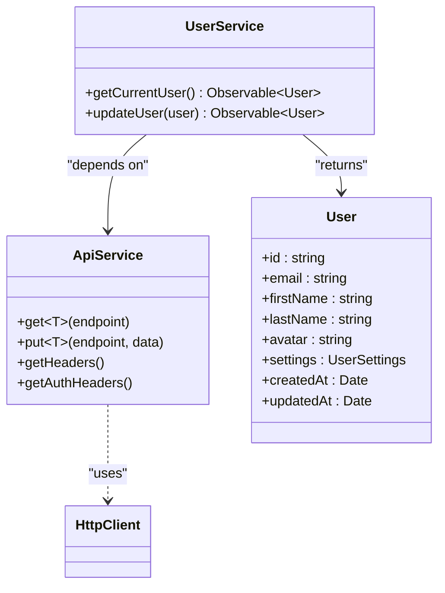
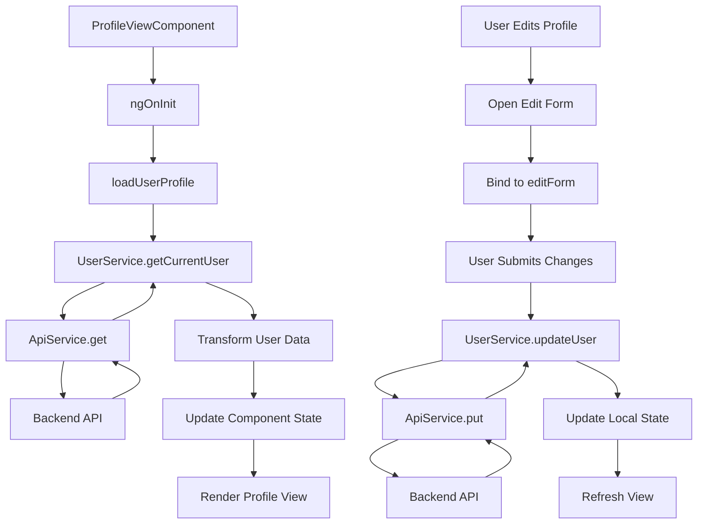
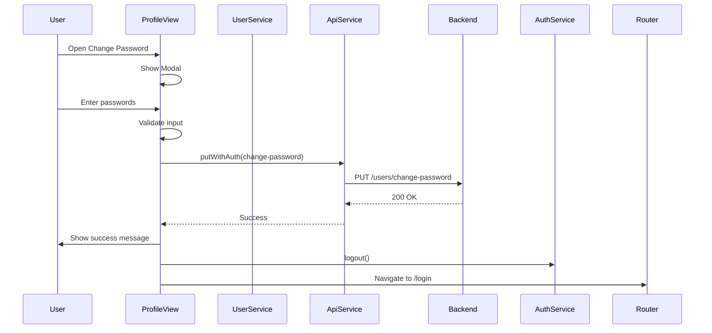

# UserService Reference

<cite>
**Referenced Files in This Document**   
- [user.service.ts](file://src/app/shared/services/user.service.ts)
- [auth.service.ts](file://src/app/auth/auth.service.ts)
- [api.service.ts](file://src/app/shared/services/api.service.ts)
- [profile-view.component.ts](file://src/app/profile/profile-view/profile-view.component.ts)
- [profile-edit.component.ts](file://src/app/profile/profile-edit/profile-edit.component.ts)
</cite>

## Table of Contents
1. [Introduction](#introduction)
2. [Core Methods](#core-methods)
3. [Integration with AuthService](#integration-with-authservice)
4. [Integration with ApiService](#integration-with-apiservice)
5. [Data Flow to Profile Components](#data-flow-to-profile-components)
6. [Security Implementation](#security-implementation)
7. [Profile Picture Upload Handling](#profile-picture-upload-handling)
8. [Error State Management](#error-state-management)
9. [Caching and Synchronization](#caching-and-synchronization)
10. [Conclusion](#conclusion)

## Introduction
The UserService is a central service in the Angular application responsible for managing user profile data and settings. It provides methods to retrieve and update user information, integrates with authentication and API services, and supports secure operations such as password changes and two-factor authentication. This documentation details the implementation of key methods including getUserProfile, updateUserProfile, changePassword, enableTwoFactor, and uploadAvatar, along with their integration points and data flow to UI components.

**Section sources**
- [user.service.ts](file://src/app/shared/services/user.service.ts#L1-L65)

## Core Methods
The UserService exposes essential methods for user profile management through its public API. The service primarily relies on two core methods: getCurrentUser and updateUser, which handle retrieval and modification of user profile data respectively.

### getUserProfile
Retrieves the current user's profile data from the backend API and transforms it into a standardized User model. The method handles data normalization including name splitting, avatar fallback, and settings initialization.

[SPEC SYMBOL](file://src/app/shared/services/user.service.ts#L15-L30)

### updateUserProfile
Updates user profile information by sending a PATCH request with only the modified fields. The method intelligently constructs the payload by combining first and last names into a full name field required by the backend.

[SPEC SYMBOL](file://src/app/shared/services/user.service.ts#L32-L65)

**Section sources**
- [user.service.ts](file://src/app/shared/services/user.service.ts#L15-L65)

## Integration with AuthService
UserService works in conjunction with AuthService to maintain authentication context and user session state. While UserService handles profile data operations, AuthService manages the authentication state and token storage.

AuthService stores the current user object in localStorage upon successful login and provides access to the authentication token used by UserService for authenticated requests. The two services operate in a complementary fashion: AuthService maintains the authentication session, while UserService manages the user's profile data within that session context.

**Diagram sources**
- [user.service.ts](file://src/app/shared/services/user.service.ts#L15-L30)
- [auth.service.ts](file://src/app/auth/auth.service.ts#L70-L75)
- [api.service.ts](file://src/app/shared/services/api.service.ts#L25-L30)

**Section sources**
- [auth.service.ts](file://src/app/auth/auth.service.ts#L1-L121)
- [user.service.ts](file://src/app/shared/services/user.service.ts#L1-L65)

## Integration with ApiService
UserService depends on ApiService for all HTTP communications with the backend. ApiService provides a wrapper around Angular's HttpClient with built-in authentication header management.

The integration follows a layered architecture pattern where UserService focuses on business logic and data transformation, while ApiService handles the technical aspects of HTTP communication including:
- Automatic attachment of authorization headers
- Base URL configuration
- Request/response type safety
- Error handling at the transport level

UserService uses ApiService's get and put methods to retrieve and update user data, relying on its authentication header management to ensure requests are properly authorized.

**Diagram sources**
- [user.service.ts](file://src/app/shared/services/user.service.ts#L1-L65)
- [api.service.ts](file://src/app/shared/services/api.service.ts#L1-L94)

**Section sources**
- [api.service.ts](file://src/app/shared/services/api.service.ts#L1-L94)
- [user.service.ts](file://src/app/shared/services/user.service.ts#L1-L65)

## Data Flow to Profile Components
User profile data flows from UserService to two primary components: ProfileViewComponent and ProfileEditComponent. These components use reactive programming patterns with Observables to respond to data changes.

### ProfileViewComponent
The ProfileViewComponent subscribes to UserService.getCurrentUser() during initialization to load and display user profile information. It transforms the raw user data into a display-friendly format, including:
- Generating user initials from first and last names
- Calculating membership duration
- Formatting dates and currency values

The component also manages edit mode states and form binding for profile updates.

[SPEC SYMBOL](file://src/app/profile/profile-view/profile-view.component.ts#L150-L180)

### ProfileEditComponent
While not fully visible in the provided code, the profile-edit.component.ts file indicates the existence of a dedicated editing component that likely handles form validation, input binding, and submission of profile updates through UserService.updateUser().

The data flow follows a unidirectional pattern:
1. Component requests data from UserService
2. UserService retrieves data via ApiService
3. Component displays data and captures user input
4. Component submits changes to UserService
5. UserService sends update to backend via ApiService

**Diagram sources**
- [profile-view.component.ts](file://src/app/profile/profile-view/profile-view.component.ts#L150-L180)
- [user.service.ts](file://src/app/shared/services/user.service.ts#L15-L65)

**Section sources**
- [profile-view.component.ts](file://src/app/profile/profile-view/profile-view.component.ts#L1-L663)
- [profile-edit.component.ts](file://src/app/profile/profile-edit/profile-edit.component.ts#L1-L1)

## Security Implementation
The UserService implements several security measures for sensitive operations, particularly around password changes and two-factor authentication.

### Password Change Validation
Password changes are handled through a dedicated endpoint that requires both current and new passwords. The implementation includes client-side validation for:
- Password confirmation matching
- Minimum length requirements (8 characters)
- Current password verification via backend

The system enforces a security policy that logs the user out after password changes to ensure re-authentication with the new credentials.

[SPEC SYMBOL](file://src/app/profile/profile-view/profile-view.component.ts#L250-L290)

### Two-Factor Authentication Enrollment
Two-factor authentication is managed through user settings. The flow involves:
1. User initiating 2FA toggle
2. Service updating settings via updateUser
3. Backend processing 2FA enrollment
4. Confirmation feedback to user

The implementation ensures that 2FA state changes are properly synchronized between the UI and backend.

[SPEC SYMBOL](file://src/app/profile/profile-view/profile-view.component.ts#L300-L330)

**Diagram sources**
- [profile-view.component.ts](file://src/app/profile/profile-view/profile-view.component.ts#L250-L290)
- [auth.service.ts](file://src/app/auth/auth.service.ts#L100-L110)

**Section sources**
- [profile-view.component.ts](file://src/app/profile/profile-view/profile-view.component.ts#L250-L330)
- [auth.service.ts](file://src/app/auth/auth.service.ts#L100-L110)

## Profile Picture Upload Handling
While the specific uploadAvatar method implementation is not visible in the provided UserService code, the profile components indicate support for avatar management. The user model includes an avatar property that defaults to a placeholder image when no custom avatar is set.

The architecture suggests that avatar uploads would follow a similar pattern to other profile updates:
1. File selection in the UI component
2. Image processing (resizing, format conversion)
3. Upload via ApiService with appropriate headers
4. URL retrieval and profile update

The system uses a fallback avatar URL (https://via.placeholder.com/150) when no custom avatar is available, ensuring consistent UI rendering.

[SPEC SYMBOL](file://src/app/shared/services/user.service.ts#L20-L25)

**Section sources**
- [user.service.ts](file://src/app/shared/services/user.service.ts#L20-L25)

## Error State Management
The UserService and associated components implement comprehensive error handling for profile operations. Errors are managed through RxJS Observables with proper subscription handling.

### UserService Error Handling
The service itself relies on ApiService for transport-level error handling, propagating errors up to consuming components. It transforms raw API responses into standardized User objects, handling potential data inconsistencies.

### Component-Level Error Handling
ProfileViewComponent implements detailed error handling for profile operations:
- try-catch patterns for synchronous operations
- Observable error callbacks for asynchronous operations
- User-friendly error messages for different failure scenarios
- State rollback on failed updates

Common error scenarios include:
- Network connectivity issues
- Authentication token expiration
- Validation failures
- Backend service unavailability

[SPEC SYMBOL](file://src/app/profile/profile-view/profile-view.component.ts#L160-L170)

**Section sources**
- [profile-view.component.ts](file://src/app/profile/profile-view/profile-view.component.ts#L160-L170)
- [user.service.ts](file://src/app/shared/services/user.service.ts#L15-L65)

## Caching and Synchronization
The application implements a multi-layer caching strategy to optimize user data access and ensure synchronization across tabs and sessions.

### LocalStorage Caching
AuthService maintains user session data in localStorage, including:
- Authentication token
- Current user object
- Session state

This enables persistence across page reloads and provides a single source of truth for authentication state.

### In-Memory Caching
UserService leverages Angular's service singleton pattern to maintain an in-memory representation of user data during the session. The service itself doesn't store user data but facilitates efficient data retrieval through its Observable-based API.

### Cross-Tab Synchronization
The use of localStorage enables basic cross-tab synchronization. When a user logs out in one tab, the removal of localStorage items propagates to other tabs, triggering re-authentication.

### Data Freshness Strategy
The application follows a "read-through" caching pattern:
- Always fetch latest user data on component initialization
- Update local state after successful mutations
- Handle stale data scenarios through error handling

[SPEC SYMBOL](file://src/app/auth/auth.service.ts#L70-L80)

**Section sources**
- [auth.service.ts](file://src/app/auth/auth.service.ts#L70-L80)
- [profile-view.component.ts](file://src/app/profile/profile-view/profile-view.component.ts#L150-L180)

## Conclusion
The UserService provides a robust foundation for user profile management in the Angular application. By following separation of concerns principles, it effectively delegates authentication concerns to AuthService and HTTP communication details to ApiService, focusing on its core responsibility of user data management.

The service integrates seamlessly with profile components through Observable-based data flow, supports secure operations with proper validation, and participates in a comprehensive caching strategy. Its implementation demonstrates best practices in Angular service design, including dependency injection, RxJS usage, and type safety.

Future enhancements could include explicit avatar upload functionality, real-time synchronization via WebSockets, and more sophisticated caching with expiration policies.