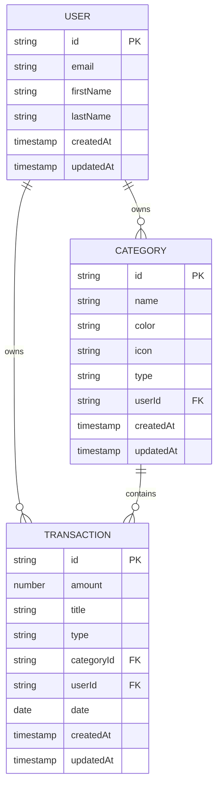
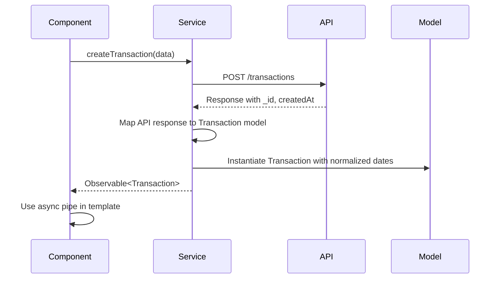

# Data Model Relationships

<cite>
**Referenced Files in This Document**  
- [user.model.ts](file://src/app/shared/models/user.model.ts)
- [category.model.ts](file://src/app/shared/models/category.model.ts)
- [transaction.model.ts](file://src/app/shared/models/transaction.model.ts)
- [budget.model.ts](file://src/app/shared/models/budget.model.ts)
- [constants.ts](file://src/app/shared/utils/constants.ts)
- [transaction.service.ts](file://src/app/shared/services/transaction.service.ts)
- [budget.service.ts](file://src/app/shared/services/budget.service.ts)
- [user.service.ts](file://src/app/shared/services/user.service.ts)
</cite>

## Table of Contents
1. [Introduction](#introduction)
2. [Core Data Models](#core-data-models)
3. [Model Relationships](#model-relationships)
4. [Data Validation and Business Logic](#data-validation-and-business-logic)
5. [Model Instantiation and Transformation](#model-instantiation-and-transformation)
6. [State Management and Persistence](#state-management-and-persistence)
7. [Data Integrity and Model Evolution](#data-integrity-and-model-evolution)
8. [Conclusion](#conclusion)

## Introduction
This document provides comprehensive documentation for the core financial data models in the Angular application: User, Transaction, Category, and Budget. It details their structure, relationships, validation rules, and usage patterns across service layers and components. The models are designed to support a personal finance tracking application with robust categorization, transaction management, and budgeting capabilities.

## Core Data Models

### User Model
The User model represents application users with personal information, settings, and metadata.

**Properties:**
- `id`: Unique identifier (string)
- `email`: User's email address (string)
- `firstName`, `lastName`: Name components (string)
- `avatar`: Optional profile image URL (string)
- `settings`: Nested object for user preferences including notification and report settings
- `createdAt`, `updatedAt`: Timestamps for record lifecycle

**Section sources**
- [user.model.ts](file://src/app/shared/models/user.model.ts#L1-L15)

### Category Model
The Category model defines transaction categories with visual and behavioral attributes.

**Properties:**
- `id`: Unique identifier (string)
- `name`: Category name (string)
- `color`, `icon`: Visual presentation attributes (string)
- `type`: Transaction type classification using union type `'income' | 'expense'`
- `userId`: Reference to owning user (string)
- `createdAt`, `updatedAt`: Timestamps

**Constants Integration:**
The `type` property aligns with `APP_CONSTANTS.TRANSACTION_TYPES` from constants.ts, ensuring consistency between UI and data layer.

**Section sources**
- [category.model.ts](file://src/app/shared/models/category.model.ts#L1-L9)

### Transaction Model
The Transaction model captures financial transactions with references to related entities.

**Properties:**
- `id`: Unique identifier (string)
- `amount`: Numeric transaction amount
- `title`, `description`: Descriptive fields (string)
- `type`: Transaction classification (`'income' | 'expense'`)
- `categoryId`: Foreign key to Category model
- `date`: Transaction date (Date object)
- `userId`: Owner reference
- `createdAt`, `updatedAt`: Timestamps
- `category`: Optional populated category name (string)

**Section sources**
- [transaction.model.ts](file://src/app/shared/models/transaction.model.ts#L1-L12)

### Budget Model
The Budget model comprises three related interfaces for comprehensive budget management:

**MonthlyBudget:** Core budget configuration with amount, currency, and alert thresholds.

**BudgetOverview:** Computed view model containing budget status, utilization metrics, and category breakdown.

**BudgetAlertSummary:** Alert-specific data structure for notification systems.

These interfaces support both budget configuration and derived analytics.

**Section sources**
- [budget.model.ts](file://src/app/shared/models/budget.model.ts#L1-L59)

## Model Relationships



**Diagram sources**
- [user.model.ts](file://src/app/shared/models/user.model.ts#L1-L15)
- [category.model.ts](file://src/app/shared/models/category.model.ts#L1-L9)
- [transaction.model.ts](file://src/app/shared/models/transaction.model.ts#L1-L12)

### Relationship Details
- **User to Category**: One-to-many relationship where each user owns multiple categories
- **User to Transaction**: One-to-many relationship where each user owns multiple transactions
- **Category to Transaction**: One-to-many relationship where each category contains multiple transactions
- **Budget to User**: Implicit one-to-one relationship managed through user context
- **Budget to Transactions**: Analytical relationship where budget utilization is calculated from transaction data

The Transaction model serves as the central entity, referencing both Category and User through `categoryId` and `userId` foreign keys.

## Data Validation and Business Logic

### Type Safety with Constants
The application uses `APP_CONSTANTS.TRANSACTION_TYPES` from constants.ts to ensure consistent transaction typing:

```typescript
type: 'income' | 'expense'
```

This union type prevents invalid values and aligns with the constant values `APP_CONSTANTS.TRANSACTION_TYPES.INCOME` and `APP_CONSTANTS.TRANSACTION_TYPES.EXPENSE`.

### Business Rules
- **Budget Threshold Validation**: Warning threshold must be less than critical threshold (enforced in budget-management.component.ts)
- **Transaction Date Handling**: Dates are normalized to Date objects during instantiation
- **Budget Status Calculation**: Percentage used triggers alert levels (safe, warning, critical)
- **Currency Formatting**: Standardized to USD with consistent formatting across components

**Section sources**
- [constants.ts](file://src/app/shared/utils/constants.ts#L1-L54)
- [budget-management.component.ts](file://src/app/shared/components/budget-management/budget-management.component.ts#L256-L300)

## Model Instantiation and Transformation

### Service Layer Transformation
Model instantiation occurs primarily in service layers with data transformation from API responses:



**Diagram sources**
- [transaction.service.ts](file://src/app/shared/services/transaction.service.ts#L55-L85)
- [transaction-form.component.ts](file://src/app/transactions/transaction-form/transaction-form.component.ts#L70-L94)

### Transformation Patterns
- **API to Model**: Services transform API responses (using `_id`) to model objects (using `id`)
- **Date Normalization**: String dates from API are converted to Date objects
- **Field Mapping**: API fields like `name` are split into `firstName` and `lastName`
- **Default Values**: Missing optional fields receive sensible defaults

## State Management and Persistence

### Component Usage Patterns
Models are consumed through Observable streams and async pipes:

```typescript
this.transactionService.getTransactions().subscribe(transactions => {
  this.transactions = transactions;
});
```

Components like `budget-card.component.ts` and `profile-view.component.ts` subscribe to budget and transaction data, combining them to present unified views.

### Data Flow
- **Read Operations**: Services fetch data and transform to model instances
- **Write Operations**: Services send simplified payloads, receiving fully populated models
- **State Updates**: Parent components (e.g., profile-edit) coordinate multiple data sources
- **Template Binding**: Async pipes minimize subscription management in templates

**Section sources**
- [budget-card.component.ts](file://src/app/dashboard/components/budget-card/budget-card.component.ts#L103-L155)
- [profile-view.component.ts](file://src/app/profile/profile-view/profile-view.component.ts#L488-L541)

## Data Integrity and Model Evolution

### Integrity Considerations
- **Foreign Key Enforcement**: `userId` and `categoryId` ensure referential integrity
- **Type Safety**: TypeScript interfaces prevent invalid property assignments
- **Validation Layers**: Form validation complements model-level constraints
- **Error Handling**: Services provide fallbacks (e.g., mock data when API unavailable)

### Evolution Strategies
- **Optional Properties**: New fields added as optional to maintain backward compatibility
- **Interface Segregation**: Budget model uses multiple interfaces for different contexts
- **Service Abstraction**: Services isolate model changes from components
- **Constants Centralization**: Shared constants enable coordinated updates

The architecture supports model evolution through gradual enhancement rather than breaking changes.

## Conclusion
The financial data models in this application form a cohesive system with well-defined relationships and constraints. The User, Category, Transaction, and Budget models work together to support comprehensive personal finance tracking. Through consistent typing, centralized constants, and service-layer transformation, the application maintains data integrity while providing flexible presentation capabilities. The use of Observables and async pipes enables reactive data binding, and the separation of concerns between models, services, and components ensures maintainability and scalability.