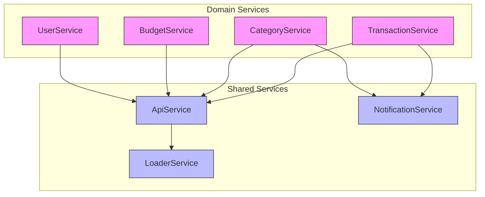
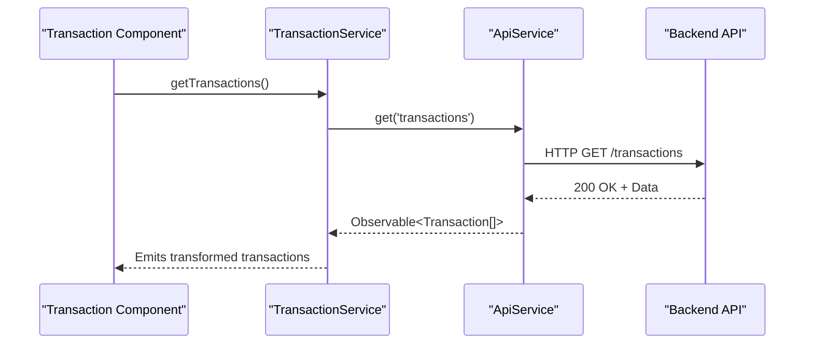
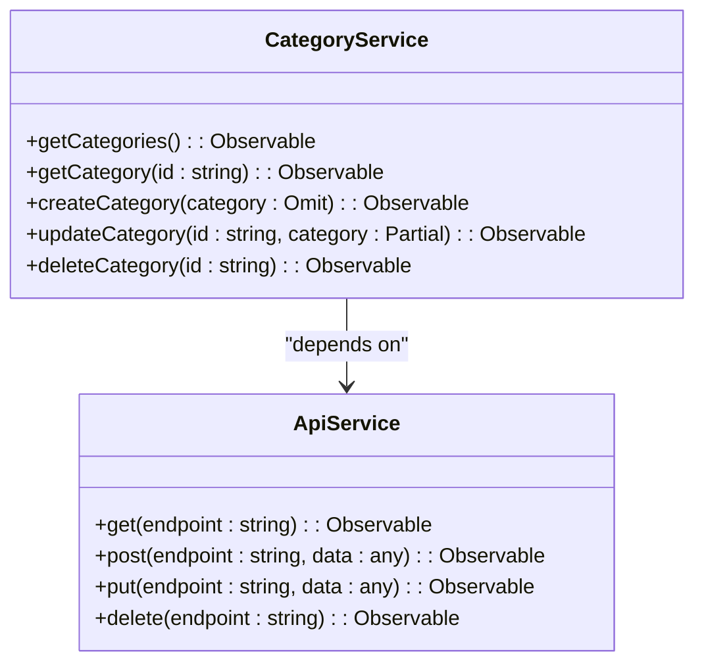
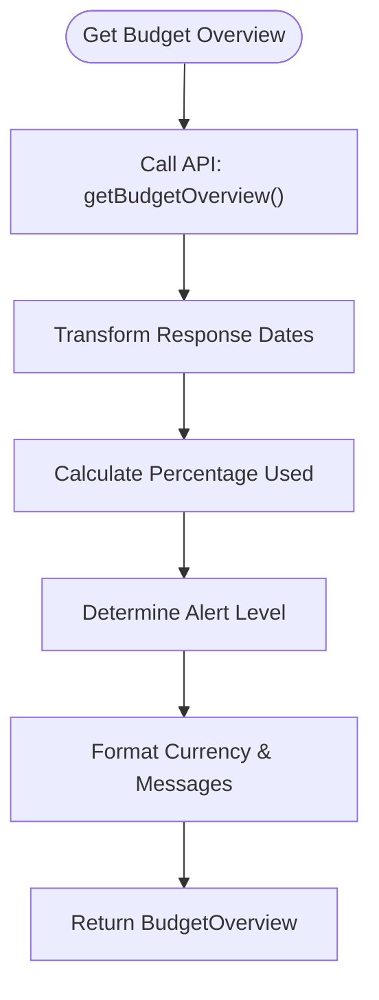
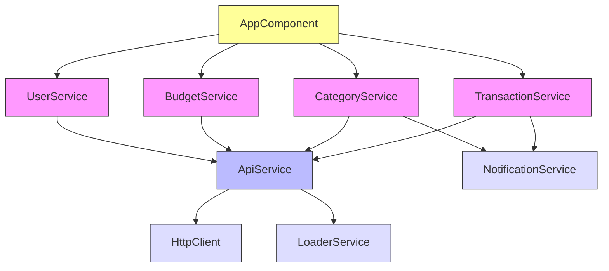
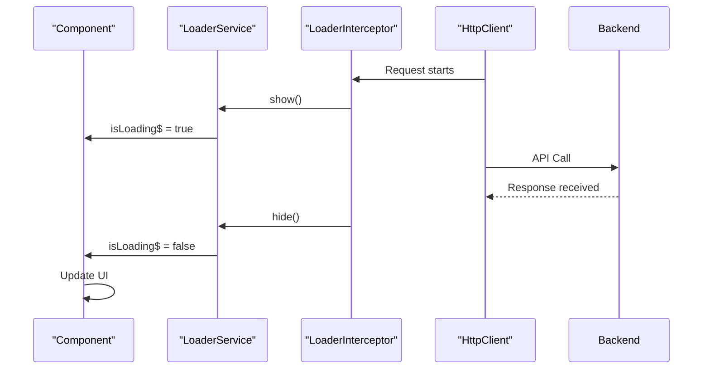

# Service Architecture

<cite>
**Referenced Files in This Document**   
- [transaction.service.ts](file://src/app/shared/services/transaction.service.ts)
- [category.service.ts](file://src/app/shared/services/category.service.ts)
- [budget.service.ts](file://src/app/shared/services/budget.service.ts)
- [user.service.ts](file://src/app/shared/services/user.service.ts)
- [api.service.ts](file://src/app/shared/services/api.service.ts)
- [loader.service.ts](file://src/app/shared/services/loader.service.ts)
- [loader.interceptor.ts](file://src/app/shared/interceptors/loader.interceptor.ts)
- [transaction.model.ts](file://src/app/shared/models/transaction.model.ts)
</cite>

## Table of Contents
1. [Introduction](#introduction)
2. [Core Service Components](#core-service-components)
3. [Architecture Overview](#architecture-overview)
4. [Detailed Component Analysis](#detailed-component-analysis)
5. [Dependency and Data Flow Analysis](#dependency-and-data-flow-analysis)
6. [Loading State Management](#loading-state-management)
7. [Best Practices for Service Design](#best-practices-for-service-design)
8. [Conclusion](#conclusion)

## Introduction
This document provides comprehensive architectural documentation for the service-based state management pattern implemented in the Angular application. It details how domain-specific services serve as single sources of truth, encapsulate business logic, and enable reactive data flows across components using RxJS Observables. The document also covers the dependency injection mechanism, HTTP communication patterns, and best practices for service design.

## Core Service Components

The application implements a service-oriented architecture where each domain (Transactions, Categories, Budgets, Users) has a dedicated service responsible for managing its state and business logic. These services are designed as singletons via Angular's dependency injection system (`providedIn: 'root'`), ensuring a single source of truth across the entire application.

Each service encapsulates CRUD operations, data transformation, error handling, and integration with shared utilities such as notifications and loading states. Services expose data through RxJS Observables, enabling reactive programming patterns where components subscribe to data streams and automatically receive updates.

**Section sources**
- [transaction.service.ts](file://src/app/shared/services/transaction.service.ts#L7-L127)
- [category.service.ts](file://src/app/shared/services/category.service.ts#L6-L94)
- [budget.service.ts](file://src/app/shared/services/budget.service.ts#L5-L156)
- [user.service.ts](file://src/app/shared/services/user.service.ts#L5-L64)

## Architecture Overview

The service architecture follows a layered pattern with domain services at the application layer, interfacing with a central ApiService for HTTP communication. This separation ensures consistent API interaction patterns, error handling, and authentication management across all services.

**Diagram sources**
- [transaction.service.ts](file://src/app/shared/services/transaction.service.ts#L7-L127)
- [category.service.ts](file://src/app/shared/services/category.service.ts#L6-L94)
- [budget.service.ts](file://src/app/shared/services/budget.service.ts#L5-L156)
- [user.service.ts](file://src/app/shared/services/user.service.ts#L5-L64)
- [api.service.ts](file://src/app/shared/services/api.service.ts#L5-L93)

## Detailed Component Analysis

### Transaction Service Analysis
The TransactionService manages all operations related to financial transactions, serving as the single source of truth for transaction data. It provides methods for retrieving, creating, updating, and deleting transactions, with automatic mapping between API response format and the application's Transaction model.

The service implements graceful degradation by falling back to mock data when the API is unavailable, enhancing application resilience during development or API outages. It also integrates with NotificationService to provide user feedback on transaction operations.

**Diagram sources**
- [transaction.service.ts](file://src/app/shared/services/transaction.service.ts#L7-L127)
- [api.service.ts](file://src/app/shared/services/api.service.ts#L5-L93)

### Category Service Analysis
The CategoryService manages category data used to classify transactions. It follows the same pattern as other domain services, providing CRUD operations with consistent error handling and data transformation. The service ensures category data integrity by validating and normalizing API responses to match the application's Category model.

**Diagram sources**
- [category.service.ts](file://src/app/shared/services/category.service.ts#L6-L94)
- [api.service.ts](file://src/app/shared/services/api.service.ts#L5-L93)

### Budget Service Analysis
The BudgetService provides specialized functionality for budget management, including comprehensive budget overview data and utility methods for calculating budget progress and status. Unlike other services, it includes helper methods that encapsulate business logic for budget calculations, formatting, and status determination.

The service exposes both data retrieval methods and pure utility functions, demonstrating a hybrid approach that combines state management with domain logic encapsulation.

**Diagram sources**
- [budget.service.ts](file://src/app/shared/services/budget.service.ts#L5-L156)

### User Service Analysis
The UserService manages user profile data and settings, handling the complexity of mapping between the API's user representation and the application's User model. It includes logic for splitting and combining name fields, and provides default values for settings to ensure consistent application behavior.

The service demonstrates data transformation patterns where the service normalizes API responses to provide a consistent interface to components.

**Section sources**
- [user.service.ts](file://src/app/shared/services/user.service.ts#L5-L64)

## Dependency and Data Flow Analysis

The service architecture relies on Angular's hierarchical dependency injection system to provide services to components and other services. All domain services are provided at the root level, ensuring singleton instances across the application.

Domain services depend on the central ApiService for HTTP communication, which in turn handles authentication headers, base URL configuration, and response type management. This layered approach ensures consistent API interaction patterns and simplifies service implementation.

**Diagram sources**
- [transaction.service.ts](file://src/app/shared/services/transaction.service.ts#L7-L127)
- [category.service.ts](file://src/app/shared/services/category.service.ts#L6-L94)
- [budget.service.ts](file://src/app/shared/services/budget.service.ts#L5-L156)
- [user.service.ts](file://src/app/shared/services/user.service.ts#L5-L64)
- [api.service.ts](file://src/app/shared/services/api.service.ts#L5-L93)

## Loading State Management

The application implements a centralized loading state management system using LoaderService and an HTTP interceptor. The LoaderService uses a BehaviorSubject to maintain loading state and expose it as an Observable stream that components can subscribe to.

**Diagram sources**
- [loader.service.ts](file://src/app/shared/services/loader.service.ts#L3-L17)
- [loader.interceptor.ts](file://src/app/shared/interceptors/loader.interceptor.ts#L3-L11)

The current implementation of the loader interceptor is incomplete and does not integrate with the LoaderService. For the loading state to function properly, the interceptor should call LoaderService.show() at the beginning of each request and LoaderService.hide() when the request completes or errors.

**Section sources**
- [loader.service.ts](file://src/app/shared/services/loader.service.ts#L3-L17)
- [loader.interceptor.ts](file://src/app/shared/interceptors/loader.interceptor.ts#L3-L11)

## Best Practices for Service Design

The service architecture demonstrates several best practices for Angular service design:

1. **Separation of Concerns**: Each service has a single responsibility and manages a specific domain of data.
2. **Reusability**: Services are designed as singletons and can be injected into any component or service that needs them.
3. **Testability**: Services have minimal dependencies and can be easily mocked in unit tests.
4. **Error Handling**: Services implement consistent error handling patterns, including fallback to mock data.
5. **Data Transformation**: Services normalize API responses to match application models, insulating components from API changes.
6. **Reactive Programming**: Services expose data through Observables, enabling reactive updates across the application.
7. **Dependency Injection**: Services leverage Angular's DI system for loose coupling and easier testing.

The architecture could be improved by:
- Completing the loader interceptor implementation to properly integrate with LoaderService
- Adding more comprehensive error handling and retry mechanisms
- Implementing caching strategies to reduce API calls
- Adding request cancellation for long-running operations

**Section sources**
- [transaction.service.ts](file://src/app/shared/services/transaction.service.ts#L7-L127)
- [category.service.ts](file://src/app/shared/services/category.service.ts#L6-L94)
- [budget.service.ts](file://src/app/shared/services/budget.service.ts#L5-L156)
- [user.service.ts](file://src/app/shared/services/user.service.ts#L5-L64)
- [api.service.ts](file://src/app/shared/services/api.service.ts#L5-L93)

## Conclusion

The service-based state management pattern in this Angular application provides a robust foundation for managing application state and business logic. By organizing functionality into domain-specific services, the architecture promotes separation of concerns, reusability, and testability. The use of RxJS Observables enables reactive data flows, while the central ApiService ensures consistent HTTP communication patterns. With minor improvements to the loading state implementation, this architecture provides a scalable and maintainable foundation for the application.