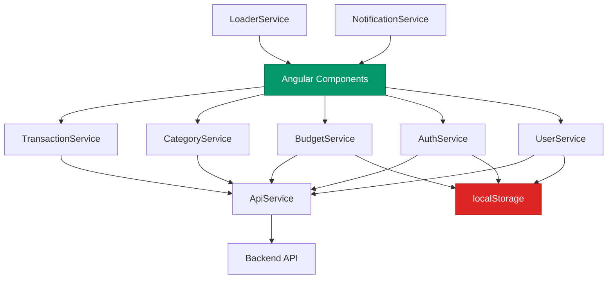
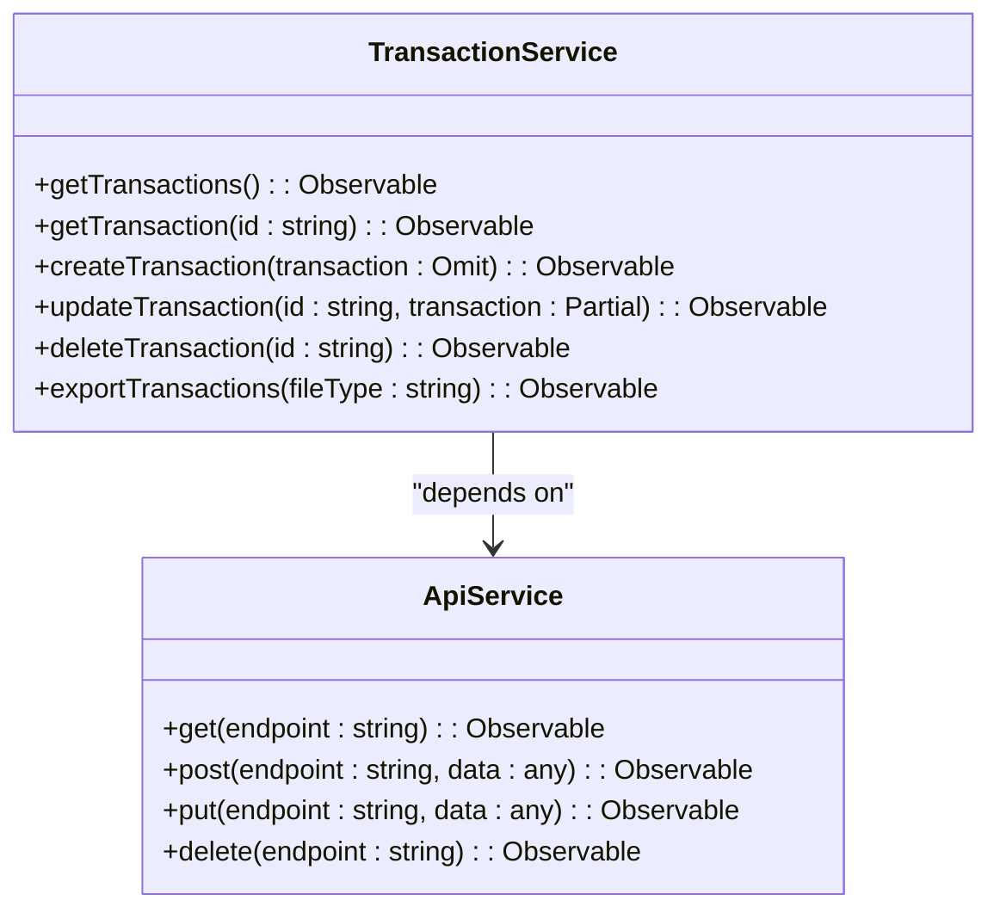
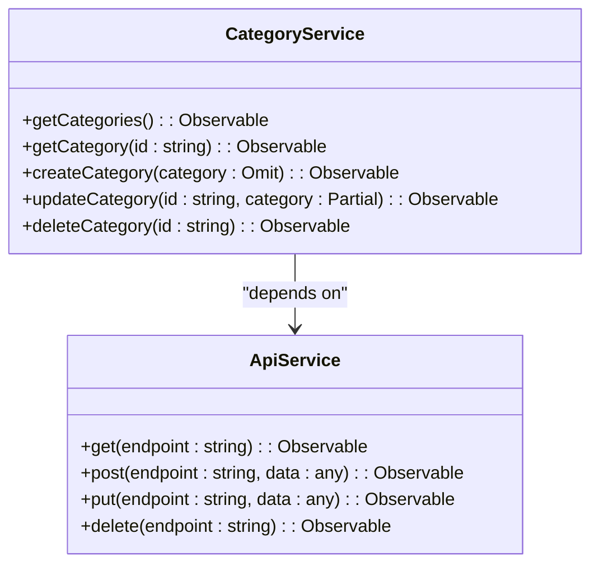
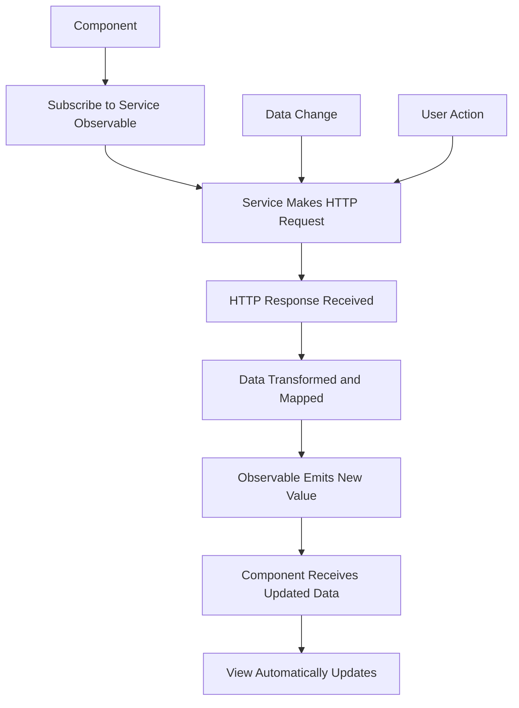
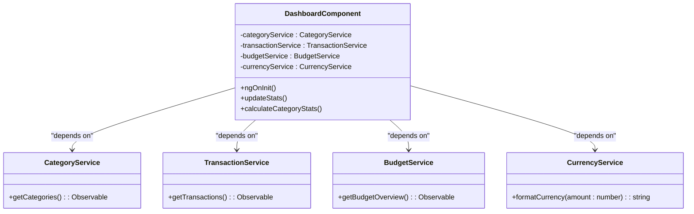
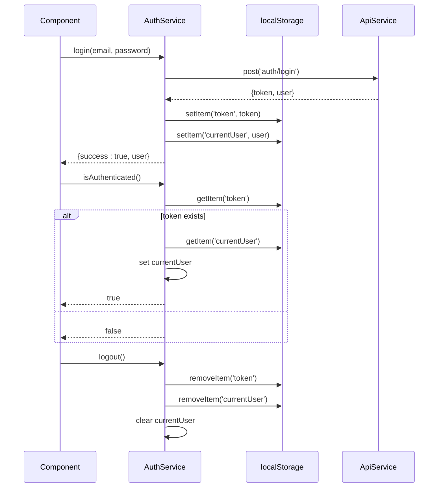
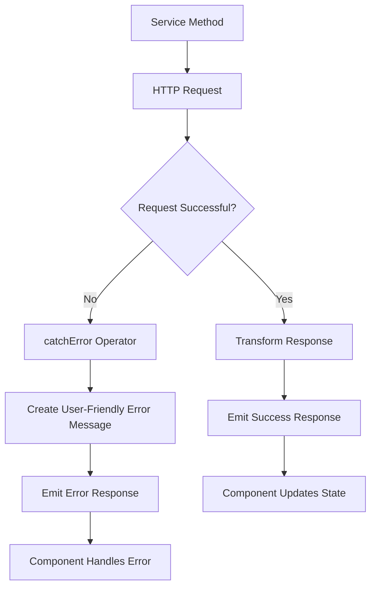
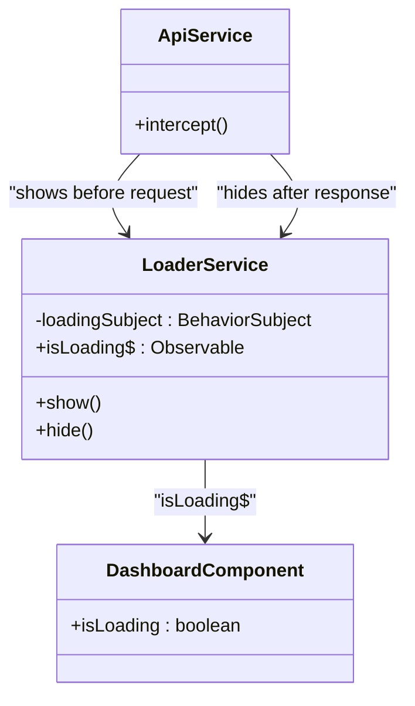
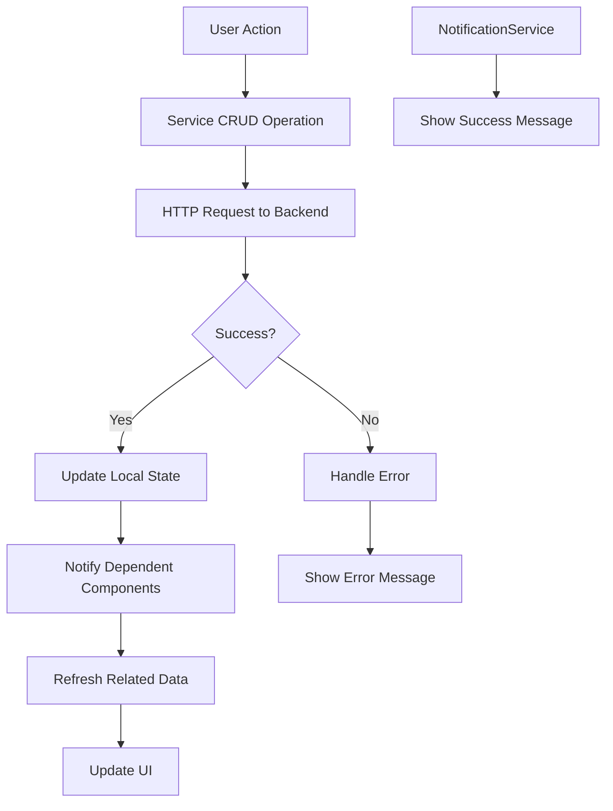
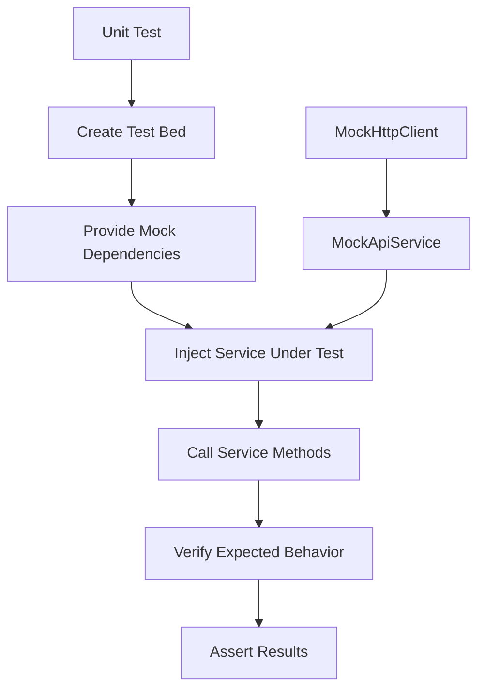

# State Management

<cite>
**Referenced Files in This Document**   
- [transaction.service.ts](file://src/app/shared/services/transaction.service.ts)
- [category.service.ts](file://src/app/shared/services/category.service.ts)
- [budget.service.ts](file://src/app/shared/services/budget.service.ts)
- [auth.service.ts](file://src/app/auth/auth.service.ts)
- [api.service.ts](file://src/app/shared/services/api.service.ts)
- [user.service.ts](file://src/app/shared/services/user.service.ts)
- [loader.service.ts](file://src/app/shared/services/loader.service.ts)
- [notification.service.ts](file://src/app/shared/services/notification.service.ts)
- [category.model.ts](file://src/app/shared/models/category.model.ts)
- [transaction.model.ts](file://src/app/shared/models/transaction.model.ts)
</cite>

## Table of Contents
1. [Introduction](#introduction)
2. [Service-Based State Management Architecture](#service-based-state-management-architecture)
3. [Core State Management Services](#core-state-management-services)
4. [Reactive Data Flow with RxJS](#reactive-data-flow-with-rxjs)
5. [Dependency Injection and Component Interaction](#dependency-injection-and-component-interaction)
6. [State Persistence with localStorage](#state-persistence-with-localstorage)
7. [Error Handling and Loading States](#error-handling-and-loading-states)
8. [Data Synchronization Patterns](#data-synchronization-patterns)
9. [Service Design Best Practices](#service-design-best-practices)
10. [Conclusion](#conclusion)

## Introduction
This document provides comprehensive architectural documentation for the service-based state management pattern implemented in the Angular application. The application utilizes Angular services as single sources of truth for different domains, leveraging RxJS observables for reactive data flow, and implementing robust patterns for state persistence, error handling, and data synchronization. This documentation covers the key services, their interactions, and the architectural principles that guide state management in the application.

## Service-Based State Management Architecture

The application implements a service-based state management architecture where dedicated services act as single sources of truth for their respective domains. This pattern centralizes data management, ensures consistency across components, and provides a clear separation of concerns.



**Diagram sources**
- [transaction.service.ts](file://src/app/shared/services/transaction.service.ts)
- [category.service.ts](file://src/app/shared/services/category.service.ts)
- [budget.service.ts](file://src/app/shared/services/budget.service.ts)
- [auth.service.ts](file://src/app/auth/auth.service.ts)
- [user.service.ts](file://src/app/shared/services/user.service.ts)
- [api.service.ts](file://src/app/shared/services/api.service.ts)

## Core State Management Services

The application implements several core services that serve as single sources of truth for their respective domains. Each service encapsulates the data and business logic for a specific domain, providing a consistent interface for components to interact with.

### TransactionService
The TransactionService manages the state for financial transactions within the application. It provides methods to retrieve, create, update, and delete transactions, serving as the single source of truth for transaction data.



**Diagram sources**
- [transaction.service.ts](file://src/app/shared/services/transaction.service.ts#L6-L121)

### CategoryService
The CategoryService manages the state for transaction categories, serving as the single source of truth for category data. It provides CRUD operations for categories and handles the transformation of API responses into typed objects.



**Diagram sources**
- [category.service.ts](file://src/app/shared/services/category.service.ts#L5-L86)

### BudgetService
The BudgetService manages the state for user budgets, serving as the single source of truth for budget-related data. It provides methods to retrieve and update budget information, as well as helper methods for calculating budget progress and status.

```mermaid
classDiagram
class BudgetService {
+getBudget() : Observable<MonthlyBudget | null>
+updateBudget(budgetData : { amount : number; currency? : string; alertThresholds? : { warning : number; critical : number; } }) : Observable<MonthlyBudget>
+getBudgetOverview() : Observable<BudgetOverview>
+getBudgetAlertSummary() : Observable<BudgetAlertSummary>
+calculateBudgetProgress(spent : number, budget : number) : number
+getBudgetStatusColor(percentage : number, thresholds? : { warning : number; critical : number; }) : string
+getBudgetProgressColor(percentage : number, thresholds? : { warning : number; critical : number; }) : string
+formatCurrency(amount : number, currency : string) : string
+getBudgetStatusMessage(overview : BudgetOverview) : string
}
class ApiService {
+get<T>(endpoint : string) : Observable<T>
+put<T>(endpoint : string, data : any) : Observable<T>
}
BudgetService --> ApiService : "depends on"
```

**Diagram sources**
- [budget.service.ts](file://src/app/shared/services/budget.service.ts#L5-L156)

## Reactive Data Flow with RxJS

The application leverages RxJS observables and operators to create a reactive data flow between services and components. This pattern enables real-time updates and efficient data handling across the application.

### Observable Pattern Implementation
The application uses RxJS observables extensively to manage asynchronous data streams. Services return observables that components can subscribe to, enabling reactive updates when data changes.



**Diagram sources**
- [category.service.ts](file://src/app/shared/services/category.service.ts)
- [transaction.service.ts](file://src/app/shared/services/transaction.service.ts)

### Combined Data Loading
For components that require data from multiple services, the application uses RxJS operators like `combineLatest` to efficiently load and combine data from multiple sources.

```mermaid
flowchart TD
A[Component Init] --> B[combineLatest]
B --> C[categoryService.getCategories()]
B --> D[transactionService.getTransactions()]
C --> B
D --> B
B --> E[map operator]
E --> F[Calculate Category Stats]
F --> G[Update Component State]
G --> H[Update UI]
I[Transaction CRUD] --> J[Refresh Data]
J --> E
K[Category CRUD] --> L[Refresh Categories]
L --> E
```

**Diagram sources**
- [update-category-page.md](file://.qoder/quests/update-category-page.md#L159-L174)

## Dependency Injection and Component Interaction

The application uses Angular's dependency injection system to provide services to components, enabling clean and testable code. Services are injected into components, which then interact with them to retrieve and manipulate data.

### Service Injection Pattern
Services are injected into components through their constructors, following Angular's dependency injection pattern. This approach promotes loose coupling and makes components easier to test.



**Diagram sources**
- [update-category-page.md](file://.qoder/quests/update-category-page.md#L60-L156)

## State Persistence with localStorage

The application implements state persistence using localStorage to maintain user authentication state and preferences across sessions. This ensures a seamless user experience even when the application is refreshed or reopened.

### Authentication State Persistence
The AuthService manages authentication state by storing the JWT token and current user information in localStorage. This allows the application to maintain the user's authenticated state across page refreshes.



**Diagram sources**
- [auth.service.ts](file://src/app/auth/auth.service.ts#L6-L120)

## Error Handling and Loading States

The application implements comprehensive error handling and loading state management to provide a smooth user experience and handle various edge cases gracefully.

### Error Handling Patterns
Services implement error handling using RxJS operators like `catchError` to gracefully handle HTTP errors and provide meaningful feedback to users.



**Section sources**
- [auth.service.ts](file://src/app/auth/auth.service.ts#L6-L120)

### Loading State Management
The application uses a centralized LoaderService to manage loading states across the application. This service uses a BehaviorSubject to emit loading state changes that components can subscribe to.



**Diagram sources**
- [loader.service.ts](file://src/app/shared/services/loader.service.ts#L3-L17)

## Data Synchronization Patterns

The application implements various data synchronization patterns to ensure that data remains consistent across different components and services.

### Real-time Data Updates
When data is modified through CRUD operations, the application ensures that all components displaying the affected data are updated in real-time.



**Section sources**
- [transaction.service.ts](file://src/app/shared/services/transaction.service.ts)
- [category.service.ts](file://src/app/shared/services/category.service.ts)

## Service Design Best Practices

The application follows several best practices in service design to ensure maintainability, testability, and scalability.

### Separation of Concerns
Each service has a well-defined responsibility and focuses on a specific domain. This separation of concerns makes services easier to understand, test, and maintain.

| Service | Responsibility | Dependencies |
|--------|----------------|--------------|
| TransactionService | Manage transaction data | ApiService |
| CategoryService | Manage category data | ApiService |
| BudgetService | Manage budget data | ApiService |
| AuthService | Handle authentication | ApiService, localStorage |
| UserService | Manage user profile | ApiService |
| ApiService | Handle HTTP communication | HttpClient |
| LoaderService | Manage loading states | None |
| NotificationService | Manage user notifications | BehaviorSubject |

**Section sources**
- [transaction.service.ts](file://src/app/shared/services/transaction.service.ts)
- [category.service.ts](file://src/app/shared/services/category.service.ts)
- [budget.service.ts](file://src/app/shared/services/budget.service.ts)
- [auth.service.ts](file://src/app/auth/auth.service.ts)
- [user.service.ts](file://src/app/shared/services/user.service.ts)
- [api.service.ts](file://src/app/shared/services/api.service.ts)
- [loader.service.ts](file://src/app/shared/services/loader.service.ts)
- [notification.service.ts](file://src/app/shared/services/notification.service.ts)

### Testability Considerations
Services are designed with testability in mind, using dependency injection and avoiding direct DOM manipulation. This makes it easier to write unit tests for service logic.



**Section sources**
- [transaction.service.ts](file://src/app/shared/services/transaction.service.ts)
- [category.service.ts](file://src/app/shared/services/category.service.ts)

## Conclusion
The service-based state management pattern implemented in this Angular application provides a robust and scalable approach to managing application state. By using services as single sources of truth, leveraging RxJS for reactive data flow, and implementing proper patterns for state persistence and error handling, the application achieves a clean architecture that is maintainable and testable. The use of dependency injection promotes loose coupling between components and services, while the centralized management of loading states and notifications ensures a consistent user experience. This architectural approach can serve as a foundation for building complex Angular applications with sophisticated state management requirements.