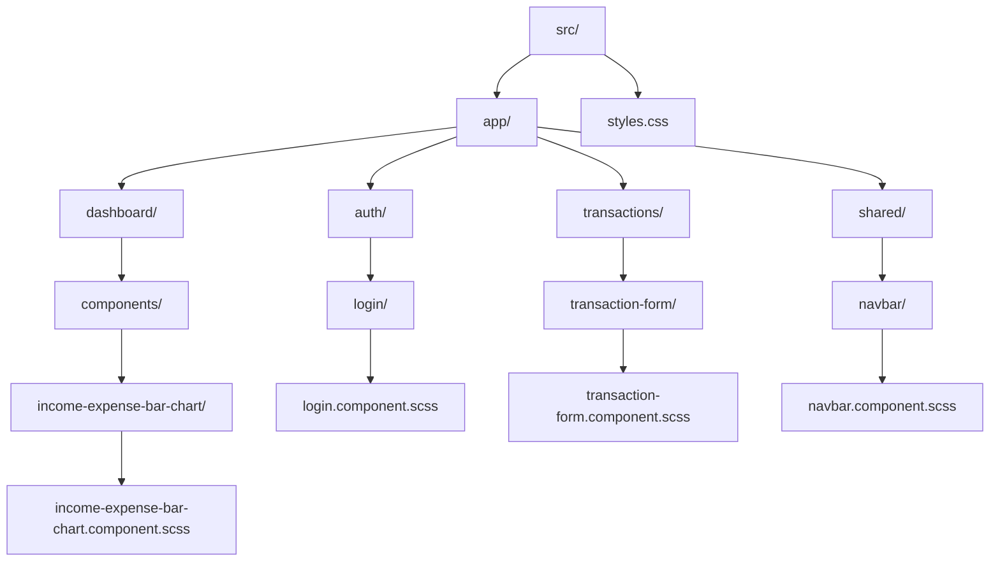
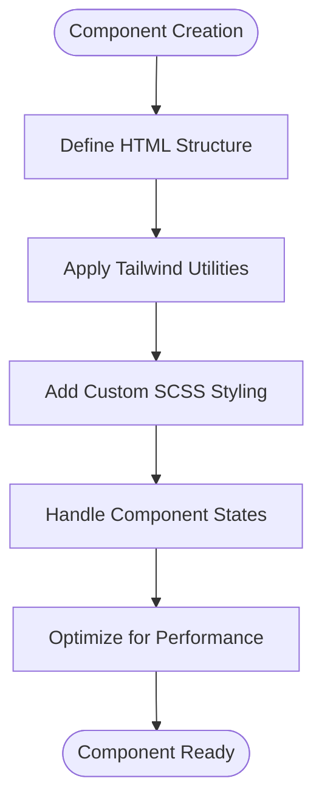
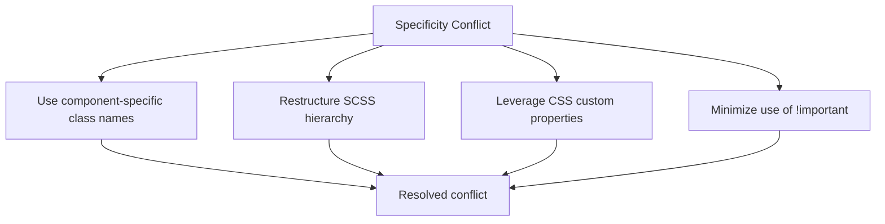

# Component-Level SCSS Styling

<cite>
**Referenced Files in This Document**   
- [income-expense-bar-chart.component.scss](file://src/app/dashboard/components/income-expense-bar-chart/income-expense-bar-chart.component.scss)
- [expense-chart.component.scss](file://src/app/dashboard/components/expense-chart/expense-chart.component.scss)
- [navbar.component.scss](file://src/app/shared/components/navbar/navbar.component.scss)
- [dashboard.component.scss](file://src/app/dashboard/dashboard.component.scss)
- [transaction-form.component.scss](file://src/app/transactions/transaction-form/transaction-form.component.scss)
- [login.component.scss](file://src/app/auth/login/login.component.scss)
- [footer.component.scss](file://src/app/shared/components/footer/footer.component.scss)
- [styles.css](file://src/styles.css)
</cite>

## Table of Contents
1. [Introduction](#introduction)
2. [Project Structure and SCSS Organization](#project-structure-and-scss-organization)
3. [Core Components and SCSS Usage](#core-components-and-scss-usage)
4. [Angular View Encapsulation Strategies](#angular-view-encapsulation-strategies)
5. [SCSS Features in Component Styling](#scss-features-in-component-styling)
6. [Styling Complex Visual Components](#styling-complex-visual-components)
7. [Performance Implications of Style Scoping](#performance-implications-of-style-scoping)
8. [SCSS vs. Tailwind: Usage Guidance](#scss-vs-tailwind-usage-guidance)
9. [Maintaining Visual Consistency](#maintaining-visual-consistency)
10. [Common Issues and Solutions](#common-issues-and-solutions)
11. [Conclusion](#conclusion)

## Introduction
This document provides a comprehensive analysis of component-level SCSS styling within an Angular application that integrates Tailwind CSS. It explores how encapsulated SCSS files are used to define custom visual styles beyond utility classes, the impact of Angular's view encapsulation strategies, and best practices for maintaining consistent and performant styling across components.

## Project Structure and SCSS Organization
The project follows a feature-based organization with SCSS files colocated alongside their corresponding Angular components. Each component has its own `.component.scss` file for encapsulated styles, ensuring modularity and maintainability.



**Diagram sources**
- [income-expense-bar-chart.component.scss](file://src/app/dashboard/components/income-expense-bar-chart/income-expense-bar-chart.component.scss)
- [login.component.scss](file://src/app/auth/login/login.component.scss)
- [transaction-form.component.scss](file://src/app/transactions/transaction-form/transaction-form.component.scss)
- [navbar.component.scss](file://src/app/shared/components/navbar/navbar.component.scss)
- [styles.css](file://src/styles.css)

**Section sources**
- [src/app](file://src/app)
- [src/styles.css](file://src/styles.css)

## Core Components and SCSS Usage
Component-specific SCSS files are used to define custom styles that extend beyond what Tailwind utilities can provide. These styles are encapsulated within each component's scope, preventing style bleed and ensuring predictable styling behavior.

**Section sources**
- [income-expense-bar-chart.component.scss](file://src/app/dashboard/components/income-expense-bar-chart/income-expense-bar-chart.component.scss)
- [expense-chart.component.scss](file://src/app/dashboard/components/expense-chart/expense-chart.component.scss)
- [transaction-form.component.scss](file://src/app/transactions/transaction-form/transaction-form.component.scss)

## Angular View Encapsulation Strategies
Angular provides three view encapsulation strategies that affect how component styles are scoped:

- **Emulated**: Default strategy that emulates shadow DOM by preprocessing styles and adding attribute selectors
- **ShadowDom**: Uses native browser shadow DOM for true style encapsulation
- **None**: Disables style encapsulation, making styles global

The current implementation relies on Angular's default emulated encapsulation, which ensures component styles do not leak to other components while allowing global styles from Tailwind to be applied.

**Section sources**
- [angular.json](file://angular.json#L0-L46)
- [tsconfig.json](file://tsconfig.json#L0-L26)

## SCSS Features in Component Styling
SCSS features such as nesting, variables, and mixins enhance readability and reuse within component styles. Although the current SCSS files contain minimal styling, the structure supports advanced SCSS features for future expansion.

```mermaid
classDiagram
class ComponentSCSS {
+nesting for hierarchical selectors
+variables for theme consistency
+mixins for reusable style patterns
+partials for modular organization
}
ComponentSCSS --> : uses : "SCSS preprocessing"
ComponentSCSS --> : integrates : "Tailwind CSS"
```

**Diagram sources**
- [navbar.component.scss](file://src/app/shared/components/navbar/navbar.component.scss#L0-L3)
- [dashboard.component.scss](file://src/app/dashboard/dashboard.component.scss#L0-L3)

## Styling Complex Visual Components
Complex visual components like charts require custom CSS that goes beyond utility classes. The income-expense-bar-chart and expense-chart components have dedicated SCSS files to handle their specific styling needs, including chart dimensions, color schemes, and animation effects.



**Diagram sources**
- [income-expense-bar-chart.component.scss](file://src/app/dashboard/components/income-expense-bar-chart/income-expense-bar-chart.component.scss)
- [expense-chart.component.scss](file://src/app/dashboard/components/expense-chart/expense-chart.component.scss)

**Section sources**
- [income-expense-bar-chart.component.scss](file://src/app/dashboard/components/income-expense-bar-chart/income-expense-bar-chart.component.scss)
- [expense-chart.component.scss](file://src/app/dashboard/components/expense-chart/expense-chart.component.scss)

## Performance Implications of Style Scoping
Component-scoped styles improve performance by reducing the global CSS footprint and minimizing style recalculation. The current configuration includes build-time budgets that warn when component styles exceed 4kB, encouraging efficient styling practices.

Global styles in `styles.css` contain Tailwind directives that are processed during build time, while component SCSS files are compiled and scoped to their respective components, balancing global consistency with local specificity.

**Section sources**
- [angular.json](file://angular.json#L0-L46)
- [styles.css](file://src/styles.css#L0-L3)

## SCSS vs. Tailwind: Usage Guidance
The project combines Tailwind CSS for utility-based styling with SCSS for component-specific custom styles. General guidelines include:

- Use Tailwind utilities for layout, spacing, typography, and basic styling
- Use SCSS for complex visual components, animations, and browser-specific styling
- Use SCSS variables for theme consistency when not covered by Tailwind
- Avoid overriding Tailwind utilities with SCSS unless necessary

This hybrid approach leverages the rapid development benefits of Tailwind while maintaining the flexibility of SCSS for complex styling requirements.

**Section sources**
- [styles.css](file://src/styles.css#L0-L3)
- [navbar.component.scss](file://src/app/shared/components/navbar/navbar.component.scss)

## Maintaining Visual Consistency
Visual consistency is maintained through a combination of Tailwind's design system and component-level SCSS variables. The global `styles.css` file imports Tailwind's base, components, and utilities layers, establishing a consistent foundation across the application.

Component SCSS files extend this foundation with custom styles for specific visual elements, ensuring that complex components maintain alignment with the overall design language while implementing their unique requirements.

**Section sources**
- [styles.css](file://src/styles.css#L0-L3)
- [dashboard.component.scss](file://src/app/dashboard/dashboard.component.scss#L0-L3)

## Common Issues and Solutions
Common styling issues in Angular components include style bleed, specificity conflicts, and integration challenges between utility classes and custom CSS.

### Style Bleed Solutions
- Rely on Angular's default emulated encapsulation
- Use `::ng-deep` sparingly and with caution (deprecated)
- Prefer CSS custom properties for theme variables
- Use unique class names for component-specific styles

### Specificity Conflict Management
- Structure SCSS to avoid !important declarations
- Use component-specific class names to increase specificity when needed
- Organize styles hierarchically to maintain predictable cascading



**Diagram sources**
- [transaction-form.component.scss](file://src/app/transactions/transaction-form/transaction-form.component.scss)
- [login.component.scss](file://src/app/auth/login/login.component.scss)

**Section sources**
- [transaction-form.component.scss](file://src/app/transactions/transaction-form/transaction-form.component.scss)
- [login.component.scss](file://src/app/auth/login/login.component.scss)

## Conclusion
The component-level SCSS styling approach in this Angular application effectively balances the rapid development benefits of Tailwind CSS with the flexibility of custom SCSS for complex visual components. By leveraging Angular's view encapsulation, the architecture ensures style isolation while maintaining visual consistency through a well-structured combination of global utilities and component-specific styles. This hybrid approach provides a scalable foundation for building maintainable and performant user interfaces.