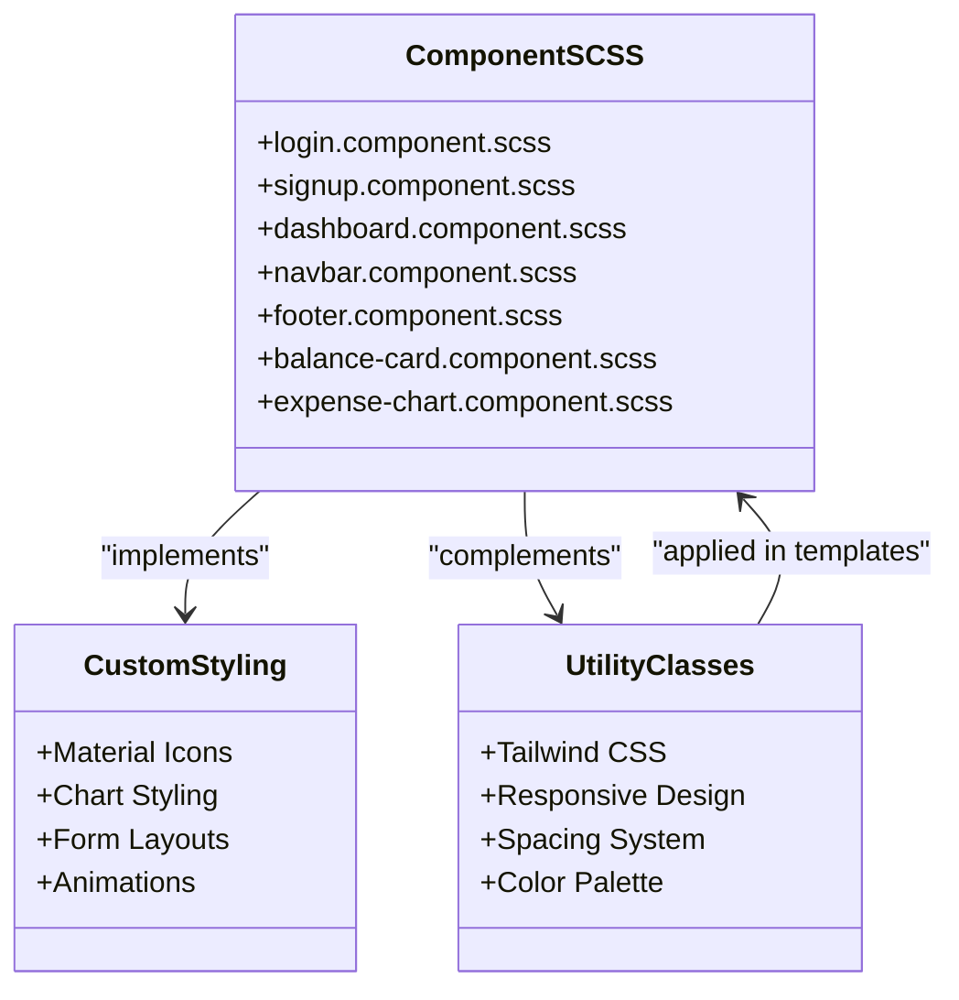
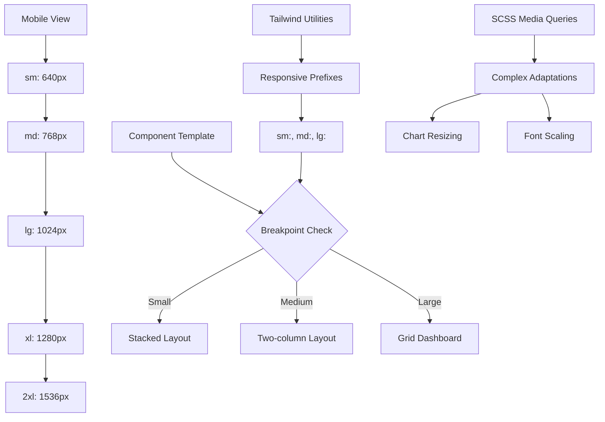
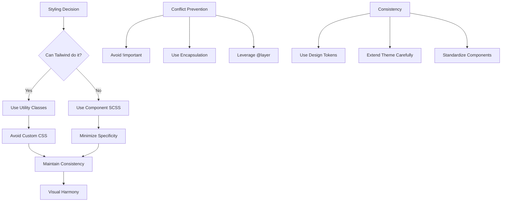
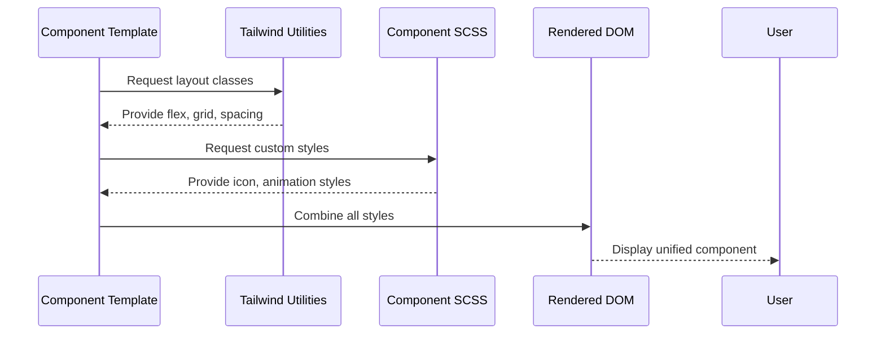

# Styling Strategy

<cite>
**Referenced Files in This Document**   
- [styles.css](file://src/styles.css)
- [tailwind.config.js](file://tailwind.config.js)
- [login.component.scss](file://src/app/auth/login/login.component.scss)
- [signup.component.scss](file://src/app/auth/signup/signup.component.scss)
- [dashboard.component.scss](file://src/app/dashboard/dashboard.component.scss)
- [navbar.component.scss](file://src/app/shared/components/navbar/navbar.component.scss)
- [footer.component.scss](file://src/app/shared/components/footer/footer.component.scss)
- [balance-card.component.scss](file://src/app/dashboard/components/balance-card/balance-card.component.scss)
- [expense-chart.component.scss](file://src/app/dashboard/components/expense-chart/expense-chart.component.scss)
- [income-expense-bar-chart.component.scss](file://src/app/dashboard/components/income-expense-bar-chart/income-expense-bar-chart.component.scss)
- [profile-view.component.scss](file://src/app/profile/profile-view/profile-view.component.scss)
- [package.json](file://package.json)
- [angular.json](file://angular.json)
</cite>

## Table of Contents
1. [Introduction](#introduction)
2. [Global Styles Integration](#global-styles-integration)
3. [Tailwind Configuration](#tailwind-configuration)
4. [Component-Level SCSS Architecture](#component-level-scss-architecture)
5. [Responsive Design Implementation](#responsive-design-implementation)
6. [Styling Guidelines and Best Practices](#styling-guidelines-and-best-practices)
7. [Combined Styling Examples](#combined-styling-examples)
8. [Conclusion](#conclusion)

## Introduction
This document outlines the styling architecture of the Angular application that combines Tailwind CSS utility classes with SCSS for component-specific styling. The hybrid approach enables rapid UI development through utility-first classes while maintaining flexibility for custom designs through SCSS. This strategy ensures visual consistency, responsive behavior, and maintainable code across the application.

## Global Styles Integration

The global styling system is centered around the `styles.css` file, which serves as the foundation for all visual elements in the application. This file imports the three core layers of Tailwind CSS: base, components, and utilities. The base layer resets browser defaults and applies global typography and color settings. The components layer provides a space for defining reusable component classes, while the utilities layer includes all atomic CSS classes available throughout the application.

Custom global styles are applied selectively for third-party libraries or consistent design tokens that extend beyond Tailwind's default configuration. For example, Material Icons are consistently styled across components to maintain uniform icon sizing.

**Section sources**
- [styles.css](file://src/styles.css#L1-L3)
- [navbar.component.scss](file://src/app/shared/components/navbar/navbar.component.scss#L2-L3)
- [balance-card.component.scss](file://src/app/dashboard/components/balance-card/balance-card.component.scss#L2-L3)

## Tailwind Configuration

The `tailwind.config.js` file defines the framework's behavior and integration with the Angular project. The content configuration specifies that Tailwind should scan all HTML and TypeScript files within the `src/` directory to detect utility class usage. This ensures that only used classes are included in the final build, optimizing bundle size through tree-shaking.

Currently, the theme extension is empty, indicating reliance on Tailwind's default design system for colors, spacing, typography, and breakpoints. The plugins array is also empty, suggesting no additional Tailwind plugins are currently in use. This minimal configuration provides a stable foundation that can be extended as design requirements evolve.

The integration with Angular is facilitated through build tools that process SCSS files and apply Tailwind directives. This setup allows components to use both utility classes in templates and custom SCSS in component style files.

```mermaid
graph TB
A[Tailwind Configuration] --> B[Content Scanning]
A --> C[Theme Settings]
A --> D[Plugin System]
B --> E[HTML Templates]
B --> F[TypeScript Files]
C --> G[Default Design Tokens]
D --> H[No Active Plugins]
I[styles.css] --> J[@tailwind base]
I --> K[@tailwind components]
I --> L[@tailwind utilities]
J --> M[Normalize Styles]
K --> N[Component Classes]
L --> O[Utility Classes]
```

**Diagram sources**
- [tailwind.config.js](file://tailwind.config.js#L1-L9)
- [styles.css](file://src/styles.css#L1-L3)

**Section sources**
- [tailwind.config.js](file://tailwind.config.js#L1-L9)
- [package.json](file://package.json)
- [angular.json](file://angular.json)

## Component-Level SCSS Architecture

Component-specific styling is implemented using SCSS files that accompany Angular components. This approach follows Angular's encapsulated styling model, where styles are scoped to individual components. The SCSS files are used for styling that cannot be easily achieved with Tailwind utility classes alone, such as complex animations, pseudo-elements, or library integrations.

The component SCSS architecture follows a consistent pattern across the application:
- Authentication components (login, signup) have dedicated SCSS files for form styling
- Dashboard components use SCSS for chart rendering and data visualization
- Shared UI components (navbar, footer) apply SCSS for consistent navigation elements
- Profile and transaction components utilize SCSS for layout customization

This modular approach ensures that custom styles remain isolated and maintainable. The SCSS files primarily focus on structural styling and third-party library integration, while deferring to Tailwind for spacing, colors, and responsive behavior.



**Diagram sources**
- [login.component.scss](file://src/app/auth/login/login.component.scss)
- [signup.component.scss](file://src/app/auth/signup/signup.component.scss)
- [dashboard.component.scss](file://src/app/dashboard/dashboard.component.scss)
- [navbar.component.scss](file://src/app/shared/components/navbar/navbar.component.scss)

**Section sources**
- [login.component.scss](file://src/app/auth/login/login.component.scss)
- [signup.component.scss](file://src/app/auth/signup/signup.component.scss)
- [dashboard.component.scss](file://src/app/dashboard/dashboard.component.scss)
- [navbar.component.scss](file://src/app/shared/components/navbar/navbar.component.scss)
- [footer.component.scss](file://src/app/shared/components/footer/footer.component.scss)

## Responsive Design Implementation

Responsive design is primarily achieved through Tailwind's breakpoint system, which provides a mobile-first approach to layout adaptation. The framework's default breakpoints (sm, md, lg, xl, 2xl) are utilized throughout component templates to create fluid interfaces that adapt to different screen sizes.

While the current configuration uses Tailwind's default breakpoints without customization, the system is fully operational across all components. Utility classes with breakpoint prefixes (e.g., `md:flex`, `lg:grid`) are applied directly in HTML templates to control layout behavior at different viewport widths.

The combination with SCSS allows for more complex responsive behaviors when needed. For example, dashboard components can use SCSS media queries for chart-specific adaptations while relying on Tailwind for overall layout structure. This hybrid approach provides maximum flexibility for responsive design implementation.



**Diagram sources**
- [tailwind.config.js](file://tailwind.config.js#L4-L6)
- [dashboard.component.scss](file://src/app/dashboard/dashboard.component.scss)
- [income-expense-bar-chart.component.scss](file://src/app/dashboard/components/income-expense-bar-chart/income-expense-bar-chart.component.scss)

**Section sources**
- [tailwind.config.js](file://tailwind.config.js#L4-L6)
- [dashboard.component.scss](file://src/app/dashboard/dashboard.component.scss)
- [income-expense-bar-chart.component.scss](file://src/app/dashboard/components/income-expense-bar-chart/income-expense-bar-chart.component.scss)

## Styling Guidelines and Best Practices

To ensure maintainable and consistent styling across the application, the following guidelines are recommended:

### Utility Class Priority
- Use Tailwind utility classes for layout, spacing, colors, and typography
- Apply utility classes directly in component templates for maximum reusability
- Avoid creating custom CSS classes that replicate Tailwind functionality
- Leverage Tailwind's responsive prefixes for mobile-first design

### SCSS Usage Constraints
- Reserve SCSS for styling that cannot be achieved with utility classes
- Use SCSS primarily for third-party library integration (charts, icons)
- Keep component SCSS files focused and minimal
- Avoid deep nesting and excessive specificity

### Specificity Management
- Prevent specificity conflicts by avoiding `!important` declarations
- Utilize Angular's view encapsulation to contain component styles
- When extending Tailwind, use the `@layer` directive in component SCSS
- Maintain consistent class naming conventions

### Visual Consistency
- Rely on Tailwind's design system for color, spacing, and typography
- Extend the theme only when necessary through `tailwind.config.js`
- Use consistent icon sizing and spacing patterns
- Implement shared component styles through Angular's shared module



**Diagram sources**
- [styles.css](file://src/styles.css#L1-L3)
- [tailwind.config.js](file://tailwind.config.js#L5-L7)
- [angular.json](file://angular.json)

**Section sources**
- [styles.css](file://src/styles.css#L1-L3)
- [tailwind.config.js](file://tailwind.config.js#L5-L7)
- [angular.json](file://angular.json)

## Combined Styling Examples

The most effective component styling occurs when Tailwind utility classes and SCSS work together seamlessly. Several patterns demonstrate this integration:

### Dashboard Card Components
Dashboard cards use Tailwind for layout and spacing while applying SCSS for icon styling. The balance card, for example, uses utility classes for padding, margins, and background colors, while the SCSS file adjusts Material Icon size for visual consistency. This separation of concerns allows layout changes to be made in templates without touching style files.

### Form Components
Authentication forms leverage Tailwind's form utilities for input styling and validation states, while using SCSS for form-specific layout requirements. The login and signup components use utility classes for responsive behavior and spacing, with minimal SCSS for any custom form elements.

### Data Visualization
Chart components rely heavily on SCSS for rendering library integration, while using Tailwind for container layout and positioning. The expense chart component uses utility classes to control its grid placement and responsive behavior, while the SCSS file handles chart-specific styling requirements.

These patterns demonstrate the optimal balance between utility-first development and custom styling, ensuring both development speed and design flexibility.



**Diagram sources**
- [balance-card.component.scss](file://src/app/dashboard/components/balance-card/balance-card.component.scss)
- [login.component.scss](file://src/app/auth/login/login.component.scss)
- [expense-chart.component.scss](file://src/app/dashboard/components/expense-chart/expense-chart.component.scss)
- [dashboard.component.html](file://src/app/dashboard/dashboard.component.html)

**Section sources**
- [balance-card.component.scss](file://src/app/dashboard/components/balance-card/balance-card.component.scss)
- [login.component.scss](file://src/app/auth/login/login.component.scss)
- [expense-chart.component.scss](file://src/app/dashboard/components/expense-chart/expense-chart.component.scss)
- [profile-view.component.scss](file://src/app/profile/profile-view/profile-view.component.scss)

## Conclusion
The styling architecture successfully combines Tailwind CSS and SCSS to create a flexible, maintainable, and consistent design system. By leveraging Tailwind's utility classes for foundational styling and reserving SCSS for component-specific requirements, the application achieves both development efficiency and design flexibility. The current implementation provides a solid foundation that can be extended with custom theme configurations and plugins as design requirements evolve. Following the established guidelines ensures visual consistency and prevents common styling pitfalls across the codebase.