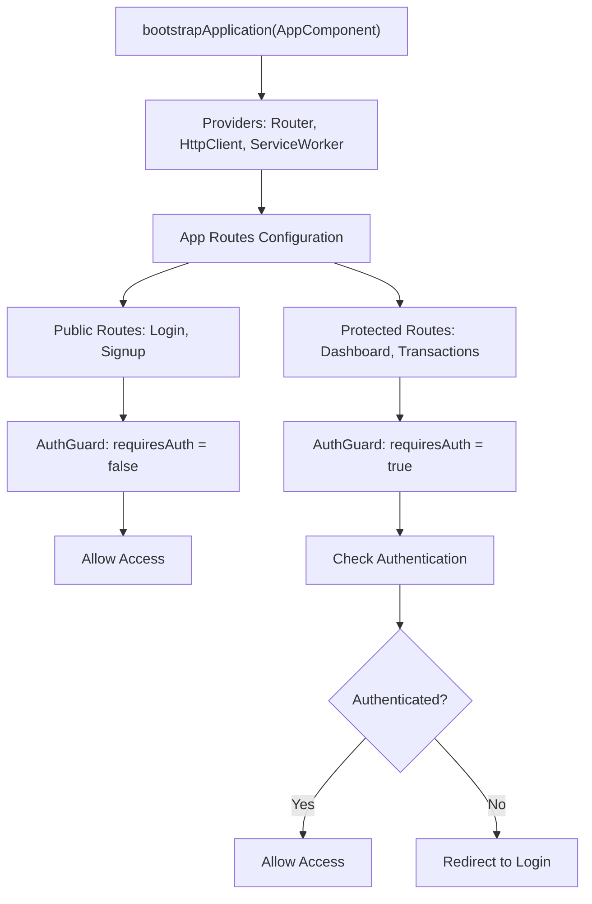
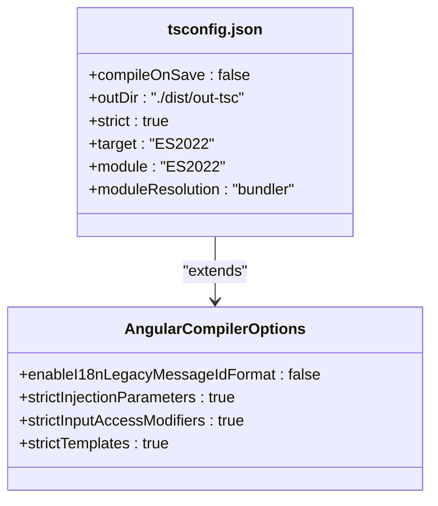
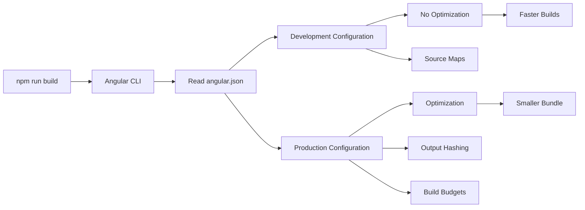
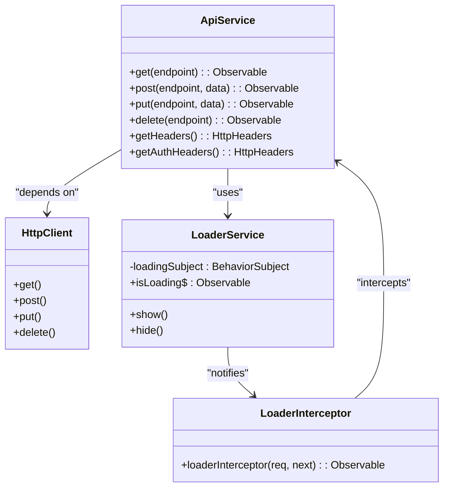
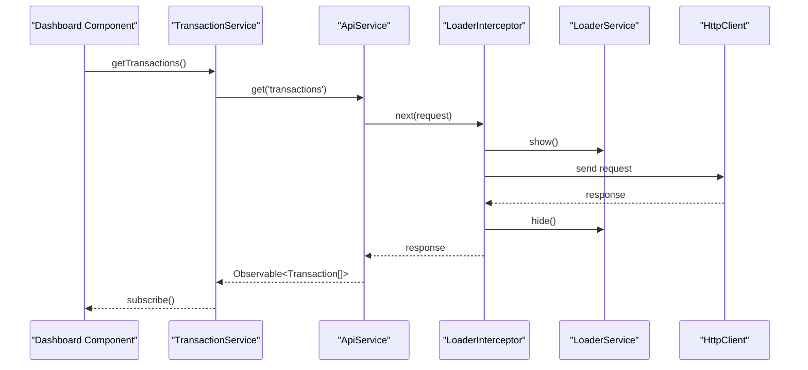

# Technology Stack & Dependencies

<cite>
**Referenced Files in This Document**  
- [package.json](file://package.json)
- [angular.json](file://angular.json)
- [tsconfig.json](file://tsconfig.json)
- [tailwind.config.js](file://tailwind.config.js)
- [app.config.ts](file://src/app/app.config.ts)
- [main.ts](file://src/main.ts)
- [app.routes.ts](file://src/app/app.routes.ts)
- [api.service.ts](file://src/app/shared/services/api.service.ts)
- [auth.guard.ts](file://src/app/shared/services/auth.guard.ts)
- [loader.interceptor.ts](file://src/app/shared/interceptors/loader.interceptor.ts)
- [loader.service.ts](file://src/app/shared/services/loader.service.ts)
- [auth.service.ts](file://src/app/auth/auth.service.ts)
- [user.service.ts](file://src/app/shared/services/user.service.ts)
- [transaction.service.ts](file://src/app/shared/services/transaction.service.ts)
</cite>

## Table of Contents
1. [Angular v17+ Framework](#angular-v17-framework)
2. [Tailwind CSS Integration](#tailwind-css-integration)
3. [TypeScript Configuration](#typescript-configuration)
4. [Angular CLI & Build Tooling](#angular-cli--build-tooling)
5. [Core Dependencies](#core-dependencies)
6. [Technology Interactions](#technology-interactions)
7. [Performance Implications](#performance-implications)
8. [Development Experience Benefits](#development-experience-benefits)

## Angular v17+ Framework

Angular v19.2.0 serves as the core framework for component architecture, dependency injection, and application structure. The application leverages standalone components and the `bootstrapApplication` API in `main.ts` to initialize the app without a traditional `AppModule`, reflecting modern Angular practices. Component architecture is organized in a feature-based structure under the `src/app` directory, with dedicated folders for `auth`, `dashboard`, `transactions`, `categories`, `profile`, and `shared` components.

Dependency injection is implemented through Angular's provider system, configured in `app.config.ts` and `main.ts`. The `appConfig` object provides essential services such as routing, HTTP client, and service workers. This centralized provider configuration enables tree-shakable services and improves bundle optimization.

Routing is implemented using Angular Router v19.2.0 with lazy-loaded routes and route guards. The `routes` array in `app.routes.ts` defines both authenticated and public routes, using `loadComponent` syntax for code splitting. The `AuthGuard` service protects routes based on authentication state, redirecting users appropriately based on the `requiresAuth` data property.

**Diagram sources**  
- [main.ts](file://src/main.ts#L1-L16)
- [app.config.ts](file://src/app/app.config.ts#L0-L12)
- [app.routes.ts](file://src/app/app.routes.ts#L0-L83)
- [auth.guard.ts](file://src/app/shared/services/auth.guard.ts#L0-L29)

**Section sources**  
- [main.ts](file://src/main.ts#L1-L16)
- [app.config.ts](file://src/app/app.config.ts#L0-L12)
- [app.routes.ts](file://src/app/app.routes.ts#L0-L83)

## Tailwind CSS Integration

Tailwind CSS v3.4.0 is integrated as the utility-first styling framework, enabling rapid UI development with atomic classes. The configuration in `tailwind.config.js` specifies content paths to scan for class usage, ensuring unused styles are purged in production builds. The content array includes all HTML and TypeScript files under `src/`, allowing Tailwind to detect classes used in Angular templates.

The framework enables responsive design through breakpoint prefixes (e.g., `sm:`, `md:`, `lg:`) and supports dark mode, hover states, and focus variants directly in class names. Components like `sidebar.component.html` demonstrate the utility-first approach with classes such as `flex items-center px-4 py-3 text-gray-700 rounded-lg hover:bg-gray-100 transition-colors`. This approach eliminates the need for custom CSS files in most components, with SCSS files only used for component-specific overrides when necessary.

The integration with Angular's component encapsulation works seamlessly, as Tailwind classes are applied directly to template elements and respect view encapsulation. The build process leverages PostCSS (via `postcss` and `autoprefixer` in devDependencies) to process Tailwind directives and generate optimized CSS.

**Section sources**  
- [tailwind.config.js](file://tailwind.config.js#L0-L9)
- [sidebar.component.html](file://src/app/shared/components/sidebar/sidebar.component.html#L27-L55)

## TypeScript Configuration

TypeScript v5.7.2 is configured through `tsconfig.json` and `tsconfig.app.json` to ensure type safety and modern JavaScript features. The base `tsconfig.json` enforces strict compilation options including `strict`, `noImplicitOverride`, `noImplicitReturns`, and `noFallthroughCasesInSwitch`, which help catch common programming errors at compile time.

Key compiler options include:
- **target**: ES2022 for modern browser support
- **module**: ES2022 for native module syntax
- **moduleResolution**: "bundler" for compatibility with modern build tools
- **strictTemplates**: Enabled in Angular compiler options for type checking in templates
- **isolatedModules**: Enabled for compatibility with transpilation tools

The configuration supports experimental decorators (`experimentalDecorators: true`) required by Angular's decorator-based syntax. The `importHelpers` option reduces bundle size by importing helper functions from `tslib` rather than duplicating them across files.

**Diagram sources**  
- [tsconfig.json](file://tsconfig.json#L0-L27)

**Section sources**  
- [tsconfig.json](file://tsconfig.json#L0-L27)

## Angular CLI & Build Tooling

Angular CLI v19.2.16 provides the primary build and development tooling through `angular.json`. The configuration defines build targets for development and production, with distinct settings for each environment. The production configuration includes build budgets that enforce size limits (500kB warning, 1MB error for initial bundle) and enables output hashing for cache busting.

Key build features include:
- **Application builder**: `@angular-devkit/build-angular:application` for modern build outputs
- **Asset handling**: Public folder assets are copied to output via glob pattern
- **Style processing**: Global styles.css is processed with Tailwind directives
- **Service worker**: Configured for production with `ngsw-config.json`
- **Development server**: Hot reload capabilities through `ng serve`

The `scripts` section in `package.json` defines npm scripts that wrap Angular CLI commands, including `start`, `build`, `test`, and a custom `deploy` script that builds and deploys to Netlify. This integration streamlines the development workflow and enables CI/CD pipelines.

**Diagram sources**  
- [angular.json](file://angular.json#L0-L97)
- [package.json](file://package.json#L0-L46)

**Section sources**  
- [angular.json](file://angular.json#L0-L97)
- [package.json](file://package.json#L0-L46)

## Core Dependencies

### RxJS for Observables
RxJS v7.8.0 is used throughout the application for reactive programming patterns. Services like `ApiService`, `TransactionService`, and `LoaderService` return Observables for asynchronous operations, enabling powerful composition with operators like `map`, `tap`, and `catchError`. The `LoaderService` uses a `BehaviorSubject` to manage loading state across components, demonstrating state management through observables.

### Angular Router for Navigation
Angular Router v19.2.0 handles client-side navigation with a declarative routing configuration. The router enables features like:
- Lazy loading via `loadComponent`
- Route guards for authentication
- Route parameters (e.g., `:id` in transaction edit routes)
- Navigation events and active route detection
- Child routes and nested layouts

### HttpClientModule for API Communication
HttpClientModule provides the foundation for API communication through the `HttpClient` service. The `ApiService` wrapper implements consistent request patterns with authentication headers, error handling, and type safety. Key features include:
- Interceptor pattern (via `loader.interceptor.ts`) for cross-cutting concerns
- Observable-based async operations
- Type-safe HTTP methods with generics
- Blob response handling for file downloads

Additional dependencies include:
- **zone.js**: Enables Angular's change detection by patching browser async APIs
- **tslib**: Provides helper functions for TypeScript features, reducing bundle size
- **service-worker**: Enables PWA capabilities with offline support
- **chart.js**: Used for data visualization in dashboard components

**Diagram sources**  
- [api.service.ts](file://src/app/shared/services/api.service.ts#L0-L93)
- [loader.interceptor.ts](file://src/app/shared/interceptors/loader.interceptor.ts#L0-L10)
- [loader.service.ts](file://src/app/shared/services/loader.service.ts#L0-L17)

**Section sources**  
- [api.service.ts](file://src/app/shared/services/api.service.ts#L0-L93)
- [loader.interceptor.ts](file://src/app/shared/interceptors/loader.interceptor.ts#L0-L10)
- [loader.service.ts](file://src/app/shared/services/loader.service.ts#L0-L17)
- [auth.service.ts](file://src/app/auth/auth.service.ts#L34-L120)
- [user.service.ts](file://src/app/shared/services/user.service.ts#L0-L30)
- [transaction.service.ts](file://src/app/shared/services/transaction.service.ts#L0-L79)

## Technology Interactions

The technology stack components interact through well-defined patterns that promote maintainability and scalability. The bootstrap process in `main.ts` initializes the application with providers that configure routing, HTTP, and service workers. When a user navigates to a route, Angular Router activates the appropriate component, which may inject services like `ApiService` to fetch data.

The HTTP request lifecycle demonstrates key interactions:
1. A component calls a service method (e.g., `transactionService.getTransactions()`)
2. The service returns an Observable from `apiService.get()`
3. The `loader.interceptor` detects the request and notifies `loaderService`
4. `loaderService` updates its `isLoading$` subject, showing the loading spinner
5. HttpClient sends the request with appropriate headers (including Authorization)
6. Upon response, the interceptor hides the loader and the component processes data

Authentication flows integrate multiple technologies:
- `auth.service` manages token storage in localStorage
- `AuthGuard` uses route data to determine access requirements
- Google/GitHub login opens popups and monitors window state
- `api.service` provides the `openAuthPopup` utility for consistent popup behavior

**Diagram sources**  
- [main.ts](file://src/main.ts#L1-L16)
- [app.config.ts](file://src/app/app.config.ts#L0-L12)
- [transaction.service.ts](file://src/app/shared/services/transaction.service.ts#L0-L47)
- [api.service.ts](file://src/app/shared/services/api.service.ts#L0-L93)
- [loader.interceptor.ts](file://src/app/shared/interceptors/loader.interceptor.ts#L0-L10)
- [loader.service.ts](file://src/app/shared/services/loader.service.ts#L0-L17)

**Section sources**  
- [main.ts](file://src/main.ts#L1-L16)
- [app.config.ts](file://src/app/app.config.ts#L0-L12)
- [transaction.service.ts](file://src/app/shared/services/transaction.service.ts#L0-L79)
- [api.service.ts](file://src/app/shared/services/api.service.ts#L0-L93)
- [loader.interceptor.ts](file://src/app/shared/interceptors/loader.interceptor.ts#L0-L10)
- [loader.service.ts](file://src/app/shared/services/loader.service.ts#L0-L17)

## Performance Implications

The technology stack delivers significant performance benefits through several mechanisms:

**Bundle Optimization**: Angular's standalone components and lazy loading reduce initial bundle size. The `loadComponent` syntax in routes ensures code splitting, with only necessary code loaded for the current view. Build budgets in `angular.json` prevent uncontrolled bundle growth.

**Change Detection**: Zone.js enables efficient change detection by tracking async operations. The use of `OnPush` change detection strategy (implied by modern Angular patterns) reduces unnecessary checks, improving rendering performance.

**Caching & Optimization**: Tailwind's JIT compiler generates only used classes, resulting in highly optimized CSS. The framework's utility classes eliminate the need for custom CSS files, reducing HTTP requests.

**Memory Management**: RxJS observables are properly unsubscribed through Angular's async pipe or component lifecycle methods, preventing memory leaks. The `BehaviorSubject` in `LoaderService` provides a single source of truth for loading state.

**Service Worker**: The PWA configuration enables offline capabilities and asset caching, improving load times on subsequent visits and in poor network conditions.

## Development Experience Benefits

The chosen stack provides an excellent development experience through:

**Type Safety**: TypeScript configuration with strict mode catches errors at compile time, reducing runtime bugs. Type definitions for services, models, and API responses ensure consistent data handling.

**Hot Reloading**: Angular CLI's development server provides fast rebuilds and hot module replacement, enabling rapid iteration.

**Developer Tools**: Angular DevTools offer component inspection, RxJS debugging, and performance profiling.

**Consistent Patterns**: The application follows Angular best practices with clear separation of concerns:
- Components handle UI and user interaction
- Services manage business logic and data
- Interceptors handle cross-cutting concerns
- Guards control navigation

**Utility-First Styling**: Tailwind CSS enables rapid UI development without context switching between HTML and CSS files. The responsive design utilities make mobile-first development intuitive.

**Modern JavaScript Features**: The TypeScript configuration supports modern ECMAScript features, allowing developers to use the latest language capabilities while maintaining browser compatibility.