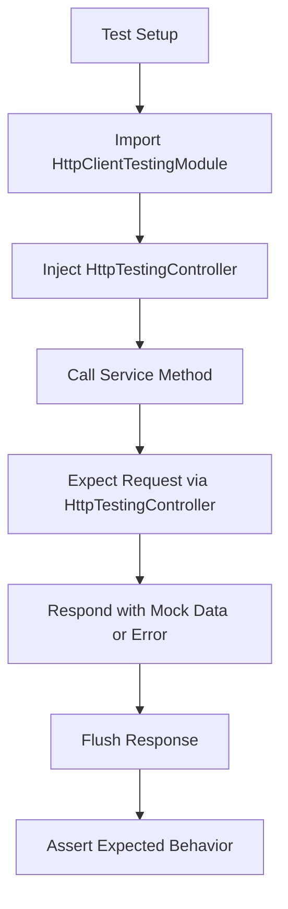
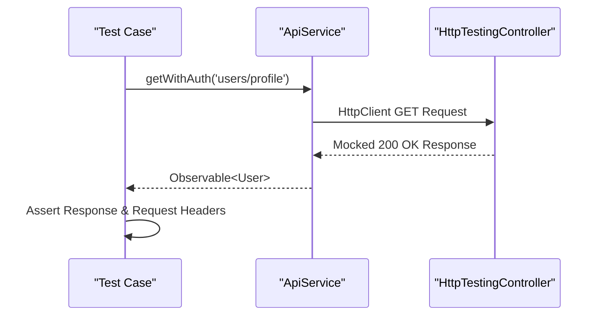
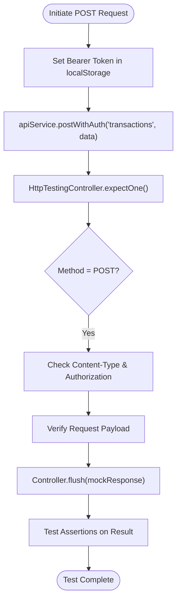
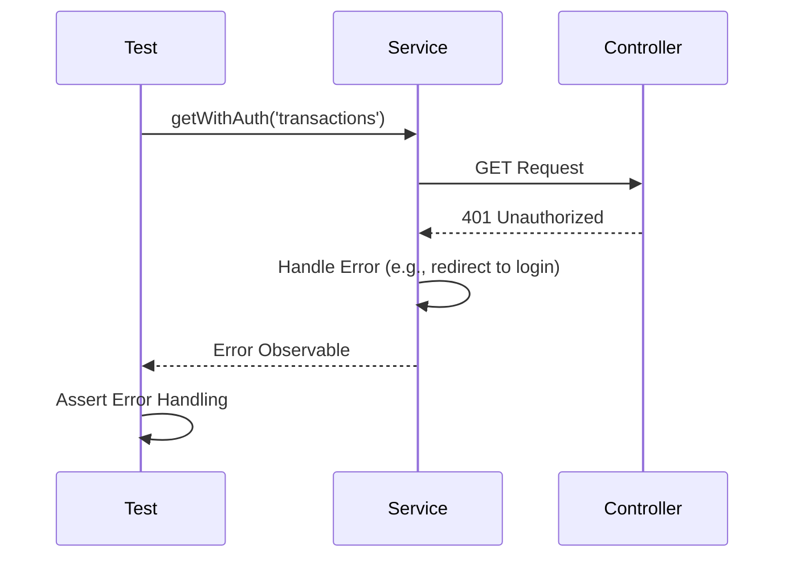
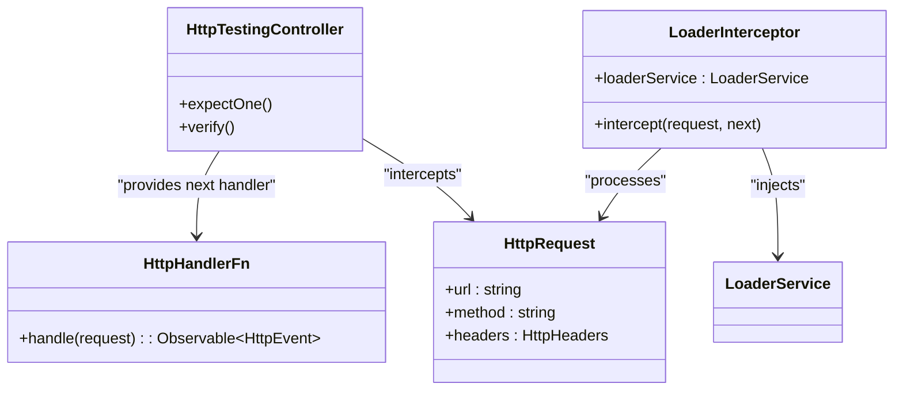
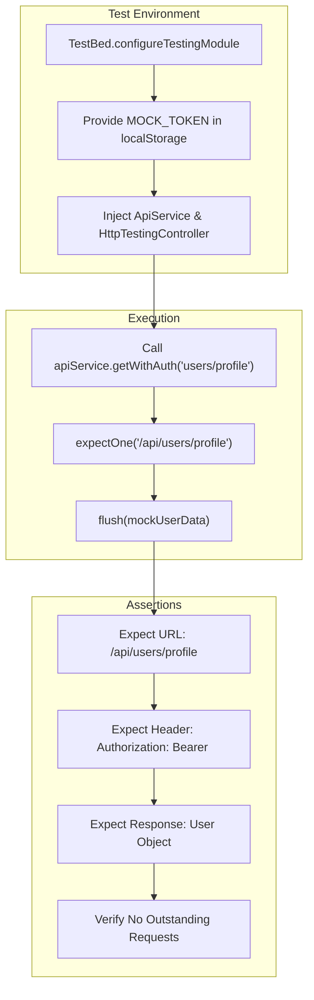

# HTTP Request Mocking

<cite>
**Referenced Files in This Document**   
- [api.service.ts](file://src/app/shared/services/api.service.ts)
- [constants.ts](file://src/app/shared/utils/constants.ts)
- [loader.interceptor.ts](file://src/app/shared/interceptors/loader.interceptor.ts)
- [app.component.spec.ts](file://src/app/app.component.spec.ts)
</cite>

## Table of Contents
1. [Introduction](#introduction)
2. [Core Testing Setup with HttpClientTestingModule](#core-testing-setup-with-httpclienttestingmodule)
3. [Mocking GET Requests and Validating Headers](#mocking-get-requests-and-validating-headers)
4. [Testing POST, PUT, and DELETE Operations](#testing-post-put-and-delete-operations)
5. [Validating URL Construction and Query Parameters](#validating-url-construction-and-query-parameters)
6. [Testing Error Responses and Retry Logic](#testing-error-responses-and-retry-logic)
7. [Testing Loading States with LoaderInterceptor](#testing-loading-states-with-loaderinterceptor)
8. [End-to-End Testing of ApiService Methods](#end-to-end-testing-of-apiservice-methods)
9. [Conclusion](#conclusion)

## Introduction
This document provides a comprehensive guide to mocking HTTP requests in Angular unit tests using `HttpClientTestingModule` and `HttpTestingController`. It covers best practices for testing services that interact with external APIs, including request interception, header validation, response mocking, and verification of loading states. The focus is on the `ApiService` class, which uses constants from `constants.ts` to construct URLs and includes authentication headers via `localStorage`.

## Core Testing Setup with HttpClientTestingModule

To effectively test HTTP interactions in Angular, you must import `HttpClientTestingModule` and use `HttpTestingController` to intercept outgoing requests. This allows full control over mock responses and enables assertions on request parameters.



**Diagram sources**
- [api.service.ts](file://src/app/shared/services/api.service.ts#L1-L94)
- [app.component.spec.ts](file://src/app/app.component.spec.ts#L1-L50)

**Section sources**
- [api.service.ts](file://src/app/shared/services/api.service.ts#L1-L94)
- [app.component.spec.ts](file://src/app/app.component.spec.ts#L1-L50)

## Mocking GET Requests and Validating Headers

When testing GET requests, use `HttpTestingController.expectOne()` to intercept the request and validate its properties such as method type, URL, and headers—especially the Authorization token.



**Diagram sources**
- [api.service.ts](file://src/app/shared/services/api.service.ts#L35-L40)
- [constants.ts](file://src/app/shared/utils/constants.ts#L20-L55)

**Section sources**
- [api.service.ts](file://src/app/shared/services/api.service.ts#L35-L40)
- [constants.ts](file://src/app/shared/utils/constants.ts#L20-L55)

## Testing POST, PUT, and DELETE Operations

For non-GET methods, ensure the request body, headers, and endpoint are correctly sent. Use `expectOne()` with URL or predicate function to match the expected request.



**Diagram sources**
- [api.service.ts](file://src/app/shared/services/api.service.ts#L55-L75)
- [constants.ts](file://src/app/shared/utils/constants.ts#L35-L40)

**Section sources**
- [api.service.ts](file://src/app/shared/services/api.service.ts#L55-L75)

## Validating URL Construction and Query Parameters

The `ApiService` constructs URLs using `API_CONFIG.BASE_URL` and dynamic endpoints. Tests should verify correct URL formation, including path parameters and query strings.

```mermaid
erDiagram
API_CONFIG {
string BASE_URL
object ENDPOINTS
}
API_SERVICE {
string baseUrl
method get<T>(endpoint)
method post<T>(endpoint, data)
}
TEST_CASE {
string expectedUrl
method expectOne(url)
}
API_CONFIG ||--|| API_SERVICE : "uses constant"
TEST_CASE }|--|| API_SERVICE : "calls and verifies"
```

**Diagram sources**
- [constants.ts](file://src/app/shared/utils/constants.ts#L20-L55)
- [api.service.ts](file://src/app/shared/services/api.service.ts#L6-L10)

**Section sources**
- [constants.ts](file://src/app/shared/utils/constants.ts#L20-L55)
- [api.service.ts](file://src/app/shared/services/api.service.ts#L6-L10)

## Testing Error Responses and Retry Logic

Simulate error responses using `controller.flush()` with status codes like 401 or 500. This validates error handling in components and services, including retry mechanisms if implemented.



**Diagram sources**
- [api.service.ts](file://src/app/shared/services/api.service.ts#L35-L40)
- [app.component.spec.ts](file://src/app/app.component.spec.ts#L30-L45)

**Section sources**
- [api.service.ts](file://src/app/shared/services/api.service.ts#L35-L40)

## Testing Loading States with LoaderInterceptor

Although the current `loaderInterceptor` is a placeholder, it's designed to manage UI loading states during HTTP requests. In tests, verify that interceptors are applied and can influence `LoaderService` or similar state management.



**Diagram sources**
- [loader.interceptor.ts](file://src/app/shared/interceptors/loader.interceptor.ts#L1-L12)
- [api.service.ts](file://src/app/shared/services/api.service.ts#L1-L94)

**Section sources**
- [loader.interceptor.ts](file://src/app/shared/interceptors/loader.interceptor.ts#L1-L12)

## End-to-End Testing of ApiService Methods

Comprehensive tests should validate full request-response cycles for key methods like `getWithAuth`, `postWithAuth`, and `deleteWithAuth`, ensuring they use correct endpoints from `constants.ts`, attach proper headers, and return expected data.



**Diagram sources**
- [api.service.ts](file://src/app/shared/services/api.service.ts#L1-L94)
- [constants.ts](file://src/app/shared/utils/constants.ts#L20-L55)
- [app.component.spec.ts](file://src/app/app.component.spec.ts#L1-L50)

**Section sources**
- [api.service.ts](file://src/app/shared/services/api.service.ts#L1-L94)
- [constants.ts](file://src/app/shared/utils/constants.ts#L20-L55)

## Conclusion
Effective HTTP request mocking in Angular requires precise use of `HttpClientTestingModule` and `HttpTestingController` to simulate real-world API interactions. By validating request methods, headers, URLs, payloads, and responses—including errors—you can ensure robust and reliable service layer testing. Future enhancements could include testing retry logic with libraries like `exponential-backoff` and fully implementing the `LoaderInterceptor` to manage UI feedback during requests.