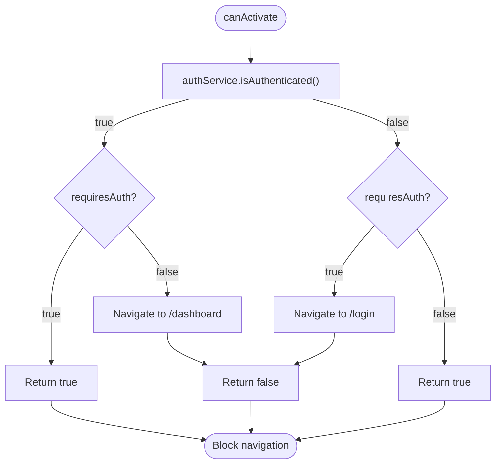
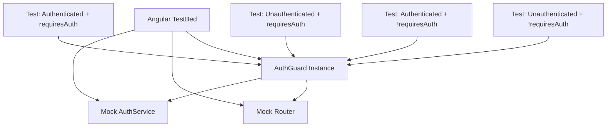
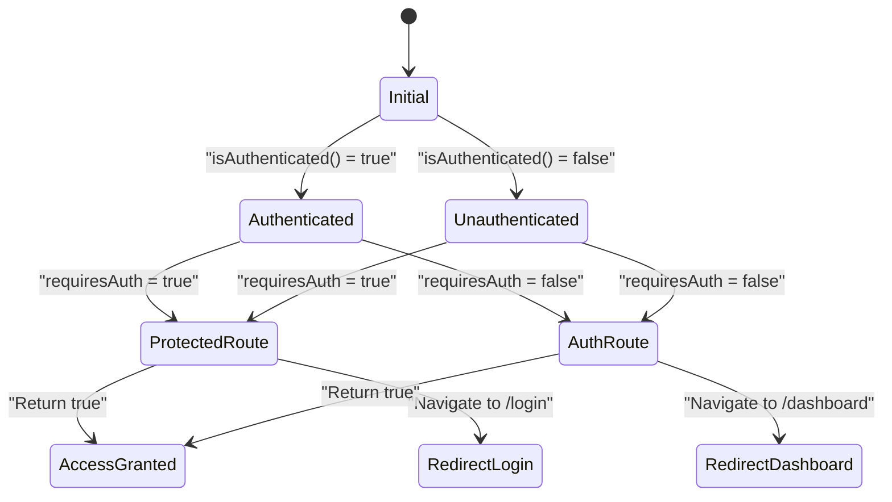

# Route Guard Testing

<cite>
**Referenced Files in This Document**   
- [auth.guard.ts](file://src/app/shared/services/auth.guard.ts)
- [auth.service.ts](file://src/app/auth/auth.service.ts)
- [app.routes.ts](file://src/app/app.routes.ts)
</cite>

## Table of Contents
1. [Introduction](#introduction)
2. [AuthGuard Implementation Overview](#authguard-implementation-overview)
3. [Testing Strategy for Route Guards](#testing-strategy-for-route-guards)
4. [Setting Up the Test Environment](#setting-up-the-test-environment)
5. [Testing Authentication States](#testing-authentication-states)
6. [Simulating Router State and Navigation](#simulating-router-state-and-navigation)
7. [Testing Protected Routes Configuration](#testing-protected-routes-configuration)
8. [Edge Case Testing](#edge-case-testing)
9. [Best Practices for Guard Testing](#best-practices-for-guard-testing)
10. [Conclusion](#conclusion)

## Introduction
This document provides comprehensive guidance on testing Angular route guards, with a focus on the `AuthGuard` implementation in the application. It covers techniques for verifying navigation logic under different authentication states, mocking dependencies, and ensuring complete test coverage. The content is designed to help developers write robust, maintainable tests for route protection mechanisms.

## AuthGuard Implementation Overview

The `AuthGuard` service controls access to routes based on user authentication status and route requirements. It uses the `requiresAuth` flag in route data to determine appropriate behavior for both authenticated and unauthenticated users.



**Diagram sources**
- [auth.guard.ts](file://src/app/shared/services/auth.guard.ts#L15-L29)

**Section sources**
- [auth.guard.ts](file://src/app/shared/services/auth.guard.ts#L1-L30)

## Testing Strategy for Route Guards

Effective testing of route guards requires isolating the guard logic from external dependencies while simulating various authentication scenarios. The strategy involves:
- Mocking the `AuthService` to control authentication state
- Spying on the `Router` service to verify navigation calls
- Using `TestBed` for dependency injection and configuration
- Testing both synchronous return values and side effects (navigation)

## Setting Up the Test Environment

To properly test the `AuthGuard`, configure a testing module with mocked dependencies using Angular's testing utilities. The test setup should provide mock implementations for `AuthService` and `Router`.



**Diagram sources**
- [auth.guard.ts](file://src/app/shared/services/auth.guard.ts#L10-L14)
- [auth.service.ts](file://src/app/auth/auth.service.ts#L10-L15)

**Section sources**
- [auth.guard.ts](file://src/app/shared/services/auth.guard.ts#L1-L30)

## Testing Authentication States

The `AuthGuard` must be tested under four distinct scenarios based on the combination of actual authentication status and route requirements. Each test should verify both the return value and any navigation side effects.

### Testing Logged-In State
When a user is authenticated, the guard should:
- Allow access to protected routes (`requiresAuth: true`)
- Redirect to dashboard when accessing auth routes (`requiresAuth: false`)

### Testing Logged-Out State
When a user is not authenticated, the guard should:
- Redirect to login when accessing protected routes (`requiresAuth: true`)
- Allow access to auth routes (`requiresAuth: false`)



**Diagram sources**
- [auth.guard.ts](file://src/app/shared/services/auth.guard.ts#L15-L29)

**Section sources**
- [auth.guard.ts](file://src/app/shared/services/auth.guard.ts#L1-L30)
- [auth.service.ts](file://src/app/auth/auth.service.ts#L75-L85)

## Simulating Router State and Navigation

Testing requires simulating `ActivatedRouteSnapshot` objects with specific data properties to represent different route configurations. The router's `navigate` method should be spied upon to verify redirection behavior.

### Creating Route Snapshots
Use object literals to create mock `ActivatedRouteSnapshot` instances with the required data:

```typescript
const activatedRouteSnapshot = {
  data: { requiresAuth: true }
} as ActivatedRouteSnapshot;
```

### Verifying Navigation
Spy on the router's `navigate` method to assert that correct navigation occurs:

```typescript
expect(router.navigate).toHaveBeenCalledWith(['/login']);
```

**Section sources**
- [auth.guard.ts](file://src/app/shared/services/auth.guard.ts#L15-L29)
- [app.routes.ts](file://src/app/app.routes.ts#L10-L25)

## Testing Protected Routes Configuration

The route configuration in `app.routes.ts` defines which routes require authentication. Tests should verify that the `AuthGuard` is properly applied to route configurations with appropriate `data` properties.

```mermaid
erDiagram
ROUTE ||--o{ AUTH_GUARD : "canActivate"
ROUTE {
string path
function loadComponent
array canActivate
object data
}
AUTH_GUARD {
boolean requiresAuth
}
ROUTE }o--|| AUTH_GUARD : "data.requiresAuth"
class ROUTE {
path: string
canActivate: AuthGuard[]
data: { requiresAuth: boolean }
}
class AUTH_GUARD {
canActivate(route: ActivatedRouteSnapshot): boolean
}
```

**Diagram sources**
- [app.routes.ts](file://src/app/app.routes.ts#L10-L84)
- [auth.guard.ts](file://src/app/shared/services/auth.guard.ts#L1-L30)

**Section sources**
- [app.routes.ts](file://src/app/app.routes.ts#L1-L84)

## Edge Case Testing

Comprehensive testing should include edge cases that represent real-world scenarios users might encounter.

### Expired Token Handling
Test scenarios where a token exists but is expired or invalid. The `isAuthenticated` method should return `false` when validation fails.

### Redirect Behavior
Verify that after redirection, the guard returns `false` to prevent the original navigation, ensuring users cannot access restricted content.

### Multiple Guard Evaluations
Test that the guard works correctly when multiple routes with different `requiresAuth` values are accessed in sequence.

**Section sources**
- [auth.guard.ts](file://src/app/shared/services/auth.guard.ts#L15-L29)
- [auth.service.ts](file://src/app/auth/auth.service.ts#L85-L95)

## Best Practices for Guard Testing

Adopt these best practices to ensure effective and maintainable route guard tests:

### Isolate Guard Logic
Keep guard tests focused on the guard's logic without testing Angular router internals. Mock all dependencies to isolate the unit under test.

### Use TestBed.inject
Retrieve services using `TestBed.inject` rather than injecting through constructors to ensure proper testing module configuration:

```typescript
const guard = TestBed.inject(AuthGuard);
const authService = TestBed.inject(AuthService);
```

### Test All Code Paths
Ensure 100% code coverage by testing all branches in the `canActivate` method, including both truthy and falsy conditions.

### Verify Side Effects
In addition to return values, verify that `router.navigate` is called with correct arguments when redirection occurs.

### Clear Test State
Reset mocks and localStorage between tests to prevent test pollution:

```typescript
beforeEach(() => {
  localStorage.clear();
  jest.clearAllMocks();
});
```

**Section sources**
- [auth.guard.ts](file://src/app/shared/services/auth.guard.ts#L1-L30)
- [auth.service.ts](file://src/app/auth/auth.service.ts#L85-L95)

## Conclusion
Testing Angular route guards is essential for ensuring proper application security and user experience. By mocking dependencies, simulating router state, and testing all possible authentication scenarios, developers can verify that navigation logic works correctly under various conditions. The `AuthGuard` in this application demonstrates a flexible approach to route protection that can be thoroughly tested using Angular's testing framework. Following best practices for isolation, coverage, and verification of both return values and side effects ensures robust protection of application routes.