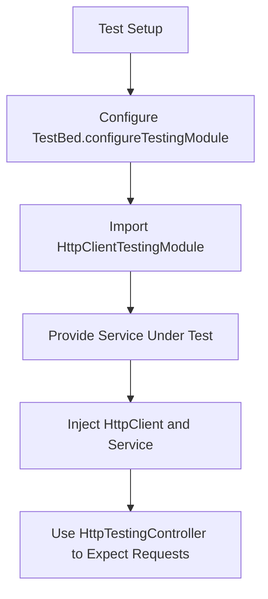
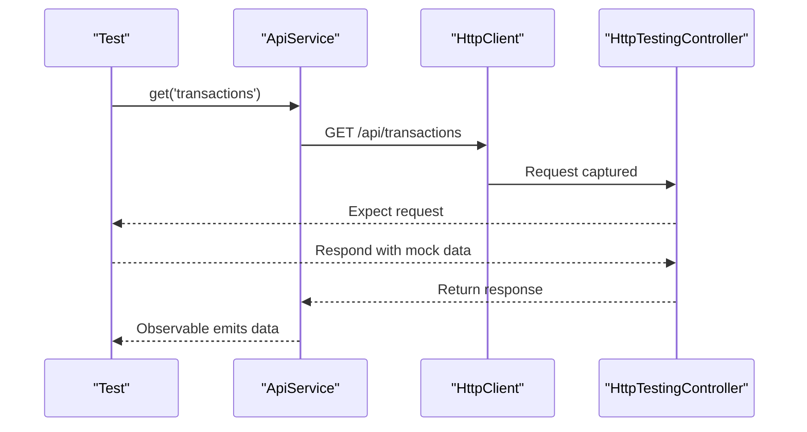
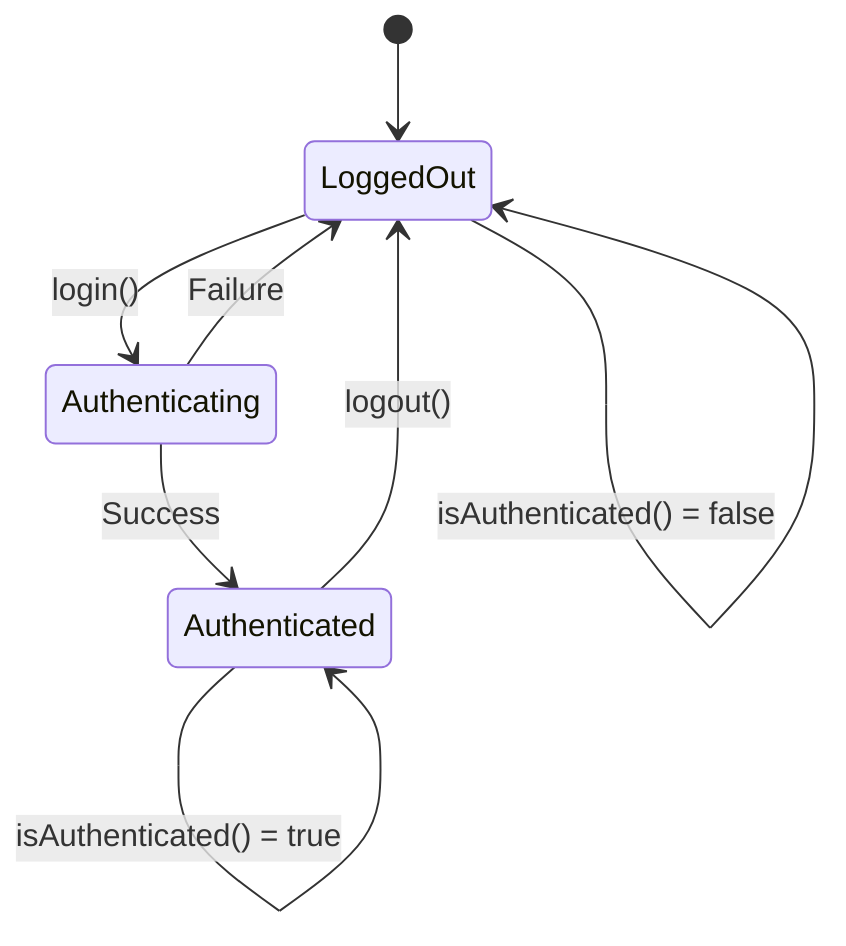
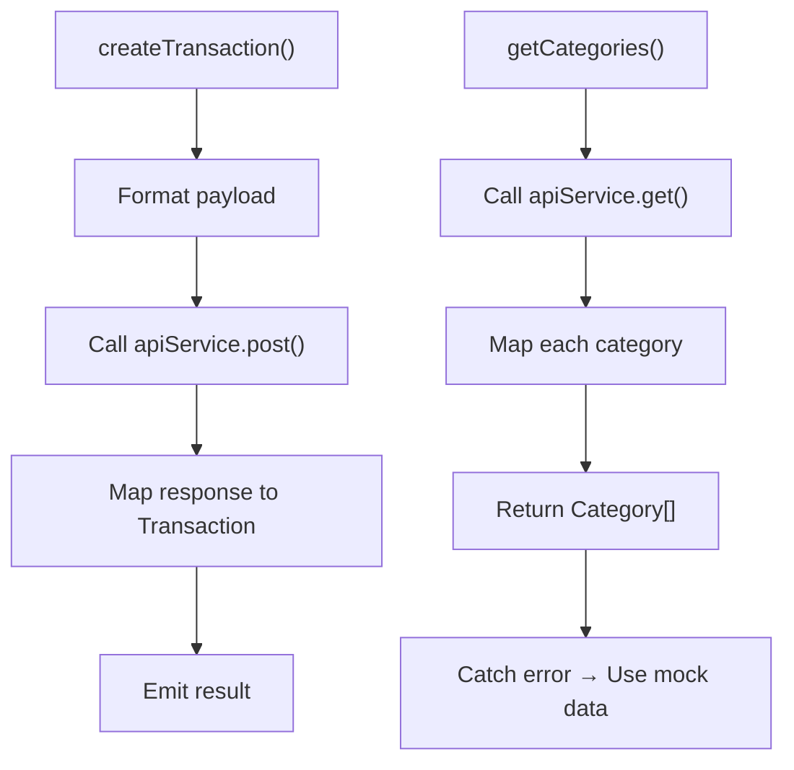
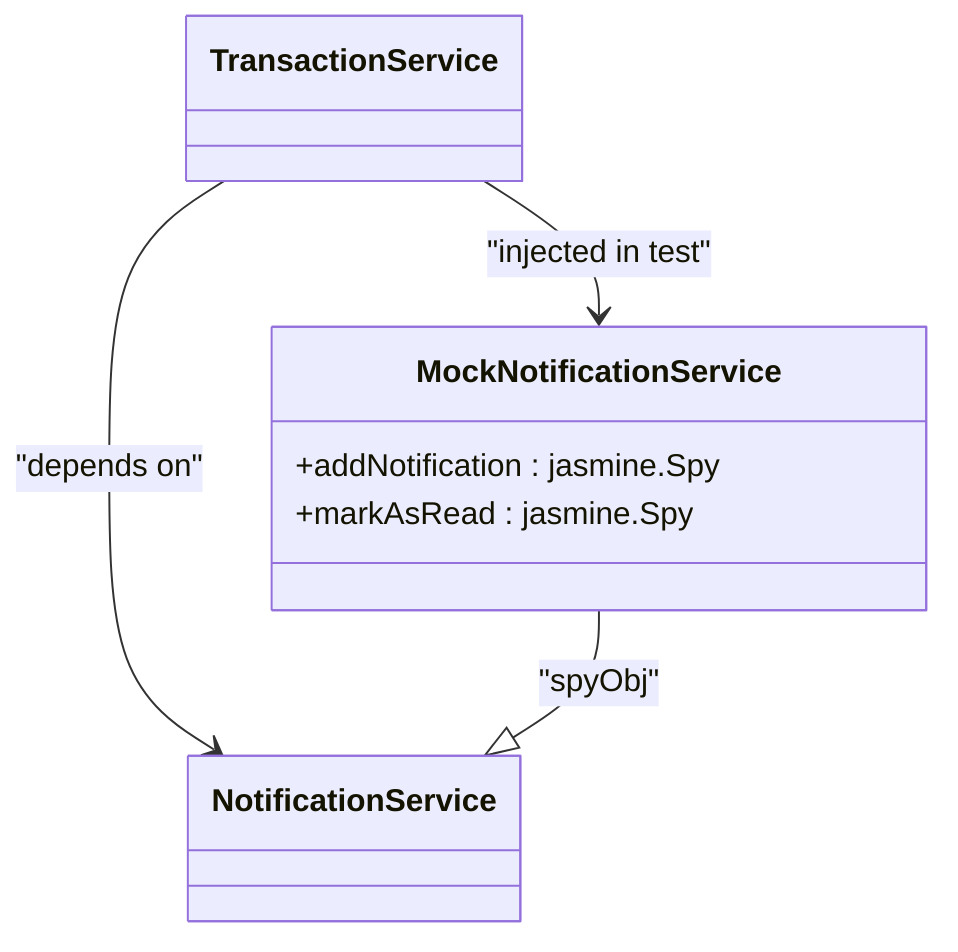
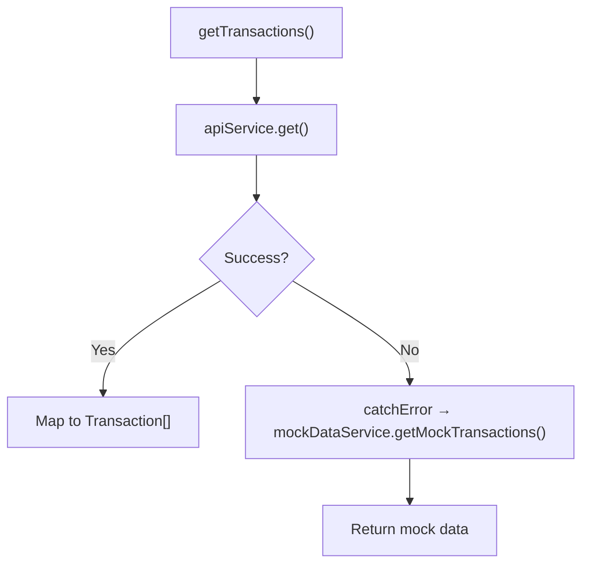
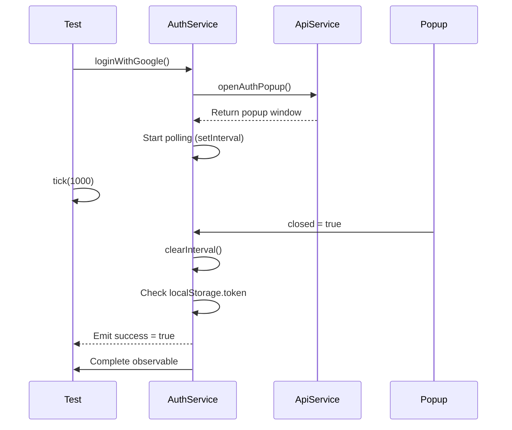
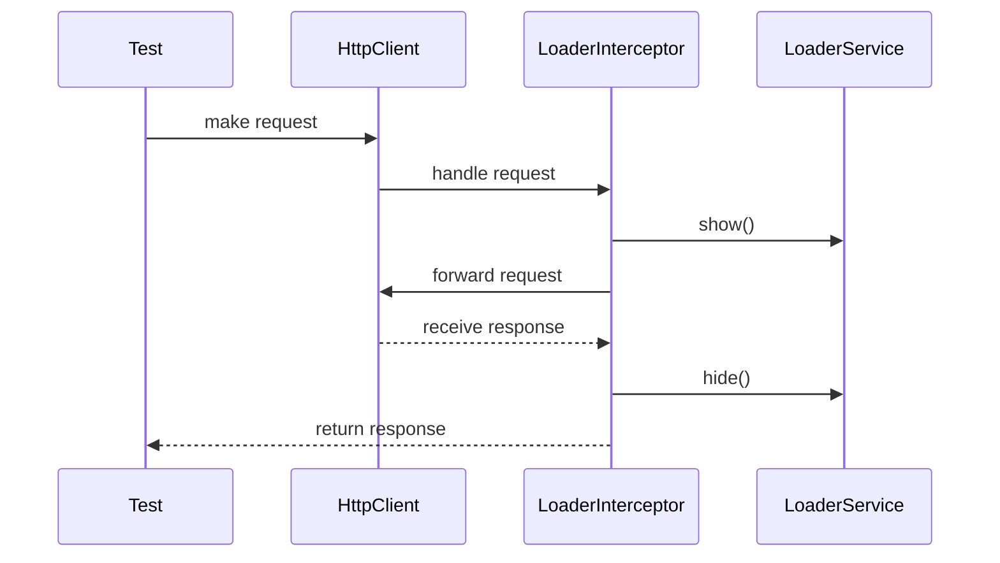
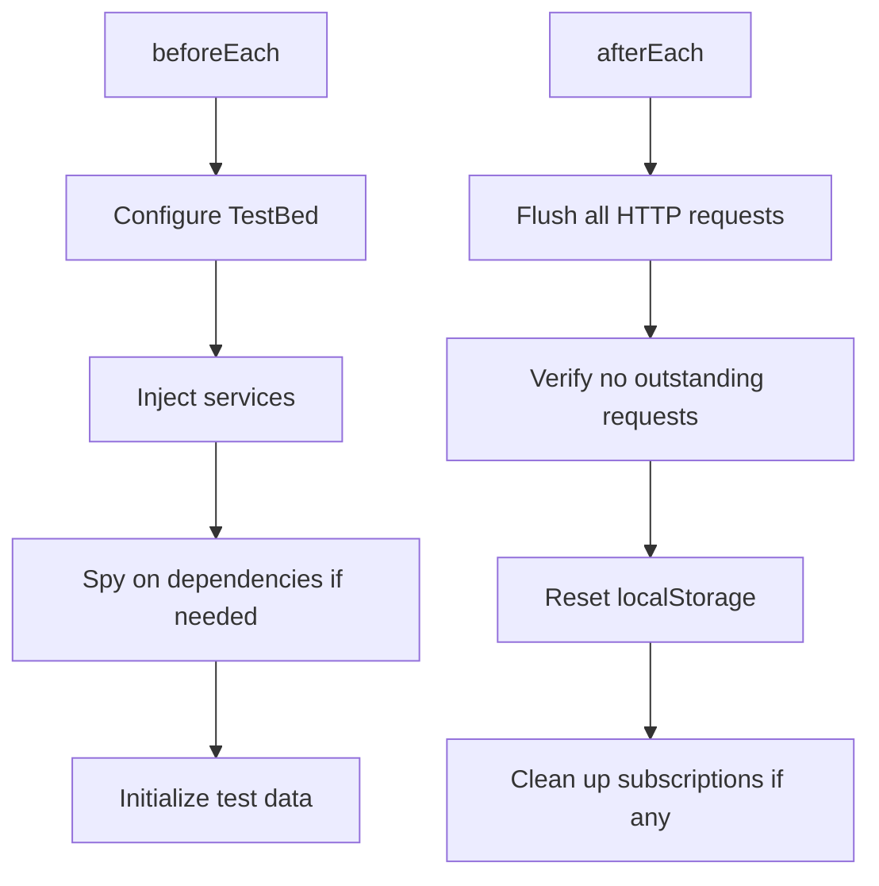

# Service Testing

<cite>
**Referenced Files in This Document**   
- [api.service.ts](file://src/app/shared/services/api.service.ts)
- [auth.service.ts](file://src/app/auth/auth.service.ts)
- [transaction.service.ts](file://src/app/shared/services/transaction.service.ts)
- [category.service.ts](file://src/app/shared/services/category.service.ts)
- [notification.service.ts](file://src/app/shared/services/notification.service.ts)
- [loader.service.ts](file://src/app/shared/services/loader.service.ts)
- [loader.interceptor.ts](file://src/app/shared/interceptors/loader.interceptor.ts)
</cite>

## Table of Contents
1. [Introduction](#introduction)
2. [Testing Setup and TestBed Configuration](#testing-setup-and-testbed-configuration)
3. [Testing ApiService with HttpClientTestingModule](#testing-api-service-with-httpclienttestingmodule)
4. [Testing Stateful Services: AuthService and Authentication State](#testing-stateful-services-auth-service-and-authentication-state)
5. [Testing CRUD Operations in TransactionService and CategoryService](#testing-crud-operations-in-transaction-service-and-category-service)
6. [Mocking Dependent Services with jasmine.createSpyObj](#mocking-dependent-services-with-jasminecreatespyobj)
7. [Testing Observables, Error Handling, and Fallback Logic](#testing-observables-error-handling-and-fallback-logic)
8. [Testing Async Behavior and Retry Logic](#testing-async-behavior-and-retry-logic)
9. [Testing Request Interception and Loader Integration](#testing-request-interception-and-loader-integration)
10. [Best Practices for beforeEach and afterEach Cleanup](#best-practices-for-beforeeach-and-aftereach-cleanup)

## Introduction
This document provides a comprehensive guide to testing Angular services using Jasmine and Karma. It focuses on real-world examples from the codebase, including testing services that depend on `HttpClient`, managing authentication state, handling CRUD operations, and integrating with interceptors and stateful services. The guide emphasizes proper mocking strategies, observable testing, and maintaining clean, maintainable test suites.

## Testing Setup and TestBed Configuration
Angular service testing relies on `TestBed` to configure the testing module and inject dependencies. For services that use `HttpClient`, the `HttpClientTestingModule` is essential to mock HTTP requests without making real calls. This setup allows full control over request responses and error simulation.

**Diagram sources**
- [api.service.ts](file://src/app/shared/services/api.service.ts)
- [transaction.service.ts](file://src/app/shared/services/transaction.service.ts)

**Section sources**
- [api.service.ts](file://src/app/shared/services/api.service.ts#L1-L94)
- [transaction.service.ts](file://src/app/shared/services/transaction.service.ts#L1-L129)

## Testing ApiService with HttpClientTestingModule
The `ApiService` encapsulates all HTTP communication, using `HttpClient` with dynamic headers for authentication. Testing this service requires `HttpClientTestingModule` to intercept and respond to requests. Each method (get, post, put, delete) can be tested by expecting specific endpoints and verifying headers, especially the Authorization token.

**Diagram sources**
- [api.service.ts](file://src/app/shared/services/api.service.ts#L1-L94)

**Section sources**
- [api.service.ts](file://src/app/shared/services/api.service.ts#L1-L94)

## Testing Stateful Services: AuthService and Authentication State
The `AuthService` manages user authentication state using `localStorage`. Tests must verify login, logout, and session persistence. Since it depends on `ApiService`, it should be mocked. Tests should validate token storage, user object parsing, and behavior when no token exists.

**Diagram sources**
- [auth.service.ts](file://src/app/auth/auth.service.ts#L1-L121)

**Section sources**
- [auth.service.ts](file://src/app/auth/auth.service.ts#L1-L121)

## Testing CRUD Operations in TransactionService and CategoryService
Both `TransactionService` and `CategoryService` implement CRUD operations via `ApiService`. Tests should verify correct payload formatting, endpoint usage, and transformation of API responses into domain models. Special attention should be given to date parsing and field mapping (e.g., `_id` to `id`).

**Diagram sources**
- [transaction.service.ts](file://src/app/shared/services/transaction.service.ts#L1-L129)
- [category.service.ts](file://src/app/shared/services/category.service.ts#L1-L95)

**Section sources**
- [transaction.service.ts](file://src/app/shared/services/transaction.service.ts#L1-L129)
- [category.service.ts](file://src/app/shared/services/category.service.ts#L1-L95)

## Mocking Dependent Services with jasmine.createSpyObj
Services like `TransactionService` depend on `NotificationService` for UI feedback. In tests, these should be replaced with spies using `jasmine.createSpyObj`. This allows verification that notifications are triggered on create/delete operations without coupling to the actual implementation.

**Diagram sources**
- [transaction.service.ts](file://src/app/shared/services/transaction.service.ts#L1-L129)
- [notification.service.ts](file://src/app/shared/services/notification.service.ts#L1-L52)

**Section sources**
- [transaction.service.ts](file://src/app/shared/services/transaction.service.ts#L1-L129)
- [notification.service.ts](file://src/app/shared/services/notification.service.ts#L1-L52)

## Testing Observables, Error Handling, and Fallback Logic
Several services use `catchError` to provide fallbacks (e.g., mock data when API fails). Tests must simulate HTTP errors using `HttpTestingController` and verify that fallback observables are returned. This ensures resilience when the backend is unavailable.

**Diagram sources**
- [transaction.service.ts](file://src/app/shared/services/transaction.service.ts#L1-L129)
- [category.service.ts](file://src/app/shared/services/category.service.ts#L1-L95)

**Section sources**
- [transaction.service.ts](file://src/app/shared/services/transaction.service.ts#L1-L129)
- [category.service.ts](file://src/app/shared/services/category.service.ts#L1-L95)

## Testing Async Behavior and Retry Logic
While the current codebase does not implement explicit retry logic, services like `loginWithGoogle` and `loginWithGitHub` use `Observable` with polling via `setInterval`. Tests should verify that popup monitoring starts, checks closure, and completes the observable appropriately. FakeAsync and tick() can simulate time passage.

**Diagram sources**
- [auth.service.ts](file://src/app/auth/auth.service.ts#L1-L121)

**Section sources**
- [auth.service.ts](file://src/app/auth/auth.service.ts#L1-L121)

## Testing Request Interception and Loader Integration
The `LoaderService` and `loaderInterceptor` work together to show/hide loading indicators during HTTP requests. To test this integration, the interceptor must be properly configured in `TestBed`, and tests should verify that `LoaderService.isLoading$` emits `true` during requests and `false` afterward.

**Diagram sources**
- [loader.interceptor.ts](file://src/app/shared/interceptors/loader.interceptor.ts#L1-L12)
- [loader.service.ts](file://src/app/shared/services/loader.service.ts#L1-L19)

**Section sources**
- [loader.interceptor.ts](file://src/app/shared/interceptors/loader.interceptor.ts#L1-L12)
- [loader.service.ts](file://src/app/shared/services/loader.service.ts#L1-L19)

## Best Practices for beforeEach and afterEach Cleanup
Each test suite should use `beforeEach` to reset state and inject dependencies, and `afterEach` to verify no outstanding HTTP requests remain using `HttpTestingController.verify()`. This prevents test pollution and ensures isolation.

**Diagram sources**
- [api.service.ts](file://src/app/shared/services/api.service.ts#L1-L94)
- [auth.service.ts](file://src/app/auth/auth.service.ts#L1-L121)

**Section sources**
- [api.service.ts](file://src/app/shared/services/api.service.ts#L1-L94)
- [auth.service.ts](file://src/app/auth/auth.service.ts#L1-L121)