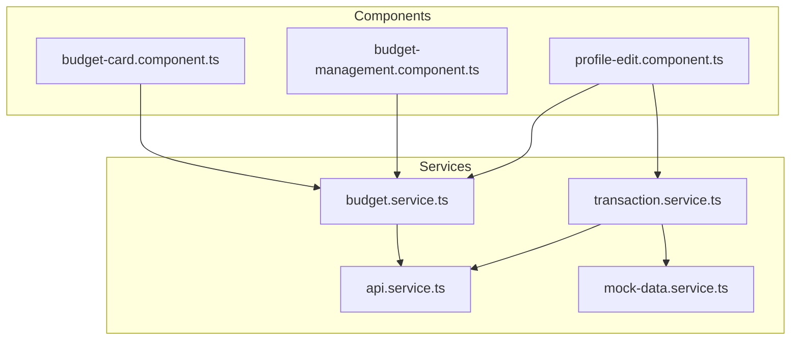
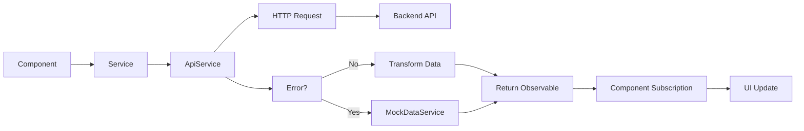
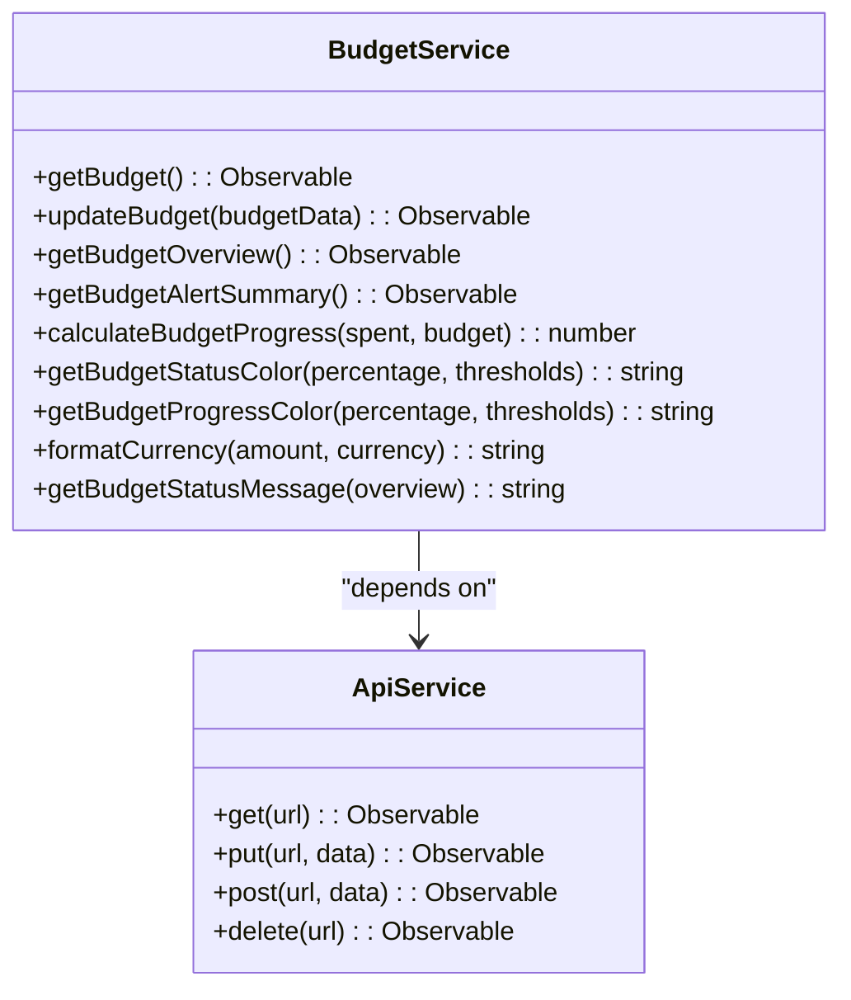
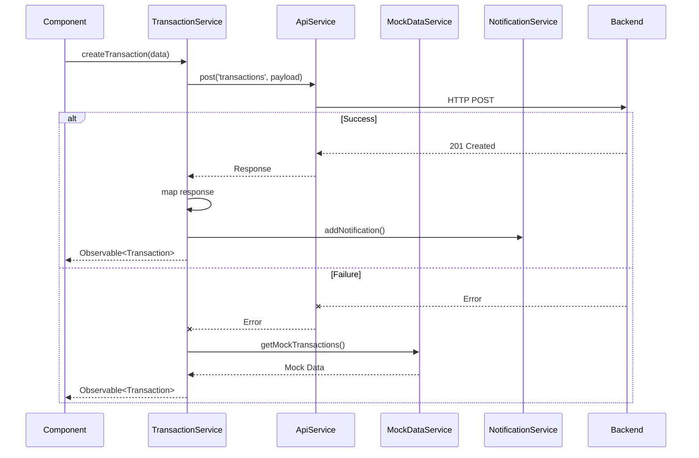
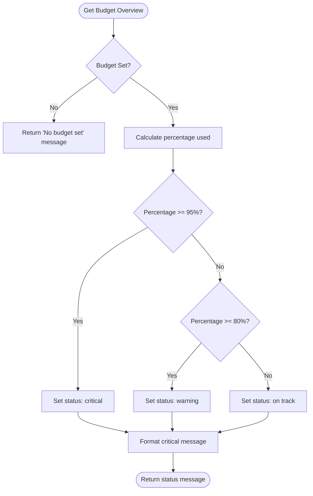
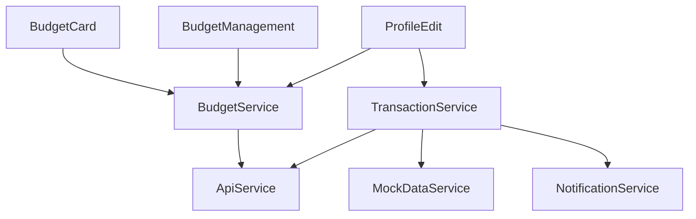

# Testing Observables and Async Operations

<cite>
**Referenced Files in This Document**   
- [budget.service.ts](file://src/app/shared/services/budget.service.ts)
- [transaction.service.ts](file://src/app/shared/services/transaction.service.ts)
- [mock-data.service.ts](file://src/app/shared/services/mock-data.service.ts)
- [api.service.ts](file://src/app/shared/services/api.service.ts)
- [budget-card.component.ts](file://src/app/dashboard/components/budget-card/budget-card.component.ts)
- [budget-management.component.ts](file://src/app/shared/components/budget-management/budget-management.component.ts)
- [profile-edit.component.ts](file://src/app/profile/profile-edit/profile-edit.component.ts)
</cite>

## Table of Contents
1. [Introduction](#introduction)
2. [Project Structure](#project-structure)
3. [Core Components](#core-components)
4. [Architecture Overview](#architecture-overview)
5. [Detailed Component Analysis](#detailed-component-analysis)
6. [Dependency Analysis](#dependency-analysis)
7. [Performance Considerations](#performance-considerations)
8. [Troubleshooting Guide](#troubleshooting-guide)
9. [Conclusion](#conclusion)

## Introduction
This document provides a comprehensive guide to testing reactive code involving RxJS Observables and asynchronous operations in Angular. It focuses on practical techniques such as marble testing with `rxjs/testing`, the use of `fakeAsync`, `tick`, and `flush` for time manipulation in tests, and handling Promises and async/await patterns. The analysis is grounded in real-world examples from services like `BudgetService` and `TransactionService`, which manage financial data streams, handle error propagation, and interact with backend APIs through `ApiService`. Special attention is given to testing subscription behavior, completion events, and common pitfalls such as uncompleted observables and memory leaks due to improper subscription cleanup.

## Project Structure
The Angular application follows a modular structure with feature modules and shared services organized under the `src/app` directory. Key components related to reactive programming and asynchronous operations are located in the `shared/services` folder, including `budget.service.ts`, `transaction.service.ts`, and `api.service.ts`. These services return RxJS Observables and are consumed by various components across the application, such as `budget-card.component.ts` and `budget-management.component.ts`. The use of RxJS operators like `map`, `tap`, `catchError`, and `takeUntil` is widespread, indicating a reactive architecture designed for handling asynchronous data flows from HTTP requests and user interactions.

**Diagram sources**
- [budget.service.ts](file://src/app/shared/services/budget.service.ts#L1-L157)
- [transaction.service.ts](file://src/app/shared/services/transaction.service.ts#L1-L129)
- [budget-card.component.ts](file://src/app/dashboard/components/budget-card/budget-card.component.ts#L1-L155)

**Section sources**
- [budget.service.ts](file://src/app/shared/services/budget.service.ts#L1-L157)
- [transaction.service.ts](file://src/app/shared/services/transaction.service.ts#L1-L129)

## Core Components
The core reactive components in this application are the `BudgetService` and `TransactionService`, both of which rely heavily on RxJS Observables to manage asynchronous data streams. These services interact with the `ApiService` to perform HTTP operations and use operators like `map` for data transformation, `catchError` for error handling, and `tap` for side effects such as notifications. The `takeUntil` operator is used in components to ensure subscriptions are properly cleaned up, preventing memory leaks. Additionally, the `MockDataService` provides fallback data when the API is unavailable, demonstrating resilient async error handling.

**Section sources**
- [budget.service.ts](file://src/app/shared/services/budget.service.ts#L1-L157)
- [transaction.service.ts](file://src/app/shared/services/transaction.service.ts#L1-L129)
- [mock-data.service.ts](file://src/app/shared/services/mock-data.service.ts#L1-L56)

## Architecture Overview
The application employs a reactive architecture where data flows through Observables from services to components. Services expose methods that return Observables, which are then subscribed to in components using the `async` pipe or direct subscription with cleanup via `takeUntil`. HTTP calls are abstracted through `ApiService`, allowing consistent error handling and type safety. The use of RxJS operators enables declarative transformation and composition of asynchronous data streams. Error recovery is implemented using `catchError`, falling back to mock data when necessary, ensuring a smooth user experience even during network failures.

**Diagram sources**
- [api.service.ts](file://src/app/shared/services/api.service.ts)
- [transaction.service.ts](file://src/app/shared/services/transaction.service.ts#L1-L129)
- [mock-data.service.ts](file://src/app/shared/services/mock-data.service.ts#L1-L56)

## Detailed Component Analysis

### BudgetService Analysis
The `BudgetService` provides methods to retrieve and update budget-related data using Observables. It transforms API responses by mapping raw data into domain models, including parsing dates and formatting currency. The service uses the `map` operator extensively to shape data before emitting it to subscribers. It also includes utility methods for calculating budget progress and determining status messages based on spending thresholds.

#### For Object-Oriented Components:

**Diagram sources**
- [budget.service.ts](file://src/app/shared/services/budget.service.ts#L1-L157)

**Section sources**
- [budget.service.ts](file://src/app/shared/services/budget.service.ts#L1-L157)

### TransactionService Analysis
The `TransactionService` manages transaction data with methods that return Observables for retrieving, creating, updating, and deleting transactions. It demonstrates advanced reactive patterns such as error recovery using `catchError`, where failed API calls fall back to mock data from `MockDataService`. The `createTransaction` method uses `tap` to trigger side effects—specifically, showing notifications upon successful creation—without altering the data stream.

#### For API/Service Components:

**Diagram sources**
- [transaction.service.ts](file://src/app/shared/services/transaction.service.ts#L1-L129)
- [api.service.ts](file://src/app/shared/services/api.service.ts)
- [notification.service.ts](file://src/app/shared/services/notification.service.ts)

**Section sources**
- [transaction.service.ts](file://src/app/shared/services/transaction.service.ts#L1-L129)

### Complex Logic in Budget Calculation
The budget status logic involves conditional formatting based on spending thresholds. This includes calculating percentage used, determining alert levels, and generating appropriate status messages. The logic is encapsulated in helper methods within `BudgetService`, making it testable and reusable across components.

#### For Complex Logic Components:

**Diagram sources**
- [budget.service.ts](file://src/app/shared/services/budget.service.ts#L100-L150)

**Section sources**
- [budget.service.ts](file://src/app/shared/services/budget.service.ts#L100-L150)

## Dependency Analysis
The services in this application exhibit a clear dependency hierarchy. `BudgetService` and `TransactionService` depend on `ApiService` for HTTP communication, while `TransactionService` also depends on `MockDataService` for fallback data. Components such as `BudgetCardComponent` and `ProfileEditComponent` depend on these services to load data. The use of `takeUntil` in components ensures that subscriptions are automatically unsubscribed when the component is destroyed, preventing memory leaks.

**Diagram sources**
- [budget.service.ts](file://src/app/shared/services/budget.service.ts#L1-L157)
- [transaction.service.ts](file://src/app/shared/services/transaction.service.ts#L1-L129)
- [budget-card.component.ts](file://src/app/dashboard/components/budget-card/budget-card.component.ts#L1-L155)
- [profile-edit.component.ts](file://src/app/profile/profile-edit/profile-edit.component.ts#L1-L352)

**Section sources**
- [budget.service.ts](file://src/app/shared/services/budget.service.ts#L1-L157)
- [transaction.service.ts](file://src/app/shared/services/transaction.service.ts#L1-L129)

## Performance Considerations
The application uses RxJS operators efficiently to avoid unnecessary re-computations. Data transformation is done within the Observable pipeline using `map`, ensuring that expensive operations like date parsing and formatting occur only once per emission. The use of `async` pipe in templates would further optimize change detection, though direct subscriptions with `takeUntil` are used here for explicit control. Caching strategies are not implemented, so repeated service calls may result in redundant HTTP requests unless handled externally.

## Troubleshooting Guide
Common issues in testing reactive code include uncompleted Observables, zone.js interference with async operations, and memory leaks from unsubscribed Observables. To address these:
- Use `fakeAsync` and `tick` to simulate passage of time and ensure Observables complete.
- Always unsubscribe using `takeUntil` or `async` pipe to prevent memory leaks.
- Test error paths by mocking HTTP failures and verifying fallback behavior.
- Use `TestScheduler` for marble testing to verify emission sequences and timing.

**Section sources**
- [budget.service.ts](file://src/app/shared/services/budget.service.ts#L1-L157)
- [transaction.service.ts](file://src/app/shared/services/transaction.service.ts#L1-L129)

## Conclusion
Testing reactive code in Angular requires a solid understanding of RxJS Observables, proper use of Angular's testing utilities like `fakeAsync`, and awareness of common pitfalls. This application demonstrates best practices such as error recovery with `catchError`, side effects with `tap`, and subscription cleanup with `takeUntil`. By leveraging marble testing and time manipulation tools, developers can write robust, predictable tests for asynchronous operations, ensuring reliability and maintainability of reactive components.