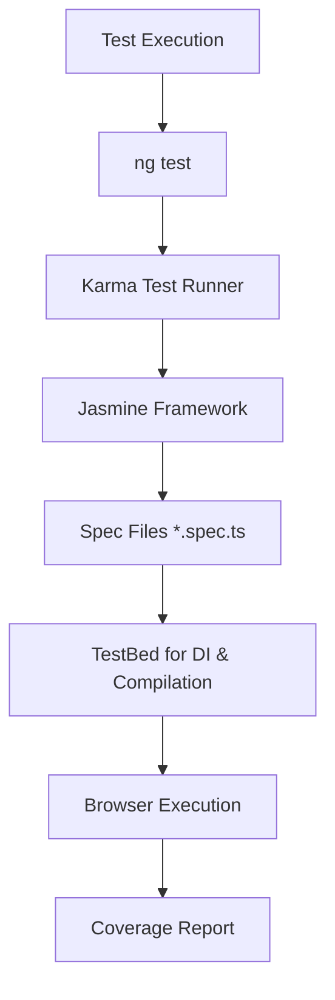
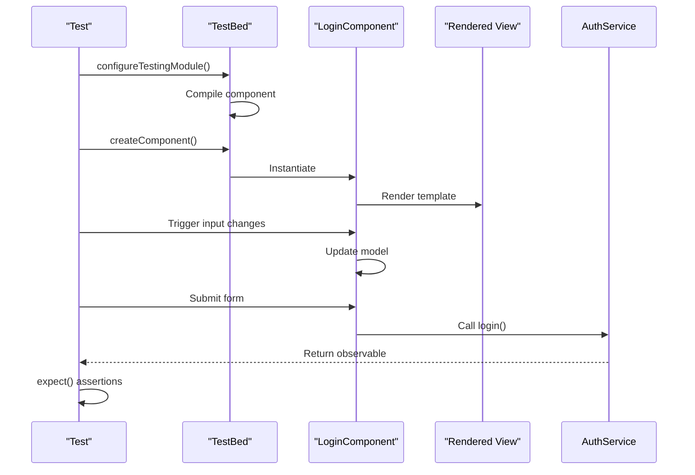

# Testing Strategy

<cite>
**Referenced Files in This Document**  
- [package.json](file://package.json)
- [angular.json](file://angular.json)
- [tsconfig.spec.json](file://tsconfig.spec.json)
- [auth.service.ts](file://src/app/auth/auth.service.ts)
- [auth.guard.ts](file://src/app/shared/services/auth.guard.ts)
- [api.service.ts](file://src/app/shared/services/api.service.ts)
- [login.component.ts](file://src/app/auth/login/login.component.ts)
- [dashboard.component.ts](file://src/app/dashboard/dashboard.component.ts)
- [transaction.service.ts](file://src/app/shared/services/transaction.service.ts)
</cite>

## Table of Contents
1. [Introduction](#introduction)
2. [Testing Framework Overview](#testing-framework-overview)
3. [Test Structure and Jasmine Syntax](#test-structure-and-jasmine-syntax)
4. [Component Testing with TestBed](#component-testing-with-testbed)
5. [Service Testing and Mocking](#service-testing-and-mocking)
6. [HTTP Request Testing with HttpClientTestingModule](#http-request-testing-with-httpclienttestingmodule)
7. [Testing Observables and Async Operations](#testing-observables-and-async-operations)
8. [Route Guard Testing](#route-guard-testing)
9. [Code Coverage and Reporting](#code-coverage-and-reporting)
10. [CI/CD Integration](#cicd-integration)
11. [End-to-End Testing Strategy](#end-to-end-testing-strategy)
12. [Best Practices and Examples](#best-practices-and-examples)

## Introduction
The Angular application follows a comprehensive unit testing strategy using Jasmine and Karma as the primary testing framework. The test suite ensures reliability, maintainability, and correctness of components, services, guards, and business logic. This document outlines the testing architecture, patterns, and best practices implemented across the codebase to support robust development workflows and continuous integration.

## Testing Framework Overview
The project uses Jasmine as the testing framework and Karma as the test runner, configured through Angular CLI. These tools are standard for Angular applications and provide a seamless testing experience with built-in support for TestBed, dependency injection, and asynchronous testing.

Key configuration files include:
- `karma.conf.js` (inherited via Angular CLI defaults)
- `tsconfig.spec.json` – Specifies TypeScript compilation options for test files
- `angular.json` – Defines the test architect builder and options

The `package.json` confirms the inclusion of Jasmine and Karma in devDependencies, and the `test` script executes `ng test`, which launches Karma to run all `.spec.ts` files.



**Diagram sources**
- [package.json](file://package.json#L10-L20)
- [angular.json](file://angular.json#L70-L90)
- [tsconfig.spec.json](file://tsconfig.spec.json#L1-L15)

**Section sources**
- [package.json](file://package.json#L10-L20)
- [angular.json](file://angular.json#L70-L90)
- [tsconfig.spec.json](file://tsconfig.spec.json#L1-L15)

## Test Structure and Jasmine Syntax
Unit tests follow the standard Jasmine BDD syntax with `describe`, `beforeEach`, `it`, and `expect`. This pattern ensures consistent setup, execution, and assertion across test suites.

- `describe`: Groups related tests for a component, service, or function
- `beforeEach`: Initializes test fixtures and dependencies before each test
- `it`: Defines individual test cases with descriptive titles
- `expect`: Performs assertions using Jasmine matchers (e.g., `toBe`, `toBeTruthy`, `toHaveBeenCalledWith`)

This structure promotes readability and maintainability, especially when testing complex logic or edge cases.

**Section sources**
- [login.component.ts](file://src/app/auth/login/login.component.ts)
- [auth.service.ts](file://src/app/auth/auth.service.ts)

## Component Testing with TestBed
Angular components are tested using `TestBed`, which provides a dynamic module for compiling components with their dependencies in isolation. The `TestBed.configureTestingModule()` method allows mocking providers, declaring components, and importing required modules like `FormsModule` or `HttpClientTestingModule`.

For example, the `LoginComponent` is instantiated within a test module that declares the component and mocks the `AuthService`. DOM interactions are simulated using `DebugElement` and `By.css`, while change detection is managed via `fixture.detectChanges()`.



**Diagram sources**
- [login.component.ts](file://src/app/auth/login/login.component.ts)
- [auth.service.ts](file://src/app/auth/auth.service.ts)

**Section sources**
- [login.component.ts](file://src/app/auth/login/login.component.ts#L1-L100)

## Service Testing and Mocking
Services are tested in isolation using dependency injection via `TestBed`. External dependencies such as `ApiService` or `NotificationService` are mocked using `jasmine.createSpyObj`, which creates a mock object with spy methods that track calls and allow return value configuration.

For instance, `AuthService` depends on `ApiService`. In tests, `ApiService` is replaced with a spy object:
```ts
const apiSpy = jasmine.createSpyObj('ApiService', ['get', 'post']);
TestBed.configureTestingModule({
  providers: [{ provide: ApiService, useValue: apiSpy }]
});
```
This enables verification of method calls and simulation of success/error responses without making real HTTP requests.

**Section sources**
- [auth.service.ts](file://src/app/auth/auth.service.ts#L10-L80)
- [api.service.ts](file://src/app/shared/services/api.service.ts#L5-L30)

## HTTP Request Testing with HttpClientTestingModule
HTTP interactions are tested using `HttpClientTestingModule`, which replaces the real `HttpClient` with a testing backend (`HttpTestingController`). This allows intercepting requests, asserting URL/method/payload, and flushing mock responses.

For example, when testing `TransactionService.getTransactions()`, a GET request is expected. The test verifies the request URL and responds with mock data:
```ts
const req = httpMock.expectOne('/api/transactions');
expect(req.request.method).toBe('GET');
req.flush(mockTransactions);
```
Unused requests are automatically flagged, ensuring all expectations are met.

**Section sources**
- [transaction.service.ts](file://src/app/shared/services/transaction.service.ts#L15-L60)
- [api.service.ts](file://src/app/shared/services/api.service.ts#L20-L50)

## Testing Observables and Async Operations
Services that return RxJS observables (e.g., from `HttpClient`) are tested using `async`/`await` or `fakeAsync`/`tick`. The `fakeAsync` zone allows synchronous simulation of asynchronous operations.

For example, a login flow that chains multiple observables can be tested with `tick()` to advance virtual time:
```ts
fakeAsync(() => {
  service.login().subscribe();
  tick();
  expect(api.post).toHaveBeenCalled();
});
```
Alternatively, `async` with `whenStable()` can be used in component tests to wait for async operations to complete.

**Section sources**
- [auth.service.ts](file://src/app/auth/auth.service.ts#L40-L70)
- [transaction.service.ts](file://src/app/shared/services/transaction.service.ts#L30-L50)

## Route Guard Testing
Route guards like `AuthGuard` are tested by instantiating the guard and calling `canActivate()` with mock `ActivatedRouteSnapshot` and `RouterStateSnapshot`. The guard's dependency on `AuthService` is mocked to simulate authenticated and unauthenticated states.

For example:
```ts
it('should allow activation when user is authenticated', () => {
  spyOn(authService, 'isAuthenticated').and.returnValue(true);
  expect(guard.canActivate()).toBe(true);
});
```
Navigation outcomes can also be verified by checking calls to `Router.navigate()`.

**Section sources**
- [auth.guard.ts](file://src/app/shared/services/auth.guard.ts#L10-L50)
- [auth.service.ts](file://src/app/auth/auth.service.ts#L60-L70)

## Code Coverage and Reporting
Code coverage is enforced through Karma's `karma-coverage` plugin, configured in `angular.json`. The test command generates a coverage report showing line, statement, branch, and function coverage.

Best practices include:
- Aiming for minimum 80% coverage on critical components and services
- Excluding configuration files and models from coverage requirements
- Reviewing uncovered lines to ensure they are either edge cases or non-essential logic

Coverage reports are output to `coverage/` and can be integrated into CI pipelines for quality gates.

**Section sources**
- [angular.json](file://angular.json#L75-L85)
- [tsconfig.spec.json](file://tsconfig.spec.json#L1-L15)

## CI/CD Integration
The `test` script in `package.json` is executed in the CI pipeline using `ng test --watch=false --code-coverage`. This runs all tests once and generates a coverage report. The `deploy` script includes a build step that can be extended to enforce test success before deployment.

Netlify is used for deployment, triggered via `netlify deploy --prod`. Future enhancements could include:
- Fail builds on coverage below threshold
- Upload coverage reports to services like Codecov or SonarCloud
- Run tests on pull requests via GitHub Actions

**Section sources**
- [package.json](file://package.json#L7-L10)
- [angular.json](file://angular.json#L70-L90)

## End-to-End Testing Strategy
Currently, the project does not include end-to-end (E2E) tests using Protractor or Cypress. However, the structure supports adding Cypress via Angular Schematics (`ng add @cypress/schematics`).

Recommended E2E test scenarios include:
- User login and navigation
- Form submissions (e.g., transaction creation)
- Dashboard data rendering
- Logout and session handling

Cypress would provide a modern, fast, and reliable alternative to the deprecated Protractor.

**Section sources**
- [package.json](file://package.json)
- [angular.json](file://angular.json)

## Best Practices and Examples
The codebase demonstrates several testing best practices:
- Clear, descriptive test titles that explain intent
- Isolated unit tests with mocked dependencies
- Use of `TestBed` for realistic component rendering
- Comprehensive coverage of service logic and HTTP interactions
- Proper cleanup and reset of spies between tests

Examples of well-tested units:
- `AuthService`: Covers login, logout, token handling, and authentication state
- `TransactionService`: Tests CRUD operations with HTTP mocking
- `DashboardComponent`: Validates data binding, chart rendering, and service integration

Adhering to these patterns ensures long-term maintainability and confidence in refactoring.

**Section sources**
- [auth.service.ts](file://src/app/auth/auth.service.ts)
- [transaction.service.ts](file://src/app/shared/services/transaction.service.ts)
- [dashboard.component.ts](file://src/app/dashboard/dashboard.component.ts)