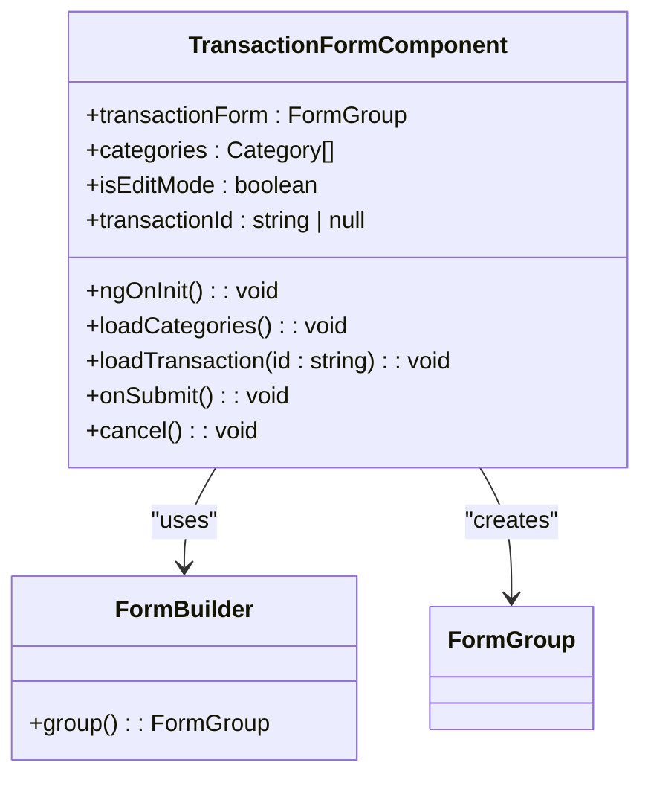
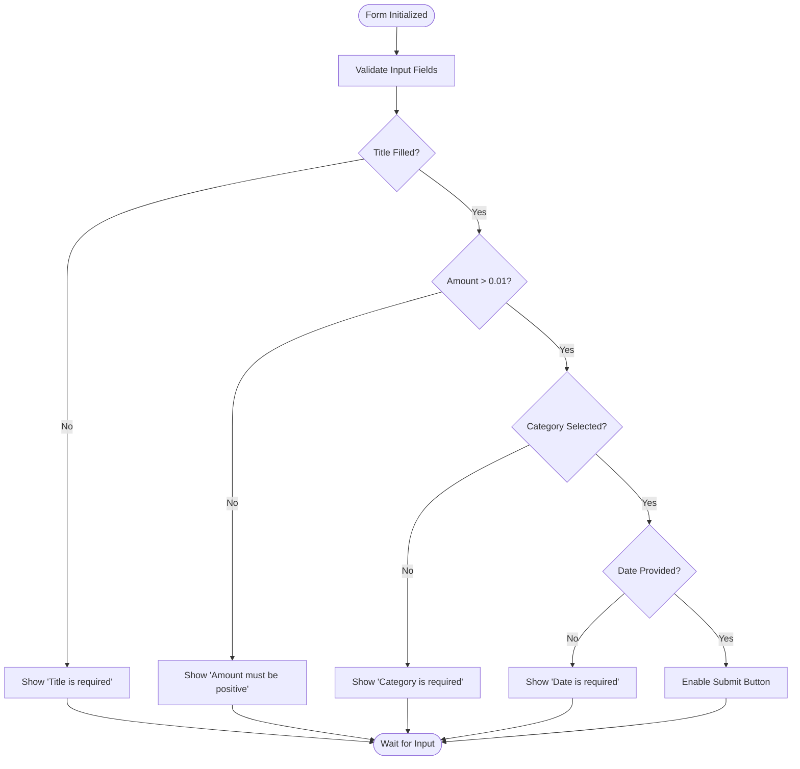
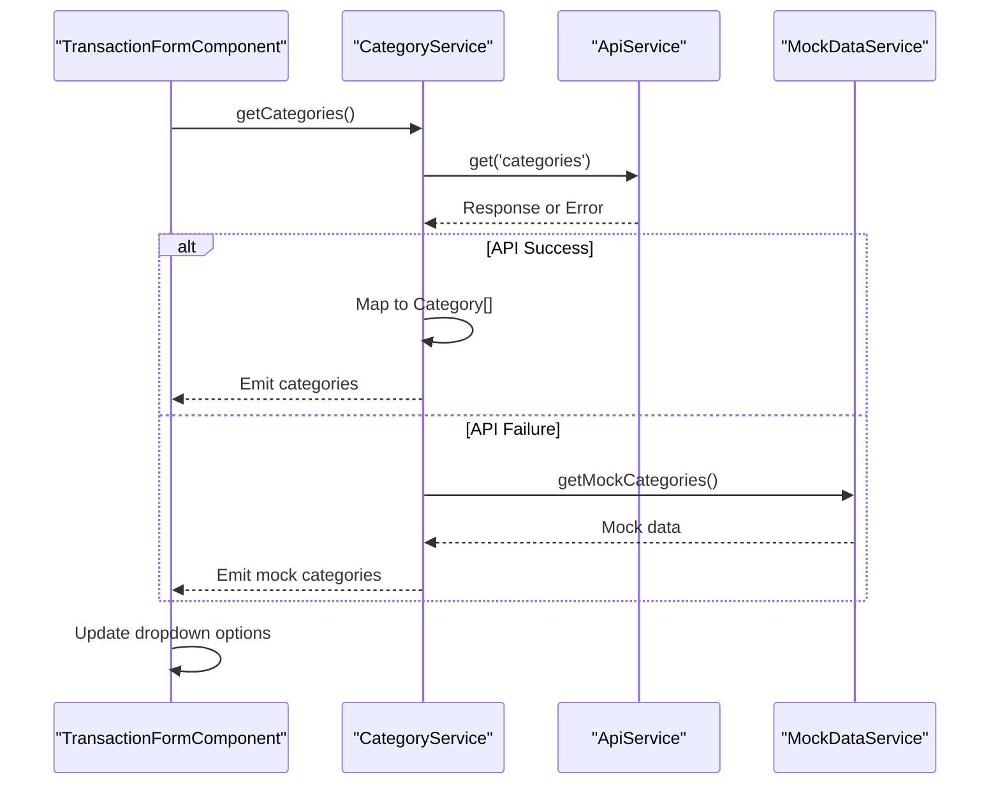
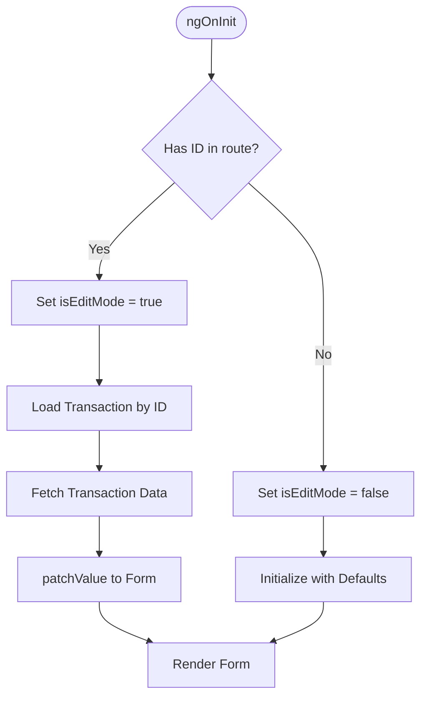
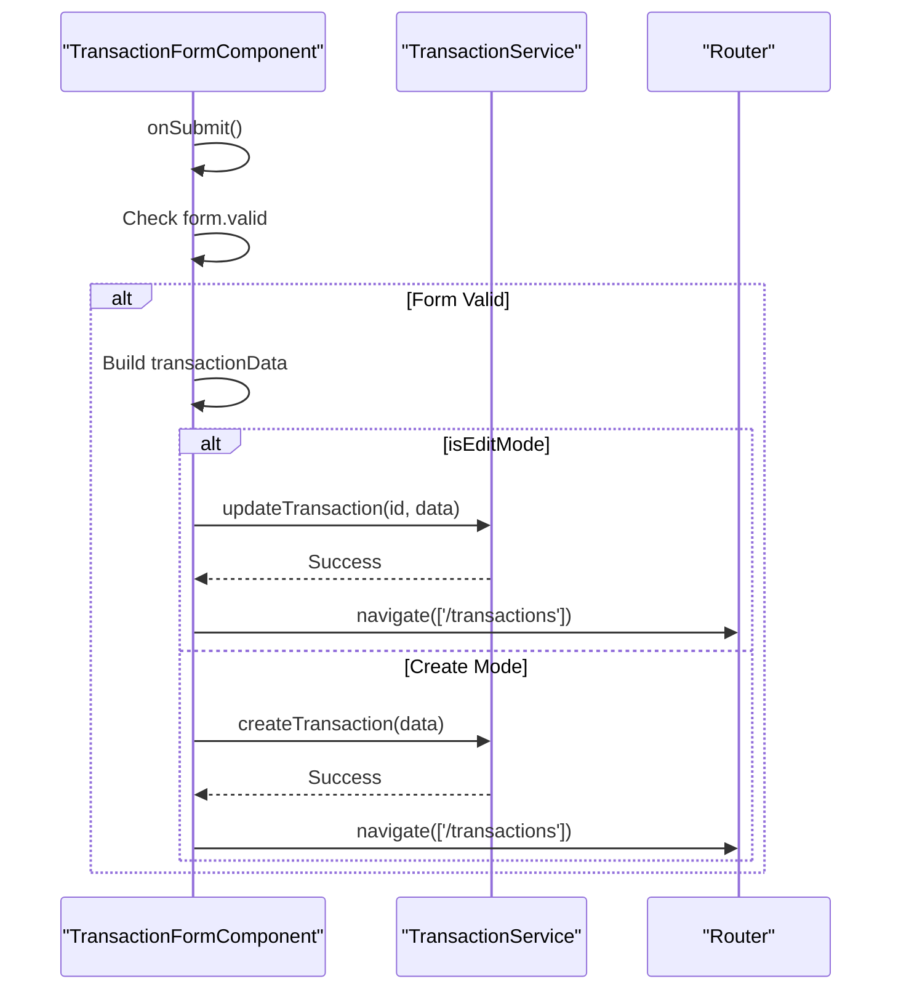
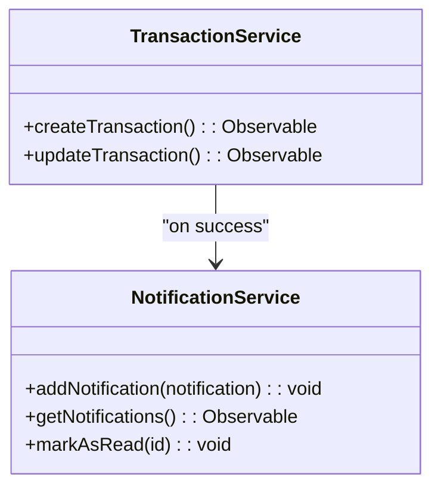

# Transaction Form Management

<cite>
**Referenced Files in This Document**   
- [transaction-form.component.ts](file://src/app/transactions/transaction-form/transaction-form.component.ts)
- [transaction-form.component.html](file://src/app/transactions/transaction-form/transaction-form.component.html)
- [category.service.ts](file://src/app/shared/services/category.service.ts)
- [transaction.service.ts](file://src/app/shared/services/transaction.service.ts)
- [notification.service.ts](file://src/app/shared/services/notification.service.ts)
- [transaction.model.ts](file://src/app/shared/models/transaction.model.ts)
- [category.model.ts](file://src/app/shared/models/category.model.ts)
</cite>

## Table of Contents
1. [Introduction](#introduction)
2. [Reactive Form Implementation](#reactive-form-implementation)
3. [Form Validation Rules](#form-validation-rules)
4. [Category Service Integration](#category-service-integration)
5. [Dual Mode Behavior: Create and Edit](#dual-mode-behavior-create-and-edit)
6. [Submission Handling and API Integration](#submission-handling-and-api-integration)
7. [Error Handling and User Feedback](#error-handling-and-user-feedback)
8. [Date Picker and Currency Input](#date-picker-and-currency-input)
9. [Accessibility and Mobile Responsiveness](#accessibility-and-mobile-responsiveness)
10. [Best Practices for Form State Management](#best-practices-for-form-state-management)

## Introduction
The `TransactionFormComponent` is a central feature in the financial management application, enabling users to create and edit income and expense transactions. Built using Angular's reactive forms, it ensures robust data handling, validation, and seamless integration with backend services. This document details the implementation, focusing on form structure, validation, category filtering, dual-mode behavior, error handling, and user experience considerations.

**Section sources**
- [transaction-form.component.ts](file://src/app/transactions/transaction-form/transaction-form.component.ts#L1-L15)

## Reactive Form Implementation
The component leverages Angular’s `FormBuilder` to declaratively define the form structure with initial values and validators. The reactive approach enables fine-grained control over form state, dynamic updates, and real-time validation feedback.

The form includes fields for title, amount, transaction type (income/expense), category, description, and date. The `type` field defaults to "expense", and the `date` field is pre-filled with the current date in ISO format.

**Diagram sources**
- [transaction-form.component.ts](file://src/app/transactions/transaction-form/transaction-form.component.ts#L25-L45)

**Section sources**
- [transaction-form.component.ts](file://src/app/transactions/transaction-form/transaction-form.component.ts#L25-L45)

## Form Validation Rules
The form enforces validation rules to ensure data integrity:
- **Title**: Required field
- **Amount**: Required and must be greater than 0.01
- **Type**: Required (income or expense)
- **Category**: Required
- **Date**: Required

Validation status is reflected in the UI, with the submit button disabled when the form is invalid. This prevents submission of incomplete or malformed data.

**Diagram sources**
- [transaction-form.component.ts](file://src/app/transactions/transaction-form/transaction-form.component.ts#L35-L45)

**Section sources**
- [transaction-form.component.ts](file://src/app/transactions/transaction-form/transaction-form.component.ts#L35-L45)

## Category Service Integration
The `CategoryService` retrieves all available categories and populates the dropdown in the form. Categories are filtered based on transaction type (income vs expense) in the UI, although the current implementation displays all categories. Future enhancements could include type-specific filtering.

The service uses `ApiService` for backend communication and falls back to mock data if the API is unavailable, ensuring resilience during development or network issues.

**Diagram sources**
- [category.service.ts](file://src/app/shared/services/category.service.ts#L15-L35)
- [transaction-form.component.ts](file://src/app/transactions/transaction-form/transaction-form.component.ts#L60-L65)

**Section sources**
- [category.service.ts](file://src/app/shared/services/category.service.ts#L15-L35)
- [transaction-form.component.ts](file://src/app/transactions/transaction-form/transaction-form.component.ts#L60-L65)

## Dual Mode Behavior: Create and Edit
The component supports two modes: creating new transactions and editing existing ones. The mode is determined by the presence of a transaction ID in the route parameters.

- **Create Mode**: Form initializes with default values (e.g., current date, expense type).
- **Edit Mode**: On initialization, the component fetches the transaction data using `TransactionService` and pre-fills the form using `patchValue()`.

This dynamic behavior ensures a consistent user interface for both operations.

**Diagram sources**
- [transaction-form.component.ts](file://src/app/transactions/transaction-form/transaction-form.component.ts#L50-L60)

**Section sources**
- [transaction-form.component.ts](file://src/app/transactions/transaction-form/transaction-form.component.ts#L50-L60)

## Submission Handling and API Integration
On form submission, the component checks validity and constructs the transaction payload. The date is converted from string to `Date` object, and a static `userId` is assigned.

- **Edit Mode**: Calls `updateTransaction()` with the transaction ID and updated data.
- **Create Mode**: Calls `createTransaction()` with the new transaction data.

Upon successful submission, the user is navigated back to the transactions list.

**Diagram sources**
- [transaction-form.component.ts](file://src/app/transactions/transaction-form/transaction-form.component.ts#L70-L94)
- [transaction.service.ts](file://src/app/shared/services/transaction.service.ts#L35-L65)

**Section sources**
- [transaction-form.component.ts](file://src/app/transactions/transaction-form/transaction-form.component.ts#L70-L94)

## Error Handling and User Feedback
While the current implementation does not explicitly handle API errors during submission, the `TransactionService` includes error fallbacks using mock data for read operations. The `NotificationService` is used to provide user feedback upon successful transaction creation, displaying a toast notification with the transaction details.

Best practice would include adding error subscriptions in `onSubmit()` to catch and display API errors, such as network failures or validation rejections from the backend.

**Diagram sources**
- [notification.service.ts](file://src/app/shared/services/notification.service.ts#L15-L30)
- [transaction.service.ts](file://src/app/shared/services/transaction.service.ts#L45-L55)

**Section sources**
- [notification.service.ts](file://src/app/shared/services/notification.service.ts#L15-L30)

## Date Picker and Currency Input
The form uses native HTML5 `type="date"` for date input, providing a consistent date picker across modern browsers. For currency input, a number field with step="0.01" ensures decimal precision. A dollar sign is visually prepended using CSS positioning for improved UX.

No custom formatting or masking is applied, but the design supports future enhancements such as currency formatting libraries or date picker components.

**Section sources**
- [transaction-form.component.html](file://src/app/transactions/transaction-form/transaction-form.component.html#L80-L90)

## Accessibility and Mobile Responsiveness
The form is built with accessibility in mind:
- All inputs have associated `<label>` elements with `for` attributes.
- Form controls are keyboard navigable.
- Semantic HTML and ARIA attributes enhance screen reader compatibility.

The layout uses Tailwind CSS for responsive design, ensuring usability on mobile devices with proper spacing, touch-friendly buttons, and adaptive sizing.

**Section sources**
- [transaction-form.component.html](file://src/app/transactions/transaction-form/transaction-form.component.html#L1-L114)

## Best Practices for Form State Management
The component follows Angular best practices:
- **Reactive Forms**: For predictable state management and validation.
- **Unidirectional Data Flow**: Form state flows from component to view.
- **Separation of Concerns**: Services handle data logic; component handles UI.
- **Resilience**: Fallback to mock data ensures functionality during API outages.
- **Navigation Safety**: Cancel button returns user without saving.

To prevent duplicate submissions, the submit button is disabled when the form is invalid. For additional safety, a loading state could be implemented during API calls to prevent multiple submissions.

**Section sources**
- [transaction-form.component.ts](file://src/app/transactions/transaction-form/transaction-form.component.ts#L70-L94)
- [transaction-form.component.html](file://src/app/transactions/transaction-form/transaction-form.component.html#L100-L110)