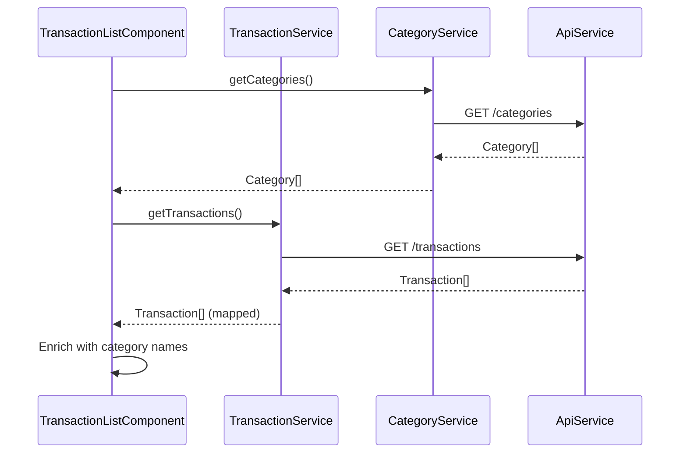
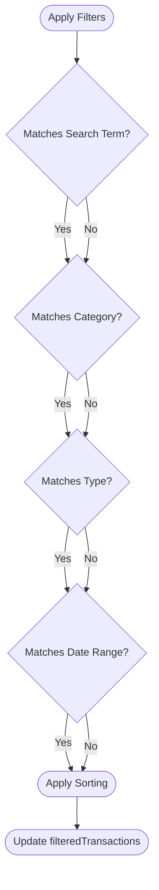
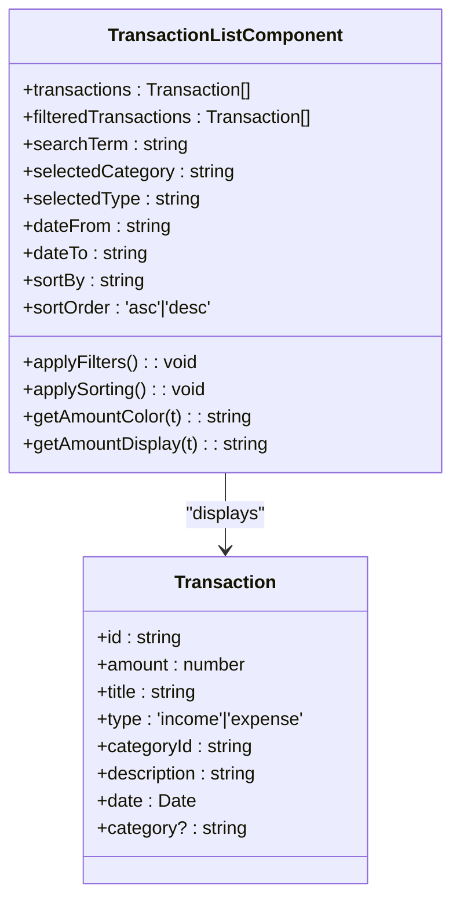

# Transaction List Display

<cite>
**Referenced Files in This Document**   
- [transaction-list.component.ts](file://src/app/transactions/transaction-list/transaction-list.component.ts)
- [transaction-list.component.html](file://src/app/transactions/transaction-list/transaction-list.component.html)
- [transaction.service.ts](file://src/app/shared/services/transaction.service.ts)
- [transaction.model.ts](file://src/app/shared/models/transaction.model.ts)
</cite>

## Table of Contents
1. [Introduction](#introduction)
2. [Core Functionality](#core-functionality)
3. [Filtering and Sorting Mechanisms](#filtering-and-sorting-mechanisms)
4. [Reactive Data Handling with Observables](#reactive-data-handling-with-observables)
5. [Template Logic and UI Rendering](#template-logic-and-ui-rendering)
6. [Performance Optimizations](#performance-optimizations)
7. [Extensibility and Export Features](#extensibility-and-export-features)
8. [Error and State Handling](#error-and-state-handling)
9. [Conclusion](#conclusion)

## Introduction
The `TransactionListComponent` is a central feature in the financial management application, responsible for displaying a comprehensive list of user transactions. It leverages Angular's component-based architecture to provide a dynamic, interactive interface for viewing, filtering, and managing transaction data. The component integrates with `TransactionService` to fetch data and supports advanced features such as date-range filtering, category/type filtering, sorting, and export capabilities. Designed with responsiveness in mind, it adapts layout for both desktop and mobile views using conditional rendering.

**Section sources**
- [transaction-list.component.ts](file://src/app/transactions/transaction-list/transaction-list.component.ts#L1-L379)
- [transaction-list.component.html](file://src/app/transactions/transaction-list/transaction-list.component.html#L1-L315)

## Core Functionality
The component initializes by loading transaction and category data from their respective services. Upon initialization, it retrieves the current currency symbol via `CurrencyService` and fetches categories using `CategoryService`. Once categories are loaded, it proceeds to load transactions through `TransactionService.getTransactions()`, enriching each transaction with its corresponding category name for display purposes. The list supports real-time updates, with actions like adding, editing, or deleting transactions triggering a reload to ensure UI consistency.

**Diagram sources**
- [transaction-list.component.ts](file://src/app/transactions/transaction-list/transaction-list.component.ts#L50-L90)
- [transaction.service.ts](file://src/app/shared/services/transaction.service.ts#L15-L30)

**Section sources**
- [transaction-list.component.ts](file://src/app/transactions/transaction-list/transaction-list.component.ts#L50-L90)
- [transaction.service.ts](file://src/app/shared/services/transaction.service.ts#L15-L30)

## Filtering and Sorting Mechanisms
The component implements a robust client-side filtering system based on search term, category, transaction type, and date range. The `applyFilters()` method evaluates each transaction against the active filter criteria, including inclusive date boundaries where `dateFrom` and `dateTo` are respected with proper end-of-day handling for the latter. Sorting is managed through `applySorting()`, which dynamically compares values based on the selected field (`date`, `amount`, `title`, `type`) and current sort order (`asc` or `desc`). Visual indicators in the table headers reflect the active sort state via the `getSortText()` method.

**Diagram sources**
- [transaction-list.component.ts](file://src/app/transactions/transaction-list/transaction-list.component.ts#L110-L170)

**Section sources**
- [transaction-list.component.ts](file://src/app/transactions/transaction-list/transaction-list.component.ts#L110-L170)

## Reactive Data Handling with Observables
The component utilizes Angular's reactive programming model through Observables provided by `TransactionService`. Instead of direct data fetching, it subscribes to observable streams that emit transaction data. This approach enables asynchronous data handling with proper error recovery—when API calls fail, the service falls back to mock data. The template uses the `async` pipe indirectly via component properties, where subscription results are mapped to component state (`transactions`, `filteredTransactions`). This ensures automatic cleanup on component destruction and promotes a clean separation between data retrieval and presentation logic.

**Section sources**
- [transaction.service.ts](file://src/app/shared/services/transaction.service.ts#L15-L30)
- [transaction-list.component.ts](file://src/app/transactions/transaction-list/transaction-list.component.ts#L70-L90)

## Template Logic and UI Rendering
The HTML template implements responsive design principles, showing a table layout on desktop (`md` and above) and card-based layout on mobile. It uses Angular's `*ngFor` with `trackByTransactionId` to optimize rendering performance. Conditional styling is applied using `[ngClass]` to dynamically assign CSS classes based on transaction type (e.g., green for income, red for expense). Currency formatting is achieved using Angular's built-in `number` pipe with `'1.2-2'` format, while date formatting uses the `date` pipe with `'MMM d, yyyy'`. The component also includes interactive elements like action menus, modal dialogs, and suggestion auto-completion for transaction titles.

**Diagram sources**
- [transaction-list.component.ts](file://src/app/transactions/transaction-list/transaction-list.component.ts#L20-L40)
- [transaction.model.ts](file://src/app/shared/models/transaction.model.ts#L1-L13)

**Section sources**
- [transaction-list.component.html](file://src/app/transactions/transaction-list/transaction-list.component.html#L100-L200)
- [transaction-list.component.ts](file://src/app/transactions/transaction-list/transaction-list.component.ts#L180-L220)

## Performance Optimizations
To enhance rendering efficiency, the component implements a `trackByTransactionId` function used in `*ngFor` directives. This allows Angular to track individual transaction objects by their unique `id`, minimizing DOM manipulations during list updates. Although virtual scrolling is not currently implemented, the architecture supports future integration by maintaining a flat list structure. The filtering and sorting operations are performed on pre-loaded data, reducing server round-trips and improving responsiveness. Additionally, event handlers are optimized to avoid unnecessary re-renders by using pure functions and immutable data patterns where applicable.

**Section sources**
- [transaction-list.component.ts](file://src/app/transactions/transaction-list/transaction-list.component.ts#L190-L200)

## Extensibility and Export Features
The component includes an `exportTransactions()` method that requests transaction data in Excel format from the backend via `TransactionService.exportTransactions()`. The response is a `Blob` that is programmatically downloaded as a file. This feature can be extended to support additional formats (e.g., PDF) or include filter parameters in the export request. Search functionality is already implemented with title suggestions that adapt based on transaction type (income/expense), providing a foundation for full-text search expansion. The modal-based transaction creation form supports dynamic category selection and type-based suggestion filtering, making it easy to extend with additional fields or validation rules.

**Section sources**
- [transaction-list.component.ts](file://src/app/transactions/transaction-list/transaction-list.component.ts#L240-L270)
- [transaction.service.ts](file://src/app/shared/services/transaction.service.ts#L120-L125)

## Error and State Handling
The component manages several UI states including loading, empty results, and error conditions. The `isLoading` flag controls the visibility of a loader component during data fetch operations. Empty states are handled gracefully with user-friendly messages and visual cues when no transactions match the filters. Error handling is implemented at both service and component levels—network errors default to mock data, while user-facing alerts notify of failed operations like transaction creation or deletion. Form validation prevents submission of incomplete transactions, and date filtering includes safeguards for invalid or incomplete date ranges.

**Section sources**
- [transaction-list.component.ts](file://src/app/transactions/transaction-list/transaction-list.component.ts#L75-L95)
- [transaction-list.component.html](file://src/app/transactions/transaction-list/transaction-list.component.html#L250-L260)

## Conclusion
The `TransactionListComponent` exemplifies a well-structured Angular component that balances functionality, performance, and usability. By leveraging reactive programming, modular services, and responsive templates, it delivers a seamless user experience for managing financial transactions. Its extensible design supports future enhancements such as advanced search, pagination, or integration with real-time data streams. The use of trackBy functions and efficient change detection strategies ensures optimal performance even with large datasets.