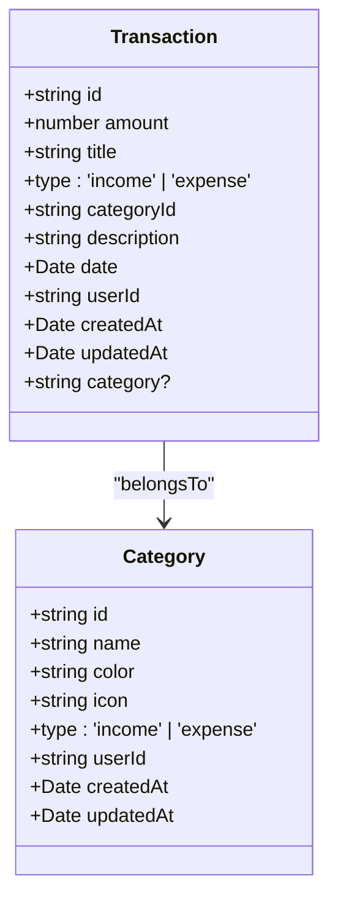
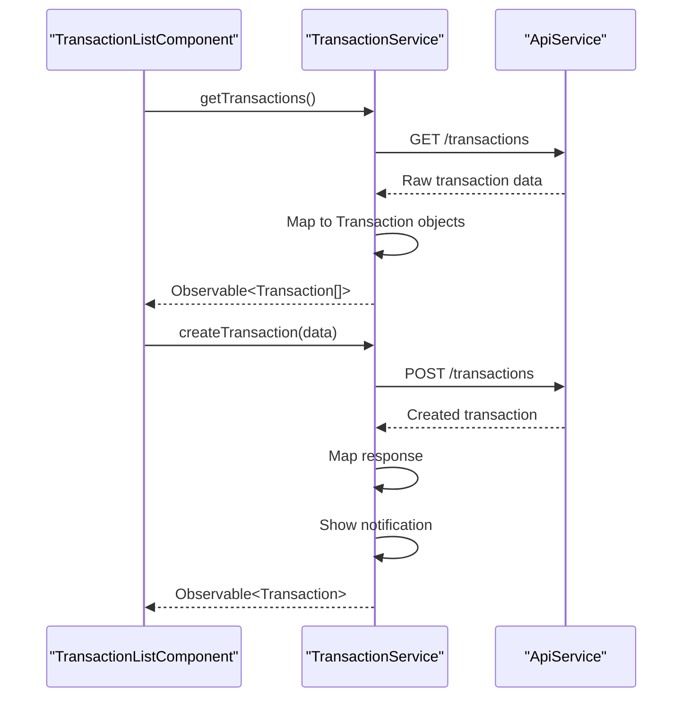
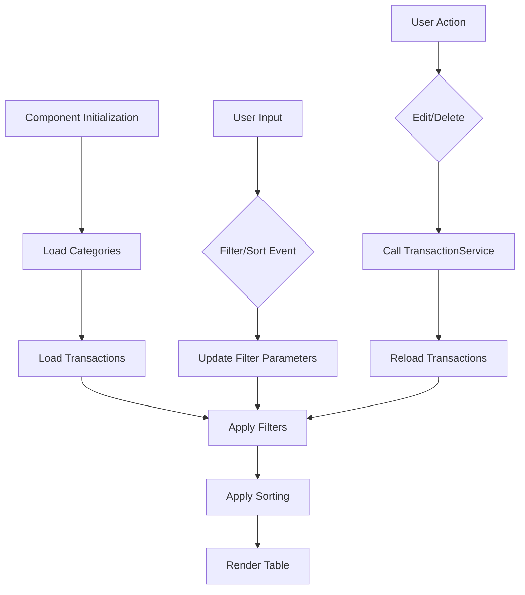
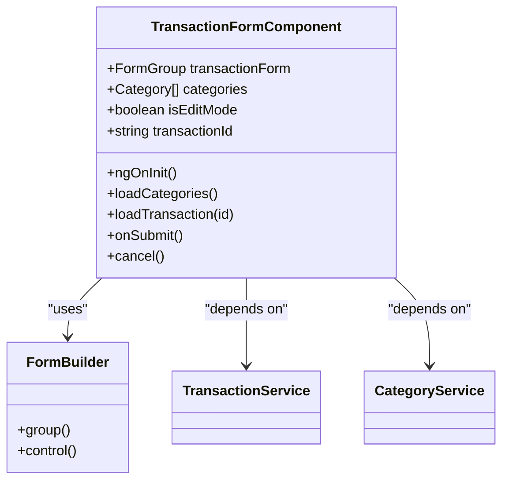
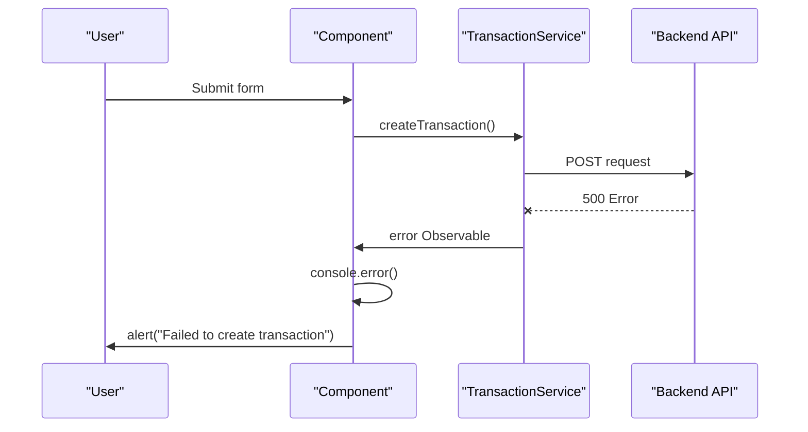
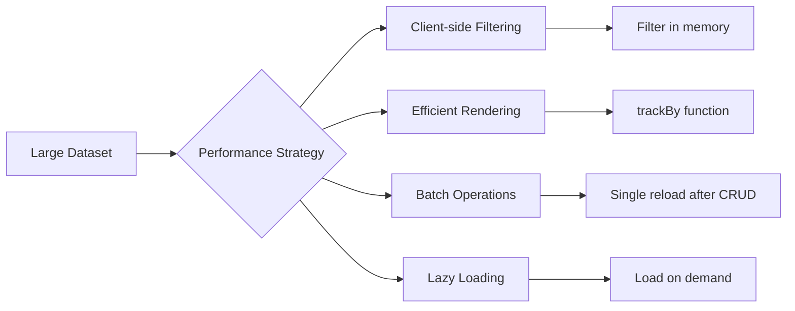

# Transaction Management

<cite>
**Referenced Files in This Document**   
- [transaction.service.ts](file://src/app/shared/services/transaction.service.ts)
- [transaction.model.ts](file://src/app/shared/models/transaction.model.ts)
- [transaction-list.component.ts](file://src/app/transactions/transaction-list/transaction-list.component.ts)
- [transaction-form.component.ts](file://src/app/transactions/transaction-form/transaction-form.component.ts)
- [category.model.ts](file://src/app/shared/models/category.model.ts)
</cite>

## Table of Contents
1. [Introduction](#introduction)
2. [Transaction Data Model](#transaction-data-model)
3. [TransactionService API](#transactionservice-api)
4. [TransactionListComponent](#transactionlistcomponent)
5. [TransactionFormComponent](#transactionformcomponent)
6. [Error Handling and Optimistic Updates](#error-handling-and-optimistic-updates)
7. [Performance Considerations](#performance-considerations)

## Introduction
The transaction management system provides a comprehensive solution for handling financial transactions within the application. It enables users to create, view, edit, and delete transactions while supporting filtering, sorting, and export functionality. The system enforces data integrity through type validation (income/expense), form validation, and consistent date handling. This document details the core components and services that power the transaction management features.

## Transaction Data Model

The transaction data model defines the structure and constraints for financial transactions in the system. Each transaction is represented as a TypeScript interface with strict typing and required fields.

**Diagram sources**
- [transaction.model.ts](file://src/app/shared/models/transaction.model.ts#L1-L12)
- [category.model.ts](file://src/app/shared/models/category.model.ts#L1-L9)

**Section sources**
- [transaction.model.ts](file://src/app/shared/models/transaction.model.ts#L1-L12)

### Key Features of the Data Model
- **Type Enforcement**: Transactions are strictly typed as either 'income' or 'expense' using union types
- **Date Handling**: All dates are stored as JavaScript Date objects with proper timezone handling
- **Relationships**: Transactions reference categories via categoryId, with optional category name denormalization for display
- **Audit Fields**: Creation and modification timestamps are automatically managed
- **User Association**: Each transaction is linked to a specific user

## TransactionService API

The TransactionService provides a complete CRUD interface for managing transactions through HTTP operations. It acts as a bridge between the frontend components and the backend API.

**Diagram sources**
- [transaction.service.ts](file://src/app/shared/services/transaction.service.ts#L15-L121)

**Section sources**
- [transaction.service.ts](file://src/app/shared/services/transaction.service.ts#L15-L121)

### API Methods

#### getTransactions()
Retrieves all transactions for the current user with proper type mapping and date conversion.

#### getTransaction(id: string)
Fetches a specific transaction by ID with complete data transformation from API response.

#### createTransaction(transaction)
Creates a new transaction with selective payload construction and success notification.

#### updateTransaction(id, transaction)
Updates an existing transaction with partial update support (only changed fields are sent).

#### deleteTransaction(id)
Removes a transaction and triggers a user notification upon success.

#### exportTransactions(fileType)
Exports transactions as a Blob (Excel/PDF) for download, handling binary responses.

## TransactionListComponent

The TransactionListComponent provides a comprehensive interface for viewing and managing transactions with advanced filtering, sorting, and pagination capabilities.

**Diagram sources**
- [transaction-list.component.ts](file://src/app/transactions/transaction-list/transaction-list.component.ts#L45-L242)

**Section sources**
- [transaction-list.component.ts](file://src/app/transactions/transaction-list/transaction-list.component.ts#L1-L378)

### Key Features

#### Filtering Capabilities
- **Search**: Full-text search on transaction titles
- **Category Filter**: Dropdown selection by category name
- **Type Filter**: Income/expense type filtering
- **Date Range**: From/to date filtering with proper end-of-day handling

#### Sorting Functionality
- **Sortable Columns**: Date, amount, title, and type
- **Toggle Direction**: Click to toggle between ascending and descending
- **Visual Indicators**: Sort direction displayed with arrow icons

#### User Interface Elements
- **Action Menu**: Context menu for edit/delete actions
- **Loading States**: Visual feedback during data operations
- **Empty State**: Informative message when no transactions match filters
- **Currency Display**: Proper formatting with currency symbol from CurrencyService

#### Performance Optimizations
- **TrackBy Function**: Efficient rendering with trackByTransactionId
- **Batch Updates**: Single reload after create/update/delete operations
- **Client-side Filtering**: Immediate feedback without server round-trips

## TransactionFormComponent

The TransactionFormComponent provides a user-friendly interface for creating and editing transactions with comprehensive form validation and category selection.

**Diagram sources**
- [transaction-form.component.ts](file://src/app/transactions/transaction-form/transaction-form.component.ts#L1-L94)

**Section sources**
- [transaction-form.component.ts](file://src/app/transactions/transaction-form/transaction-form.component.ts#L1-L94)

### Form Configuration

The form is built using Angular's Reactive Forms with the following validation rules:

| Field | Validators | Error Messages |
|-------|----------|----------------|
| title | required | "Title is required" |
| amount | required, min(0.01) | "Amount is required", "Amount must be positive" |
| type | required | "Type is required" |
| categoryId | required | "Category is required" |
| date | required | "Date is required" |

### Key Features

#### Edit Mode Detection
- Automatically detects edit mode by checking route parameters
- Loads existing transaction data when in edit mode
- Uses the same form for both creation and editing

#### Category Selection
- Loads all available categories from CategoryService
- Displays categories in a dropdown menu
- Ensures category selection is required

#### Form Submission
- Validates all fields before submission
- Constructs proper transaction object with date conversion
- Navigates back to transaction list upon success
- Handles both create and update operations

#### User Experience
- Pre-fills current date as default
- Sets default transaction type to 'expense'
- Provides clear cancel functionality
- Uses reactive forms for real-time validation feedback

## Error Handling and Optimistic Updates

The transaction management system implements robust error handling and user feedback mechanisms to ensure data integrity and provide a smooth user experience.

### Error Handling Strategies

**Section sources**
- [transaction.service.ts](file://src/app/shared/services/transaction.service.ts#L60-L68)
- [transaction-list.component.ts](file://src/app/transactions/transaction-list/transaction-list.component.ts#L260-L268)

#### Client-side Error Handling
- **Form Validation**: Prevents submission of invalid data
- **Required Field Checks**: Validates title, amount, category, and date
- **Type Safety**: Ensures proper data types before API calls

#### Server-side Error Handling
- **Subscription Error Callbacks**: Comprehensive error handling in all service method subscriptions
- **Console Logging**: Detailed error logging for debugging
- **User Alerts**: Informative error messages displayed via browser alerts
- **Graceful Degradation**: Continues operation after failed transactions

#### Optimistic Update Patterns
The system uses a reload-based approach rather than true optimistic updates:
- **Post-Operation Reload**: Calls loadTransactions() after successful create/update/delete
- **Immediate Feedback**: Shows loading states during operations
- **Consistency**: Ensures UI always reflects server state
- **Error Recovery**: Reverts to previous state on failure

#### Notification System
- **Success Notifications**: Automatic notifications via NotificationService
- **Contextual Messages**: Type-specific messages (e.g., "Income Added")
- **Visual Feedback**: Success/error states communicated to users

## Performance Considerations

The transaction management system includes several performance optimizations to handle large datasets efficiently.

### Client-side Performance

**Section sources**
- [transaction-list.component.ts](file://src/app/transactions/transaction-list/transaction-list.component.ts#L138-L177)

#### Filtering and Sorting
- **In-memory Operations**: All filtering and sorting performed client-side
- **Single Pass Filtering**: Combines all filter criteria in one array.filter() call
- **Efficient Sorting**: Uses native array.sort() with proper comparison logic

#### Rendering Optimization
- **trackBy Function**: Implements trackByTransactionId to minimize DOM updates
- **Virtual Scrolling**: Not implemented but could be added for very large datasets
- **Conditional Rendering**: Hides suggestion lists when not needed

#### Data Management
- **Batch Updates**: Single transaction reload after create/update/delete
- **Caching Strategy**: Categories cached after initial load
- **Minimal API Calls**: Only two initial calls (categories + transactions)

### Recommendations for Large Datasets

For applications with thousands of transactions, consider implementing:
- **Server-side Pagination**: Fetch only current page data
- **Infinite Scrolling**: Load more transactions as user scrolls
- **IndexedDB Caching**: Store transactions locally for offline access
- **Web Workers**: Move filtering/sorting to background threads
- **Debounced Search**: Add delay to search input to reduce processing

The current implementation is optimized for typical personal finance use cases with hundreds of transactions, providing responsive performance through client-side operations and efficient change detection.